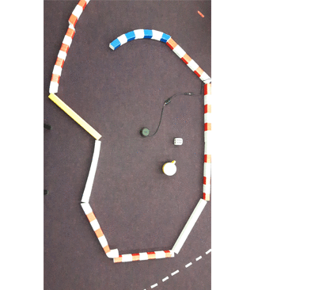

# PythonRobotics

Python codes for robotics algorithm.

# Table of Contents
   * [What is this?](#what-is-this)
   * [Requirements](#requirements)
   * [Documentation](#documentation)
   * [How to use](#how-to-use)
   * [Localization](#localization)
      * [Extended Kalman Filter localization](#extended-kalman-filter-localization)
      * [Particle filter localization](#particle-filter-localization)
      * [Histogram filter localization](#histogram-filter-localization)
   * [Mapping](#mapping)
      * [Gaussian grid map](#gaussian-grid-map)
      * [Ray casting grid map](#ray-casting-grid-map)
      * [Lidar to grid map](#lidar-to-grid-map)
      * [k-means object clustering](#k-means-object-clustering)
      * [Rectangle fitting](#rectangle-fitting)
   * [SLAM](#slam)
      * [Iterative Closest Point (ICP) Matching](#iterative-closest-point-icp-matching)
      * [FastSLAM 1.0](#fastslam-10)
   * [Path Planning](#path-planning)
      * [Dynamic Window Approach](#dynamic-window-approach)
      * [Grid based search](#grid-based-search)
         * [Dijkstra algorithm](#dijkstra-algorithm)
         * [A* algorithm](#a-algorithm)
         * [Potential Field algorithm](#potential-field-algorithm)
         * [Grid based coverage path planning](#grid-based-coverage-path-planning)
      * [State Lattice Planning](#state-lattice-planning)
         * [Biased polar sampling](#biased-polar-sampling)
         * [Lane sampling](#lane-sampling)
      * [Probabilistic Road-Map (PRM) planning](#probabilistic-road-map-prm-planning)
      * [Rapidly-Exploring Random Trees (RRT)](#rapidly-exploring-random-trees-rrt)
         * [RRT*](#rrt)
         * [RRT* with reeds-shepp path](#rrt-with-reeds-shepp-path)
         * [LQR-RRT*](#lqr-rrt)
      * [Quintic polynomials planning](#quintic-polynomials-planning)
      * [Reeds Shepp planning](#reeds-shepp-planning)
      * [LQR based path planning](#lqr-based-path-planning)
      * [Optimal Trajectory in a Frenet Frame](#optimal-trajectory-in-a-frenet-frame)
   * [Path Tracking](#path-tracking)
      * [move to a pose control](#move-to-a-pose-control)
      * [Stanley control](#stanley-control)
      * [Rear wheel feedback control](#rear-wheel-feedback-control)
      * [Linear–quadratic regulator (LQR) speed and steering control](#linearquadratic-regulator-lqr-speed-and-steering-control)
      * [Model predictive speed and steering control](#model-predictive-speed-and-steering-control)
      * [Nonlinear Model predictive control with C-GMRES](#nonlinear-model-predictive-control-with-c-gmres)
   * [Arm Navigation](#arm-navigation)
      * [N joint arm to point control](#n-joint-arm-to-point-control)
      * [Arm navigation with obstacle avoidance](#arm-navigation-with-obstacle-avoidance)
   * [Aerial Navigation](#aerial-navigation)
      * [drone 3d trajectory following](#drone-3d-trajectory-following)
      * [rocket powered landing](#rocket-powered-landing)
   * [Bipedal](#bipedal)
      * [bipedal planner with inverted pendulum](#bipedal-planner-with-inverted-pendulum)
   * [License](#license)
   * [Use-case](#use-case)
   * [Contribution](#contribution)
   * [Citing](#citing)
   * [Support](#support)
   * [Authors](#authors)

# What is this?

This is a Python code collection of robotics algorithms, especially for autonomous navigation.

Features:

1. Easy to read for understanding each algorithm's basic idea.

2. Widely used and practical algorithms are selected.

3. Minimum dependency.

See this paper for more details:

- [\[1808\.10703\] PythonRobotics: a Python code collection of robotics algorithms](https://arxiv.org/abs/1808.10703) ([BibTeX](https://github.com/AtsushiSakai/PythonRoboticsPaper/blob/master/python_robotics.bib))

# Requirements

- Python 3.7.x (2.7 is not supported)

- numpy

- scipy

- matplotlib

- pandas

- [cvxpy](https://www.cvxpy.org/index.html) 

# Documentation

This README only shows some examples of this project. 

If you are interested in other examples or mathematical backgrounds of each algorithm, 

You can check the full documentation online: [https://pythonrobotics.readthedocs.io/](https://pythonrobotics.readthedocs.io/)

All animation gifs are stored here: [AtsushiSakai/PythonRoboticsGifs: Animation gifs of PythonRobotics](https://github.com/AtsushiSakai/PythonRoboticsGifs)

# How to use

1. Clone this repo.

> git clone https://github.com/AtsushiSakai/PythonRobotics.git

> cd PythonRobotics/

2. Install the required libraries. You can use environment.yml with conda command.

> conda env create -f environment.yml

3. Execute python script in each directory.

4. Add star to this repo if you like it :smiley:. 

# Localization

## Extended Kalman Filter localization

Documentation: [Notebook](https://github.com/AtsushiSakai/PythonRobotics/blob/master/Localization/extended_kalman_filter/extended_kalman_filter_localization.ipynb)

## Particle filter localization

This is a sensor fusion localization with Particle Filter(PF).

The blue line is true trajectory, the black line is dead reckoning trajectory,

and the red line is estimated trajectory with PF.

It is assumed that the robot can measure a distance from landmarks (RFID).

This measurements are used for PF localization.

Ref:

- [PROBABILISTIC ROBOTICS](http://www.probabilistic-robotics.org/)

## Histogram filter localization

This is a 2D localization example with Histogram filter.

The red cross is true position, black points are RFID positions.

The blue grid shows a position probability of histogram filter.  

In this simulation, x,y are unknown, yaw is known.

The filter integrates speed input and range observations from RFID for localization.

Initial position is not needed.

Ref:

- [PROBABILISTIC ROBOTICS](http://www.probabilistic-robotics.org/)

# Mapping

## Gaussian grid map

This is a 2D Gaussian grid mapping example.

## Ray casting grid map

This is a 2D ray casting grid mapping example.

## Lidar to grid map

This example shows how to convert a 2D range measurement to a grid map.

## k-means object clustering

This is a 2D object clustering with k-means algorithm.

## Rectangle fitting

This is a 2D rectangle fitting for vehicle detection.

# SLAM

Simultaneous Localization and Mapping(SLAM) examples

## Iterative Closest Point (ICP) Matching

This is a 2D ICP matching example with singular value decomposition.

It can calculate a rotation matrix and a translation vector between points to points.

Ref:

- [Introduction to Mobile Robotics: Iterative Closest Point Algorithm](https://cs.gmu.edu/~kosecka/cs685/cs685-icp.pdf)

## FastSLAM 1.0

This is a feature based SLAM example using FastSLAM 1.0.

The blue line is ground truth, the black line is dead reckoning, the red line is the estimated trajectory with FastSLAM.

The red points are particles of FastSLAM.

Black points are landmarks, blue crosses are estimated landmark positions by FastSLAM.

Ref:

- [PROBABILISTIC ROBOTICS](http://www.probabilistic-robotics.org/)

- [SLAM simulations by Tim Bailey](http://www-personal.acfr.usyd.edu.au/tbailey/software/slam_simulations.htm)

# Path Planning

## Dynamic Window Approach

This is a 2D navigation sample code with Dynamic Window Approach.

- [The Dynamic Window Approach to Collision Avoidance](https://www.ri.cmu.edu/pub_files/pub1/fox_dieter_1997_1/fox_dieter_1997_1.pdf)

## Grid based search

### Dijkstra algorithm

This is a 2D grid based shortest path planning with Dijkstra's algorithm.

In the animation, cyan points are searched nodes.

### A\* algorithm

This is a 2D grid based shortest path planning with A star algorithm.

In the animation, cyan points are searched nodes.

Its heuristic is 2D Euclid distance.

### Potential Field algorithm

This is a 2D grid based path planning with Potential Field algorithm.

In the animation, the blue heat map shows potential value on each grid.

Ref:

- [Robotic Motion Planning:Potential Functions](https://www.cs.cmu.edu/~motionplanning/lecture/Chap4-Potential-Field_howie.pdf)

### Grid based coverage path planning

This is a 2D grid based coverage path planning simulation.

## State Lattice Planning

This script is a path planning code with state lattice planning.

This code uses the model predictive trajectory generator to solve boundary problem.

Ref: 

- [Optimal rough terrain trajectory generation for wheeled mobile robots](http://journals.sagepub.com/doi/pdf/10.1177/0278364906075328)

- [State Space Sampling of Feasible Motions for High-Performance Mobile Robot Navigation in Complex Environments](http://www.frc.ri.cmu.edu/~alonzo/pubs/papers/JFR_08_SS_Sampling.pdf)

### Biased polar sampling

### Lane sampling

## Probabilistic Road-Map (PRM) planning 

This PRM planner uses Dijkstra method for graph search.

In the animation, blue points are sampled points,

Cyan crosses means searched points with Dijkstra method,

The red line is the final path of PRM.

Ref:

- [Probabilistic roadmap \- Wikipedia](https://en.wikipedia.org/wiki/Probabilistic_roadmap)

　　

## Rapidly-Exploring Random Trees (RRT)

### RRT\*

This is a path planning code with RRT\*

Black circles are obstacles, green line is a searched tree, red crosses are start and goal positions.

Ref:

- [Incremental Sampling-based Algorithms for Optimal Motion Planning](https://arxiv.org/abs/1005.0416)

- [Sampling-based Algorithms for Optimal Motion Planning](http://citeseerx.ist.psu.edu/viewdoc/download?doi=10.1.1.419.5503&rep=rep1&type=pdf)

### RRT\* with reeds-shepp path

)

Path planning for a car robot with RRT\* and reeds shepp path planner.

### LQR-RRT\*

This is a path planning simulation with LQR-RRT\*.

A double integrator motion model is used for LQR local planner.

Ref:

- [LQR\-RRT\*: Optimal Sampling\-Based Motion Planning with Automatically Derived Extension Heuristics](http://lis.csail.mit.edu/pubs/perez-icra12.pdf)

- [MahanFathi/LQR\-RRTstar: LQR\-RRT\* method is used for random motion planning of a simple pendulum in its phase plot](https://github.com/MahanFathi/LQR-RRTstar)

## Quintic polynomials planning

Motion planning with quintic polynomials.

It can calculate 2D path, velocity, and acceleration profile based on quintic polynomials.

Ref:

- [Local Path Planning And Motion Control For Agv In Positioning](http://ieeexplore.ieee.org/document/637936/)

## Reeds Shepp planning

A sample code with Reeds Shepp path planning.

Ref:

- [15.3.2 Reeds\-Shepp Curves](http://planning.cs.uiuc.edu/node822.html) 

- [optimal paths for a car that goes both forwards and backwards](https://pdfs.semanticscholar.org/932e/c495b1d0018fd59dee12a0bf74434fac7af4.pdf)

- [ghliu/pyReedsShepp: Implementation of Reeds Shepp curve\.](https://github.com/ghliu/pyReedsShepp)

## LQR based path planning

A sample code using LQR based path planning for double integrator model.

## Optimal Trajectory in a Frenet Frame 

This is optimal trajectory generation in a Frenet Frame.

The cyan line is the target course and black crosses are obstacles.

The red line is predicted path.

Ref:

- [Optimal Trajectory Generation for Dynamic Street Scenarios in a Frenet Frame](https://www.researchgate.net/profile/Moritz_Werling/publication/224156269_Optimal_Trajectory_Generation_for_Dynamic_Street_Scenarios_in_a_Frenet_Frame/links/54f749df0cf210398e9277af.pdf)

- [Optimal trajectory generation for dynamic street scenarios in a Frenet Frame](https://www.youtube.com/watch?v=Cj6tAQe7UCY)

# Path Tracking

## move to a pose control

This is a simulation of moving to a pose control

Ref:

- [P. I. Corke, "Robotics, Vision and Control" \| SpringerLink p102](https://link.springer.com/book/10.1007/978-3-642-20144-8)

## Stanley control

Path tracking simulation with Stanley steering control and PID speed control.

Ref:

- [Stanley: The robot that won the DARPA grand challenge](http://robots.stanford.edu/papers/thrun.stanley05.pdf)

- [Automatic Steering Methods for Autonomous Automobile Path Tracking](https://www.ri.cmu.edu/pub_files/2009/2/Automatic_Steering_Methods_for_Autonomous_Automobile_Path_Tracking.pdf)

## Rear wheel feedback control

Path tracking simulation with rear wheel feedback steering control and PID speed control.

Ref:

- [A Survey of Motion Planning and Control Techniques for Self-driving Urban Vehicles](https://arxiv.org/abs/1604.07446)

## Linear–quadratic regulator (LQR) speed and steering control

Path tracking simulation with LQR speed and steering control.

Ref:

- [Towards fully autonomous driving: Systems and algorithms \- IEEE Conference Publication](http://ieeexplore.ieee.org/document/5940562/)

## Model predictive speed and steering control

Path tracking simulation with iterative linear model predictive speed and steering control.

Ref:

- [notebook](https://github.com/AtsushiSakai/PythonRobotics/blob/master/PathTracking/model_predictive_speed_and_steer_control/Model_predictive_speed_and_steering_control.ipynb)

- [Real\-time Model Predictive Control \(MPC\), ACADO, Python \| Work\-is\-Playing](http://grauonline.de/wordpress/?page_id=3244)

## Nonlinear Model predictive control with C-GMRES

A motion planning and path tracking simulation with NMPC of C-GMRES 

Ref:

- [notebook](https://github.com/AtsushiSakai/PythonRobotics/blob/master/PathTracking/cgmres_nmpc/cgmres_nmpc.ipynb)

# Arm Navigation

## N joint arm to point control

N joint arm to a point control simulation.

This is a interactive simulation.

You can set the goal position of the end effector with left-click on the ploting area. 

In this simulation N = 10, however, you can change it.

## Arm navigation with obstacle avoidance 

Arm navigation with obstacle avoidance simulation.

# Aerial Navigation

## drone 3d trajectory following 

This is a 3d trajectory following simulation for a quadrotor.

## rocket powered landing

This is a 3d trajectory generation simulation for a rocket powered landing.

Ref:

- [notebook](https://github.com/AtsushiSakai/PythonRobotics/blob/master/AerialNavigation/rocket_powered_landing/rocket_powered_landing.ipynb)

# Bipedal

## bipedal planner with inverted pendulum

This is a bipedal planner for modifying footsteps with inverted pendulum.

You can set the footsteps and the planner will modify those automatically.

# License 

MIT

# Use-case

If this project helps your robotics project, please let me know with .

Your robot's video, which is using PythonRobotics, is very welcome!!

This is a list of other user's comment and references:[users\_comments](https://github.com/AtsushiSakai/PythonRobotics/blob/master/users_comments.md)

# Contribution

A small PR like bug fix is welcome.

If your PR is merged multiple times, I will add your account to the author list.

# Citing

If you use this project's code for your academic work, we encourage you to cite [our papers](https://arxiv.org/abs/1808.10703) 

If you use this project's code in industry, we'd love to hear from you as well; feel free to reach out to the developers directly.

# Support

If you or your company would like to support this project, please consider:

- [Become a backer or sponsor on Patreon](https://www.patreon.com/myenigma)

- [One-time donation via PayPal](https://www.paypal.me/myenigmapay/)

You can add your name or your company logo in README if you are a patron.

E-mail consultant is also available.

 　

Your comment using  is also welcome. 

This is a list: [Users comments](https://github.com/AtsushiSakai/PythonRobotics/blob/master/users_comments.md)

# Authors

- [Atsushi Sakai](https://github.com/AtsushiSakai/) ([@Atsushi_twi](https://twitter.com/Atsushi_twi))

- [Daniel Ingram](https://github.com/daniel-s-ingram)

- [Joe Dinius](https://github.com/jwdinius)

- [Karan Chawla](https://github.com/karanchawla)

- [Antonin RAFFIN](https://github.com/araffin)

- [Alexis Paques](https://github.com/AlexisTM)

- [Ryohei Sasaki](https://github.com/rsasaki0109)

- [Göktuğ Karakaşlı](https://github.com/goktug97)

- [Guillaume Jacquenot](https://github.com/Gjacquenot)

