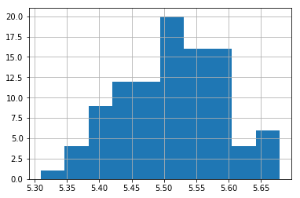
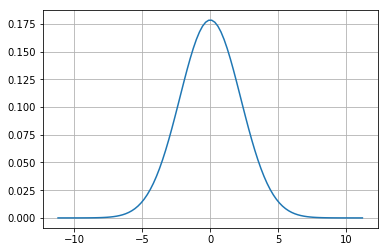
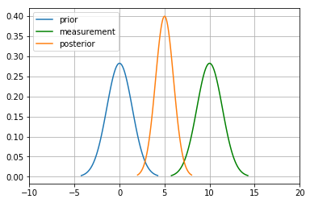
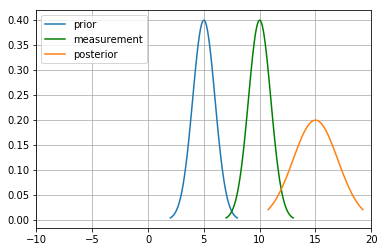
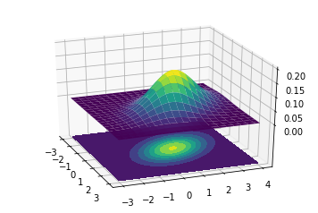
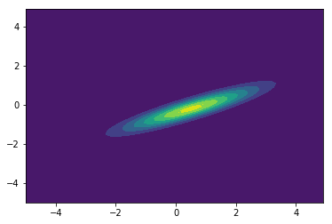

KF Basics - Part I
------------------

Introduction
~~~~~~~~~~~~

What is the need to describe belief in terms of PDF’s?
^^^^^^^^^^^^^^^^^^^^^^^^^^^^^^^^^^^^^^^^^^^^^^^^^^^^^^

This is because robot environments are stochastic. A robot environment
may have cows with Tesla by side. That is a robot and it’s environment
cannot be deterministically modelled(e.g as a function of something like
time t). In the real world sensors are also error prone, and hence
there’ll be a set of values with a mean and variance that it can take.
Hence, we always have to model around some mean and variances
associated.

What is Expectation of a Random Variables?
^^^^^^^^^^^^^^^^^^^^^^^^^^^^^^^^^^^^^^^^^^

Expectation is nothing but an average of the probabilites

.. math:: \mathbb E[X] = \sum_{i=1}^n p_ix_i

In the continous form,

.. math:: \mathbb E[X] = \int_{-\infty}^\infty x\, f(x) \,dx

.. code-block:: ipython3

    import numpy as np
    import random
    x=[3,1,2]
    p=[0.1,0.3,0.4]
    E_x=np.sum(np.multiply(x,p))
    print(E_x)

.. parsed-literal::

    1.4000000000000001

What is the advantage of representing the belief as a unimodal as opposed to multimodal?
^^^^^^^^^^^^^^^^^^^^^^^^^^^^^^^^^^^^^^^^^^^^^^^^^^^^^^^^^^^^^^^^^^^^^^^^^^^^^^^^^^^^^^^^

Obviously, it makes sense because we can’t multiple probabilities to a
car moving for two locations. This would be too confusing and the
information will not be useful.

Variance, Covariance and Correlation
~~~~~~~~~~~~~~~~~~~~~~~~~~~~~~~~~~~~

Variance
^^^^^^^^

Variance is the spread of the data. The mean does’nt tell much **about**
the data. Therefore the variance tells us about the **story** about the
data meaning the spread of the data.

.. math:: \mathit{VAR}(X) = \frac{1}{n}\sum_{i=1}^n (x_i - \mu)^2

.. code-block:: ipython3

    x=np.random.randn(10)
    np.var(x)

.. parsed-literal::

    1.0224618077401504

Covariance
^^^^^^^^^^

This is for a multivariate distribution. For example, a robot in 2-D
space can take values in both x and y. To describe them, a normal
distribution with mean in both x and y is needed.

For a multivariate distribution, mean :math:`\mu` can be represented as
a matrix,

.. math::

   \mu = \begin{bmatrix}\mu_1\\\mu_2\\ \vdots \\\mu_n\end{bmatrix}

Similarly, variance can also be represented.

But an important concept is that in the same way as every variable or
dimension has a variation in its values, it is also possible that there
will be values on how they **together vary**. This is also a measure of
how two datasets are related to each other or **correlation**.

For example, as height increases weight also generally increases. These
variables are correlated. They are positively correlated because as one
variable gets larger so does the other.

We use a **covariance matrix** to denote covariances of a multivariate
normal distribution:

.. math::

   \Sigma = \begin{bmatrix}
     \sigma_1^2 & \sigma_{12} & \cdots & \sigma_{1n} \\
     \sigma_{21} &\sigma_2^2 & \cdots & \sigma_{2n} \\
     \vdots  & \vdots  & \ddots & \vdots  \\
     \sigma_{n1} & \sigma_{n2} & \cdots & \sigma_n^2
    \end{bmatrix}

**Diagonal** - Variance of each variable associated.

**Off-Diagonal** - covariance between ith and jth variables.

.. math::

   \begin{aligned}VAR(X) = \sigma_x^2 &=  \frac{1}{n}\sum_{i=1}^n(X - \mu)^2\\
   COV(X, Y) = \sigma_{xy} &= \frac{1}{n}\sum_{i=1}^n[(X-\mu_x)(Y-\mu_y)\big]\end{aligned}

.. code-block:: ipython3

    x=np.random.random((3,3))
    np.cov(x)

.. parsed-literal::

    array([[0.08868895, 0.05064471, 0.08855629],
           [0.05064471, 0.06219243, 0.11555291],
           [0.08855629, 0.11555291, 0.21534324]])

Covariance taking the data as **sample** with :math:`\frac{1}{N-1}`

.. code-block:: ipython3

    x_cor=np.random.rand(1,10)
    y_cor=np.random.rand(1,10)
    np.cov(x_cor,y_cor)

.. parsed-literal::

    array([[ 0.1571437 , -0.00766623],
           [-0.00766623,  0.13957621]])

Covariance taking the data as **population** with :math:`\frac{1}{N}`

.. code-block:: ipython3

    np.cov(x_cor,y_cor,bias=1)

.. parsed-literal::

    array([[ 0.14142933, -0.0068996 ],
           [-0.0068996 ,  0.12561859]])

Gaussians
~~~~~~~~~

Central Limit Theorem
^^^^^^^^^^^^^^^^^^^^^

According to this theorem, the average of n samples of random and
independent variables tends to follow a normal distribution as we
increase the sample size.(Generally, for n>=30)

.. code-block:: ipython3

    import matplotlib.pyplot as plt
    import random
    a=np.zeros((100,))
    for i in range(100):
        x=[random.uniform(1,10) for _ in range(1000)]
        a[i]=np.sum(x,axis=0)/1000
    plt.hist(a)

.. parsed-literal::

    (array([ 1.,  4.,  9., 12., 12., 20., 16., 16.,  4.,  6.]),
     array([5.30943011, 5.34638597, 5.38334183, 5.42029769, 5.45725355,
            5.49420941, 5.53116527, 5.56812114, 5.605077  , 5.64203286,
            5.67898872]),
     <a list of 10 Patch objects>)

Gaussian Distribution
^^^^^^^^^^^^^^^^^^^^^

A Gaussian is a *continuous probability distribution* that is completely
described with two parameters, the mean (:math:`\mu`) and the variance
(:math:`\sigma^2`). It is defined as:

.. math::

    
   f(x, \mu, \sigma) = \frac{1}{\sigma\sqrt{2\pi}} \exp\big [{-\frac{(x-\mu)^2}{2\sigma^2} }\big ]

Range is :math:`[-\inf,\inf]`

This is just a function of mean(\ :math:`\mu`) and standard deviation
(:math:`\sigma`) and what gives the normal distribution the
charecteristic **bell curve**.

.. code-block:: ipython3

    import matplotlib.mlab as mlab
    import math
    import scipy.stats
    
    mu = 0
    variance = 5
    sigma = math.sqrt(variance)
    x = np.linspace(mu - 5*sigma, mu + 5*sigma, 100)
    plt.plot(x,scipy.stats.norm.pdf(x, mu, sigma))
    plt.show()

Why do we need Gaussian distributions?
^^^^^^^^^^^^^^^^^^^^^^^^^^^^^^^^^^^^^^

Since it becomes really difficult in the real world to deal with
multimodal distribution as we cannot put the belief in two seperate
location of the robots. This becomes really confusing and in practice
impossible to comprehend. Gaussian probability distribution allows us to
drive the robots using only one mode with peak at the mean with some
variance.

Gaussian Properties
~~~~~~~~~~~~~~~~~~~

**Multiplication**

For the measurement update in a Bayes Filter, the algorithm tells us to
multiply the Prior P(X_t) and measurement P(Z_t|X_t) to calculate the
posterior:

.. math:: P(X \mid Z) = \frac{P(Z \mid X)P(X)}{P(Z)}

Here for the numerator, :math:`P(Z \mid X),P(X)` both are gaussian.

:math:`N(\bar\mu, \bar\sigma^1)` and :math:`N(\bar\mu, \bar\sigma^2)`
are their mean and variances.

New mean is

.. math:: \mu_\mathtt{new} = \frac{\sigma_z^2\bar\mu + \bar\sigma^2z}{\bar\sigma^2+\sigma_z^2}

New variance is

.. math::

   \sigma_\mathtt{new} = \frac{\sigma_z^2\bar\sigma^2}{\bar\sigma^2+\sigma_z^2}

.. code-block:: ipython3

    import matplotlib.mlab as mlab
    import math
    mu1 = 0
    variance1 = 2
    sigma = math.sqrt(variance1)
    x1 = np.linspace(mu1 - 3*sigma, mu1 + 3*sigma, 100)
    plt.plot(x1,scipy.stats.norm.pdf(x1, mu1, sigma),label='prior')
    
    mu2 = 10
    variance2 = 2
    sigma = math.sqrt(variance2)
    x2 = np.linspace(mu2 - 3*sigma, mu2 + 3*sigma, 100)
    plt.plot(x2,scipy.stats.norm.pdf(x2, mu2, sigma),"g-",label='measurement')
    
    
    mu_new=(mu1*variance2+mu2*variance1)/(variance1+variance2)
    print("New mean is at: ",mu_new)
    var_new=(variance1*variance2)/(variance1+variance2)
    print("New variance is: ",var_new)
    sigma = math.sqrt(var_new)
    x3 = np.linspace(mu_new - 3*sigma, mu_new + 3*sigma, 100)
    plt.plot(x3,scipy.stats.norm.pdf(x3, mu_new, var_new),label="posterior")
    plt.legend(loc='upper left')
    plt.xlim(-10,20)
    plt.show()

.. parsed-literal::

    New mean is at:  5.0
    New variance is:  1.0

**Addition**

The motion step involves a case of adding up probability (Since it has
to abide the Law of Total Probability). This means their beliefs are to
be added and hence two gaussians. They are simply arithmetic additions
of the two.

.. math::

   \begin{gathered}\mu_x = \mu_p + \mu_z \\
   \sigma_x^2 = \sigma_z^2+\sigma_p^2\, \end{gathered}

.. code-block:: ipython3

    import matplotlib.mlab as mlab
    import math
    mu1 = 5
    variance1 = 1
    sigma = math.sqrt(variance1)
    x1 = np.linspace(mu1 - 3*sigma, mu1 + 3*sigma, 100)
    plt.plot(x1,scipy.stats.norm.pdf(x1, mu1, sigma),label='prior')
    
    mu2 = 10
    variance2 = 1
    sigma = math.sqrt(variance2)
    x2 = np.linspace(mu2 - 3*sigma, mu2 + 3*sigma, 100)
    plt.plot(x2,scipy.stats.norm.pdf(x2, mu2, sigma),"g-",label='measurement')
    
    
    mu_new=mu1+mu2
    print("New mean is at: ",mu_new)
    var_new=(variance1+variance2)
    print("New variance is: ",var_new)
    sigma = math.sqrt(var_new)
    x3 = np.linspace(mu_new - 3*sigma, mu_new + 3*sigma, 100)
    plt.plot(x3,scipy.stats.norm.pdf(x3, mu_new, var_new),label="posterior")
    plt.legend(loc='upper left')
    plt.xlim(-10,20)
    plt.show()

.. parsed-literal::

    New mean is at:  15
    New variance is:  2

.. code-block:: ipython3

    #Example from:
    #https://scipython.com/blog/visualizing-the-bivariate-gaussian-distribution/
    import numpy as np
    import matplotlib.pyplot as plt
    from matplotlib import cm
    from mpl_toolkits.mplot3d import Axes3D
    
    # Our 2-dimensional distribution will be over variables X and Y
    N = 60
    X = np.linspace(-3, 3, N)
    Y = np.linspace(-3, 4, N)
    X, Y = np.meshgrid(X, Y)
    
    # Mean vector and covariance matrix
    mu = np.array([0., 1.])
    Sigma = np.array([[ 1. , -0.5], [-0.5,  1.5]])
    
    # Pack X and Y into a single 3-dimensional array
    pos = np.empty(X.shape + (2,))
    pos[:, :, 0] = X
    pos[:, :, 1] = Y
    
    def multivariate_gaussian(pos, mu, Sigma):
        """Return the multivariate Gaussian distribution on array pos.
    
        pos is an array constructed by packing the meshed arrays of variables
        x_1, x_2, x_3, ..., x_k into its _last_ dimension.
    
        """
    
        n = mu.shape[0]
        Sigma_det = np.linalg.det(Sigma)
        Sigma_inv = np.linalg.inv(Sigma)
        N = np.sqrt((2*np.pi)**n * Sigma_det)
        # This einsum call calculates (x-mu)T.Sigma-1.(x-mu) in a vectorized
        # way across all the input variables.
        fac = np.einsum('...k,kl,...l->...', pos-mu, Sigma_inv, pos-mu)
    
        return np.exp(-fac / 2) / N
    
    # The distribution on the variables X, Y packed into pos.
    Z = multivariate_gaussian(pos, mu, Sigma)
    
    # Create a surface plot and projected filled contour plot under it.
    fig = plt.figure()
    ax = fig.gca(projection='3d')
    ax.plot_surface(X, Y, Z, rstride=3, cstride=3, linewidth=1, antialiased=True,
                    cmap=cm.viridis)
    
    cset = ax.contourf(X, Y, Z, zdir='z', offset=-0.15, cmap=cm.viridis)
    
    # Adjust the limits, ticks and view angle
    ax.set_zlim(-0.15,0.2)
    ax.set_zticks(np.linspace(0,0.2,5))
    ax.view_init(27, -21)
    
    plt.show()

This is a 3D projection of the gaussians involved with the lower surface
showing the 2D projection of the 3D projection above. The innermost
ellipse represents the highest peak, that is the maximum probability for
a given (X,Y) value.

\*\* numpy einsum examples \*\*

.. code-block:: ipython3

    a = np.arange(25).reshape(5,5)
    b = np.arange(5)
    c = np.arange(6).reshape(2,3)
    print(a)
    print(b)
    print(c)

.. parsed-literal::

    [[ 0  1  2  3  4]
     [ 5  6  7  8  9]
     [10 11 12 13 14]
     [15 16 17 18 19]
     [20 21 22 23 24]]
    [0 1 2 3 4]
    [[0 1 2]
     [3 4 5]]

.. code-block:: ipython3

    #this is the diagonal sum, i repeated means the diagonal
    np.einsum('ij', a)
    #this takes the output ii which is the diagonal and outputs to a
    np.einsum('ii->i',a)
    #this takes in the array A represented by their axes 'ij' and  B by its only axes'j' 
    #and multiples them element wise
    np.einsum('ij,j',a, b)

.. parsed-literal::

    array([ 30,  80, 130, 180, 230])

.. code-block:: ipython3

    A = np.arange(3).reshape(3,1)
    B = np.array([[ 0,  1,  2,  3],
                  [ 4,  5,  6,  7],
                  [ 8,  9, 10, 11]])
    C=np.multiply(A,B)
    np.sum(C,axis=1)

.. parsed-literal::

    array([ 0, 22, 76])

.. code-block:: ipython3

    D = np.array([0,1,2])
    E = np.array([[ 0,  1,  2,  3],
                  [ 4,  5,  6,  7],
                  [ 8,  9, 10, 11]])
    
    np.einsum('i,ij->i',D,E)

.. parsed-literal::

    array([ 0, 22, 76])

.. code-block:: ipython3

    from scipy.stats import multivariate_normal
    x, y = np.mgrid[-5:5:.1, -5:5:.1]
    pos = np.empty(x.shape + (2,))
    pos[:, :, 0] = x; pos[:, :, 1] = y
    rv = multivariate_normal([0.5, -0.2], [[2.0, 0.9], [0.9, 0.5]])
    plt.contourf(x, y, rv.pdf(pos))
    

.. parsed-literal::

    <matplotlib.contour.QuadContourSet at 0x139196438>

References:
~~~~~~~~~~~

1. Roger Labbe’s
   `repo <https://github.com/rlabbe/Kalman-and-Bayesian-Filters-in-Python>`__
   on Kalman Filters. (Majority of the examples in the notes are from
   this)

2. Probabilistic Robotics by Sebastian Thrun, Wolfram Burgard and Dieter
   Fox, MIT Press.

3. Scipy
   `Documentation <https://scipython.com/blog/visualizing-the-bivariate-gaussian-distribution/>`__
