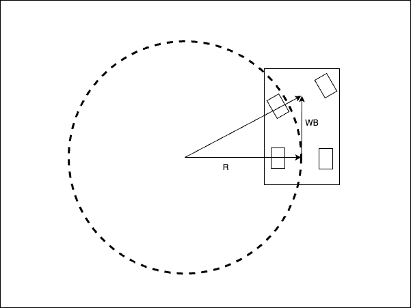
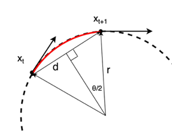

Steering Motion Model
-----------------------

Turning radius calculation by steering motion model
~~~~~~~~~~~~~~~~~~~~~~~~~~~~~~~~~~~~~~~~~~~~~~~~~~~~~

The turning Radius represents the radius of the circle when the robot turns, as shown in the diagram below.

When the steering angle is tilted by :math:`\delta`,
the turning radius :math:`R` can be calculated using the following equation,
based on the geometric relationship between the wheelbase (WB),
which is the distance between the rear wheel center and the front wheel center,
and the assumption that the turning radius circle passes through the center of
the rear wheels in the diagram above.

:math:`R = \frac{WB}{tan\delta}`

The curvature :math:`\kappa` is the reciprocal of the turning radius:

:math:`\kappa = \frac{tan\delta}{WB}`

In the diagram above, the angular difference :math:`\Delta \theta` in the vehicle’s heading between two points on the turning radius :math:`R`
is the same as the angle of the vector connecting the two points from the center of the turn.

From the formula for the length of an arc and the radius,

:math:`\Delta \theta = \frac{s}{R}`

Here, :math:`s` is the distance between two points on the turning radius.

So, yaw rate :math:`\omega` can be calculated as follows.

:math:`\omega = \frac{v}{R}`

and

:math:`\omega = v\kappa`

here, :math:`v` is the velocity of the vehicle.

Turning radius calculation by 2 consecutive positions of the robot trajectory
~~~~~~~~~~~~~~~~~~~~~~~~~~~~~~~~~~~~~~~~~~~~~~~~~~~~~~~~~~~~~~~~~~~~~~~~~~~~~~~~

In this section, we will derive the formula for the turning radius from 2 consecutive positions of the robot trajectory.

As shown in the upper diagram above, the robot moves from a point at time :math:`t` to a point at time :math:`t+1`.
Each point is represented by a 2D position :math:`(x_t, y_t)` and an orientation :math:`\theta_t`.

The distance between the two points is :math:`d = \sqrt{(x_{t+1} - x_t)^2 + (y_{t+1} - y_t)^2}`.

The angle between the two vectors from the turning center to the two points is :math:`\theta = \theta_{t+1} - \theta_t`.
Here, by drawing a perpendicular line from the center of the turning radius
to a straight line of length :math:`d` connecting two points,
the following equation can be derived from the resulting right triangle.

:math:`sin\frac{\theta}{2} = \frac{d}{2R}`

So, the turning radius :math:`R` can be calculated as follows.

:math:`R = \frac{d}{2sin\frac{\theta}{2}}`

The curvature :math:`\kappa` is the reciprocal of the turning radius.
So, the curvature can be calculated as follows.

:math:`\kappa = \frac{2sin\frac{\theta}{2}}{d}`

Target speed by maximum steering speed
~~~~~~~~~~~~~~~~~~~~~~~~~~~~~~~~~~~~~~~~~~~~~~~~~~~~~~~~~

If the maximum steering speed is given as :math:`\dot{\delta}_{max}`,
the maximum curvature change rate :math:`\dot{\kappa}_{max}` can be calculated as follows:

:math:`\dot{\kappa}_{max} = \frac{tan\dot{\delta}_{max}}{WB}`

From the curvature calculation by 2 consecutive positions of the robot trajectory,

the maximum curvature change rate :math:`\dot{\kappa}_{max}` can be calculated as follows:

:math:`\dot{\kappa}_{max} = \frac{\kappa_{t+1}-\kappa_{t}}{\Delta t}`

If we can assume that the vehicle will not exceed the maximum curvature change rate,

the target minimum velocity :math:`v_{min}` can be calculated as follows:

:math:`v_{min} = \frac{d_{t+1}+d_{t}}{\Delta t} = \frac{d_{t+1}+d_{t}}{(\kappa_{t+1}-\kappa_{t})}\frac{tan\dot{\delta}_{max}}{WB}`

Reference
~~~~~~~~~~~

- `Vehicle Dynamics and Control <https://link.springer.com/book/10.1007/978-1-4614-1433-9>`_
