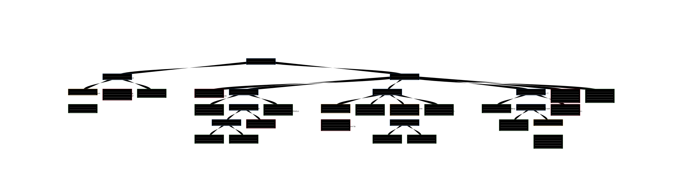

Behavior Tree
-------------

Behavior Tree is a modular, hierarchical decision model that is widely used in robot control, and game development. 
It present some similarities to hierarchical state machines with the key difference that the main building block of a behavior is a task rather than a state.
Behavior Tree have been shown to generalize several other control architectures (https://ieeexplore.ieee.org/document/7790863)

Code Link
~~~~~~~~~~~~~

Control Node
++++++++++++

.. autoclass:: MissionPlanning.BehaviorTree.behavior_tree.ControlNode

.. autoclass:: MissionPlanning.BehaviorTree.behavior_tree.SequenceNode

.. autoclass:: MissionPlanning.BehaviorTree.behavior_tree.SelectorNode

.. autoclass:: MissionPlanning.BehaviorTree.behavior_tree.WhileDoElseNode

Action Node
++++++++++++

.. autoclass:: MissionPlanning.BehaviorTree.behavior_tree.ActionNode

.. autoclass:: MissionPlanning.BehaviorTree.behavior_tree.EchoNode

.. autoclass:: MissionPlanning.BehaviorTree.behavior_tree.SleepNode

Decorator Node
++++++++++++++

.. autoclass:: MissionPlanning.BehaviorTree.behavior_tree.DecoratorNode

.. autoclass:: MissionPlanning.BehaviorTree.behavior_tree.InverterNode

.. autoclass:: MissionPlanning.BehaviorTree.behavior_tree.TimeoutNode

.. autoclass:: MissionPlanning.BehaviorTree.behavior_tree.DelayNode

.. autoclass:: MissionPlanning.BehaviorTree.behavior_tree.ForceSuccessNode

.. autoclass:: MissionPlanning.BehaviorTree.behavior_tree.ForceFailureNode

Behavior Tree Factory
+++++++++++++++++++++

.. autoclass:: MissionPlanning.BehaviorTree.behavior_tree.BehaviorTreeFactory
  :members:

Behavior Tree
+++++++++++++

.. autoclass:: MissionPlanning.BehaviorTree.behavior_tree.BehaviorTree
  :members:

Example
~~~~~~~

Visualize the behavior tree by `xml-tree-visual <https://xml-tree-visual.vercel.app/>`_.

Print the behavior tree

.. code-block:: text

    Behavior Tree
    [Robot Main Controller]
        [Battery Management]
            (Low Battery Detection)
                <Check Battery>
            <Low Battery Warning>
            <Charge Battery>
        [Patrol Task]
            <Start Task>
            [Move to Position A]
                <Move to A>
                [Obstacle Handling A]
                    [Obstacle Present]
                        <Detect Obstacle>
                        <Avoid Obstacle>
                    <No Obstacle>
                <Position A Task>
            [Move to Position B]
                (Short Wait)
                    <Prepare Movement>
                <Move to B>
                (Limited Time Obstacle Handling)
                    [Obstacle Present]
                        <Detect Obstacle>
                        <Avoid Obstacle>
                <Position B Task>
            [Conditional Move to C]
                <Check Sufficient Battery>
                [Perform Position C Task]
                    <Move to C>
                    (Ensure Completion)
                        <Position C Task>
                <Skip Position C>
            <Complete Patrol>
            <Return to Charging Station>
    Behavior Tree
