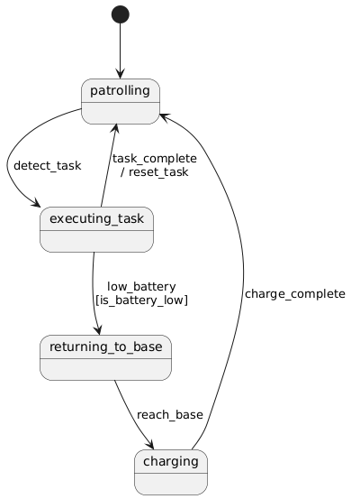

State Machine
-------------

A state machine is a model used to describe the transitions of an object between different states. It clearly shows how an object changes state based on events and may trigger corresponding actions.

Core Concepts
~~~~~~~~~~~~~

- **State**: A distinct mode or condition of the system (e.g. "Idle", "Running"). Managed by State class with optional on_enter/on_exit callbacks
- **Event**: A trigger signal that may cause state transitions (e.g. "start", "stop")
- **Transition**: A state change path from source to destination state triggered by an event
- **Action**: An operation executed during transition (before entering new state)
- **Guard**: A precondition that must be satisfied to allow transition

Code Link
~~~~~~~~~~~

.. autoclass:: MissionPlanning.StateMachine.state_machine.StateMachine
   :members: add_transition, process, register_state
   :special-members: __init__

PlantUML Support
~~~~~~~~~~~~~~~~

The ``generate_plantuml()`` method creates diagrams showing:

- Current state (marked with [*] arrow)
- All possible transitions
- Guard conditions in [brackets]
- Actions prefixed with /

Example
~~~~~~~

state machine diagram:
+++++++++++++++++++++++

state transition table:
+++++++++++++++++++++++
.. list-table:: State Transitions
   :header-rows: 1
   :widths: 20 15 20 20 20

   * - Source State
     - Event
     - Target State
     - Guard
     - Action
   * - patrolling
     - detect_task
     - executing_task
     - 
     - 
   * - executing_task
     - task_complete
     - patrolling
     - 
     - reset_task
   * - executing_task
     - low_battery
     - returning_to_base
     - is_battery_low
     - 
   * - returning_to_base
     - reach_base
     - charging
     - 
     - 
   * - charging
     - charge_complete
     - patrolling
     - 
     - 