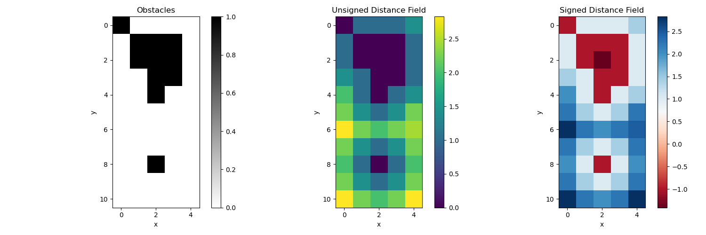

Distance Map
------------

This is an implementation of the Distance Map algorithm for path planning.

The Distance Map algorithm computes the unsigned distance field (UDF) and signed distance field (SDF) from a boolean field representing obstacles. 

The UDF gives the distance from each point to the nearest obstacle. The SDF gives positive distances for points outside obstacles and negative distances for points inside obstacles.

Example
~~~~~~~

The algorithm is demonstrated on a simple 2D grid with obstacles:

Code Link
^^^^^^^^^^^^^^^^^^^^^^^^^^^^^^^^^

.. autofunction:: Mapping.DistanceMap.distance_map.compute_sdf

.. autofunction:: Mapping.DistanceMap.distance_map.compute_udf

References
~~~~~~~~~~

- `Distance Transforms of Sampled Functions <https://cs.brown.edu/people/pfelzens/papers/dt-final.pdf>`_ paper by Pedro F. Felzenszwalb and Daniel P. Huttenlocher. 