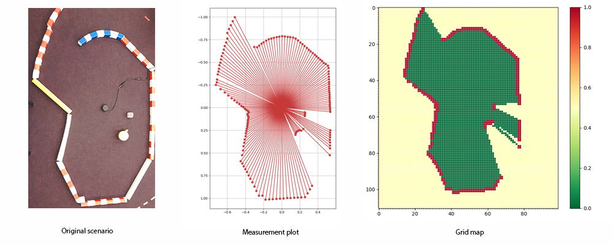
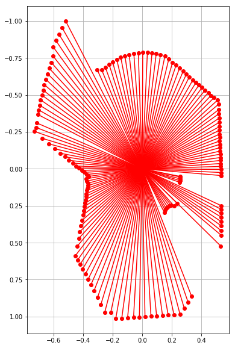
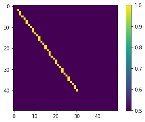
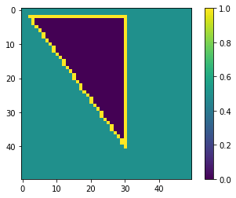
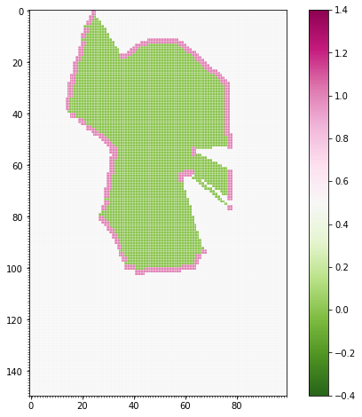

Lidar to grid map
--------------------

.. image:: https://github.com/AtsushiSakai/PythonRoboticsGifs/raw/master/Mapping/lidar_to_grid_map/animation.gif

This simple tutorial shows how to read LIDAR (range) measurements from a
file and convert it to occupancy grid.

Occupancy grid maps (*Hans Moravec, A.E. Elfes: High resolution maps
from wide angle sonar, Proc. IEEE Int. Conf. Robotics Autom. (1985)*)
are a popular, probabilistic approach to represent the environment. The
grid is basically discrete representation of the environment, which
shows if a grid cell is occupied or not. Here the map is represented as
a ``numpy array``, and numbers close to 1 means the cell is occupied
(*marked with red on the next image*), numbers close to 0 means they are
free (*marked with green*). The grid has the ability to represent
unknown (unobserved) areas, which are close to 0.5.

In order to construct the grid map from the measurement we need to
discretise the values. But, first let’s need to ``import`` some
necessary packages.

.. code:: ipython3

    import math
    import numpy as np
    import matplotlib.pyplot as plt
    from math import cos, sin, radians, pi

The measurement file contains the distances and the corresponding angles
in a ``csv`` (comma separated values) format. Let’s write the
``file_read`` method:

.. code:: ipython3

    def file_read(f):
        """
        Reading LIDAR laser beams (angles and corresponding distance data)
        """
        measures = [line.split(",") for line in open(f)]
        angles = []
        distances = []
        for measure in measures:
            angles.append(float(measure[0]))
            distances.append(float(measure[1]))
        angles = np.array(angles)
        distances = np.array(distances)
        return angles, distances

From the distances and the angles it is easy to determine the ``x`` and
``y`` coordinates with ``sin`` and ``cos``. In order to display it
``matplotlib.pyplot`` (``plt``) is used.

.. code:: ipython3

    ang, dist = file_read("lidar01.csv")
    ox = np.sin(ang) * dist
    oy = np.cos(ang) * dist
    plt.figure(figsize=(6,10))
    plt.plot([oy, np.zeros(np.size(oy))], [ox, np.zeros(np.size(oy))], "ro-") # lines from 0,0 to the 
    plt.axis("equal")
    bottom, top = plt.ylim()  # return the current ylim
    plt.ylim((top, bottom)) # rescale y axis, to match the grid orientation
    plt.grid(True)
    plt.show()

The ``lidar_to_grid_map.py`` contains handy functions which can used to
convert a 2D range measurement to a grid map. For example the
``bresenham`` gives the a straight line between two points in a grid
map. Let’s see how this works.

.. code:: ipython3

    import lidar_to_grid_map as lg
    map1 = np.ones((50, 50)) * 0.5
    line = lg.bresenham((2, 2), (40, 30))
    for l in line:
        map1[l[0]][l[1]] = 1
    plt.imshow(map1)
    plt.colorbar()
    plt.show()

.. code:: ipython3

    line = lg.bresenham((2, 30), (40, 30))
    for l in line:
        map1[l[0]][l[1]] = 1
    line = lg.bresenham((2, 30), (2, 2))
    for l in line:
        map1[l[0]][l[1]] = 1
    plt.imshow(map1)
    plt.colorbar()
    plt.show()

.. image:: lidar_to_grid_map_tutorial_8_0.png

To fill empty areas, a queue-based algorithm can be used that can be
used on an initialized occupancy map. The center point is given: the
algorithm checks for neighbour elements in each iteration, and stops
expansion on obstacles and free boundaries.

.. code:: ipython3

    from collections import deque
    def flood_fill(cpoint, pmap):
        """
        cpoint: starting point (x,y) of fill
        pmap: occupancy map generated from Bresenham ray-tracing
        """
        # Fill empty areas with queue method
        sx, sy = pmap.shape
        fringe = deque()
        fringe.appendleft(cpoint)
        while fringe:
            n = fringe.pop()
            nx, ny = n
            # West
            if nx > 0:
                if pmap[nx - 1, ny] == 0.5:
                    pmap[nx - 1, ny] = 0.0
                    fringe.appendleft((nx - 1, ny))
            # East
            if nx < sx - 1:
                if pmap[nx + 1, ny] == 0.5:
                    pmap[nx + 1, ny] = 0.0
                    fringe.appendleft((nx + 1, ny))
            # North
            if ny > 0:
                if pmap[nx, ny - 1] == 0.5:
                    pmap[nx, ny - 1] = 0.0
                    fringe.appendleft((nx, ny - 1))
            # South
            if ny < sy - 1:
                if pmap[nx, ny + 1] == 0.5:
                    pmap[nx, ny + 1] = 0.0
                    fringe.appendleft((nx, ny + 1))

This algotihm will fill the area bounded by the yellow lines starting
from a center point (e.g. (10, 20)) with zeros:

.. code:: ipython3

    flood_fill((10, 20), map1)
    map_float = np.array(map1)/10.0
    plt.imshow(map1)
    plt.colorbar()
    plt.show()

Let’s use this flood fill on real data:

.. code:: ipython3

    xyreso = 0.02  # x-y grid resolution
    yawreso = math.radians(3.1)  # yaw angle resolution [rad]
    ang, dist = file_read("lidar01.csv")
    ox = np.sin(ang) * dist
    oy = np.cos(ang) * dist
    pmap, minx, maxx, miny, maxy, xyreso = lg.generate_ray_casting_grid_map(ox, oy, xyreso, False)
    xyres = np.array(pmap).shape
    plt.figure(figsize=(20,8))
    plt.subplot(122)
    plt.imshow(pmap, cmap = "PiYG_r") 
    plt.clim(-0.4, 1.4)
    plt.gca().set_xticks(np.arange(-.5, xyres[1], 1), minor = True)
    plt.gca().set_yticks(np.arange(-.5, xyres[0], 1), minor = True)
    plt.grid(True, which="minor", color="w", linewidth = .6, alpha = 0.5)
    plt.colorbar()
    plt.show()

.. parsed-literal::

    The grid map is  150 x 100 .

