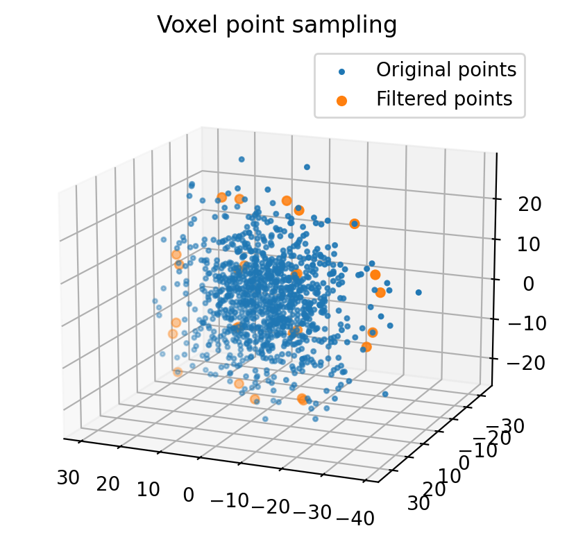

.. _point_cloud_sampling:

Point cloud Sampling
----------------------

This sections explains point cloud sampling algorithms in PythonRobotics.

Point clouds are two-dimensional and three-dimensional based data
acquired by external sensors like LIDAR, cameras, etc.
In general, Point Cloud data is very large in number of data.
So, if you process all the data, computation time might become an issue.

Point cloud sampling is a technique for solving this computational complexity
issue by extracting only representative point data and thinning the point
cloud data without compromising the performance of processing using the point
cloud data.

Voxel Point Sampling
~~~~~~~~~~~~~~~~~~~~~~~~

Voxel grid sampling is a method of reducing point cloud data by using the
`Voxel grids <https://en.wikipedia.org/wiki/Voxel>`_ which is regular grids
in three-dimensional space.

This method determines which each point is in a grid, and replaces the point
clouds that are in the same Voxel with their average to reduce the number of
points.

API
=====

.. autofunction:: Mapping.point_cloud_sampling.point_cloud_sampling.voxel_point_sampling

Farthest Point Sampling
~~~~~~~~~~~~~~~~~~~~~~~~~
.. figure:: farthest_point_sampling.png

Farthest Point Sampling is a point cloud sampling method by a specified
number of points so that the distance between points is as far from as
possible.

This method is useful for machine learning and other situations where
you want to obtain a specified number of points from point cloud.

API
=====

.. autofunction:: Mapping.point_cloud_sampling.point_cloud_sampling.farthest_point_sampling

Poisson Disk Sampling
~~~~~~~~~~~~~~~~~~~~~~~~~
.. figure:: poisson_disk_sampling.png

Poisson disk sample is a point cloud sampling method by a specified
number of points so that the algorithm selects points where the distance
from selected points is greater than a certain distance.

Although this method does not have good performance comparing the Farthest
distance sample where each point is distributed farther from each other,
this is suitable for real-time processing because of its fast computation time.

API
=====

.. autofunction:: Mapping.point_cloud_sampling.point_cloud_sampling.poisson_disk_sampling

