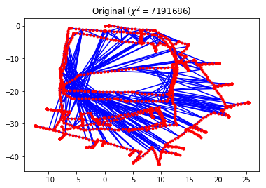
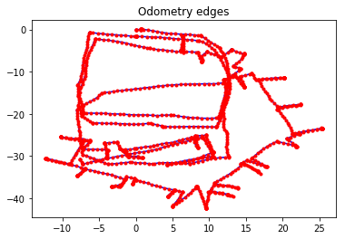
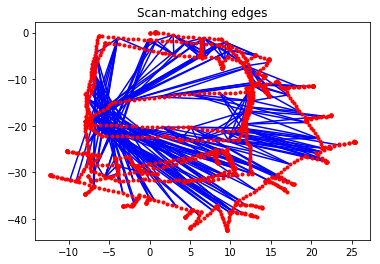
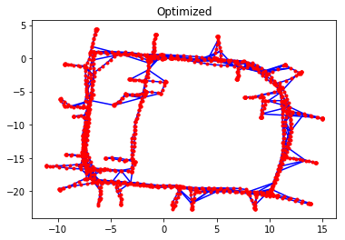
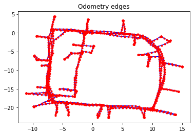
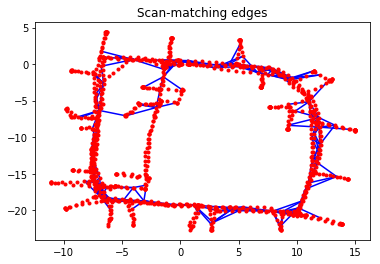

Graph SLAM for a real-world SE(2) dataset
~~~~~~~~~~~~~~~~~~~~~~~~~~~~~~~~~~~~~~~~~

.. code:: ipython3

    from graphslam.graph import Graph
    from graphslam.load import load_g2o_se2

Introduction
^^^^^^^^^^^^

For a complete derivation of the Graph SLAM algorithm, please see
`Graph SLAM Formulation`_.

This notebook illustrates the iterative optimization of a real-world
:math:`SE(2)` dataset. The code can be found in the ``graphslam``
folder. For simplicity, numerical differentiation is used in lieu of
analytic Jacobians. This code originated from the
`python-graphslam <https://github.com/JeffLIrion/python-graphslam>`__
repo, which is a full-featured Graph SLAM solver. The dataset in this
example is used with permission from Luca Carlone and was downloaded
from his `website <https://lucacarlone.mit.edu/datasets/>`__.

The Dataset
^^^^^^^^^^^^

.. code:: ipython3

    g = load_g2o_se2("data/input_INTEL.g2o")
    
    print("Number of edges:    {}".format(len(g._edges)))
    print("Number of vertices: {}".format(len(g._vertices)))

.. parsed-literal::

    Number of edges:    1483
    Number of vertices: 1228

.. code:: ipython3

    g.plot(title=r"Original ($\chi^2 = {:.0f}$)".format(g.calc_chi2()))

Each edge in this dataset is a constraint that compares the measured
:math:`SE(2)` transformation between two poses to the expected
:math:`SE(2)` transformation between them, as computed using the current
pose estimates. These edges can be classified into two categories:

1. Odometry edges constrain two consecutive vertices, and the
   measurement for the :math:`SE(2)` transformation comes directly from
   odometry data.
2. Scan-matching edges constrain two non-consecutive vertices. These
   scan matches can be computed using, for example, 2-D LiDAR data or
   landmarks; the details of how these constraints are determined is
   beyond the scope of this example. This is often referred to as *loop
   closure* in the Graph SLAM literature.

We can easily parse out the two different types of edges present in this
dataset and plot them.

.. code:: ipython3

    def parse_edges(g):
        """Split the graph `g` into two graphs, one with only odometry edges and the other with only scan-matching edges.
    
        Parameters
        ----------
        g : graphslam.graph.Graph
            The input graph
    
        Returns
        -------
        g_odom : graphslam.graph.Graph
            A graph consisting of the vertices and odometry edges from `g`
        g_scan : graphslam.graph.Graph
            A graph consisting of the vertices and scan-matching edges from `g`
    
        """
        edges_odom = []
        edges_scan = []
        
        for e in g._edges:
            if abs(e.vertex_ids[1] - e.vertex_ids[0]) == 1:
                edges_odom.append(e)
            else:
                edges_scan.append(e)
    
        g_odom = Graph(edges_odom, g._vertices)
        g_scan = Graph(edges_scan, g._vertices)
    
        return g_odom, g_scan

.. code:: ipython3

    g_odom, g_scan = parse_edges(g)
    
    print("Number of odometry edges:      {:4d}".format(len(g_odom._edges)))
    print("Number of scan-matching edges: {:4d}".format(len(g_scan._edges)))
    
    print("\nχ^2 error from odometry edges:       {:11.3f}".format(g_odom.calc_chi2()))
    print("χ^2 error from scan-matching edges:  {:11.3f}".format(g_scan.calc_chi2()))

.. parsed-literal::

    Number of odometry edges:      1227
    Number of scan-matching edges:  256
    
    χ^2 error from odometry edges:             0.232
    χ^2 error from scan-matching edges:  7191686.151

.. code:: ipython3

    g_odom.plot(title="Odometry edges")

.. code:: ipython3

    g_scan.plot(title="Scan-matching edges")

Optimization
^^^^^^^^^^^^

Initially, the pose estimates are consistent with the collected odometry
measurements, and the odometry edges contribute almost zero towards the
:math:`\chi^2` error. However, there are large discrepancies between the
scan-matching constraints and the initial pose estimates. This is not
surprising, since small errors in odometry readings that are propagated
over time can lead to large errors in the robot’s trajectory. What makes
Graph SLAM effective is that it allows incorporation of multiple
different data sources into a single optimization problem.

.. code:: ipython3

    g.optimize()

.. parsed-literal::

    
    Iteration                chi^2        rel. change
    ---------                -----        -----------
            0         7191686.3825
            1       320031728.8624          43.500234
            2       125083004.3299          -0.609154
            3          338155.9074          -0.997297
            4             735.1344          -0.997826
            5             215.8405          -0.706393
            6             215.8405          -0.000000

.. image:: https://github.com/AtsushiSakai/PythonRoboticsGifs/raw/master/SLAM/GraphBasedSLAM/Graph_SLAM_optimization.gif

.. code:: ipython3

    g.plot(title="Optimized")

.. code:: ipython3

    print("\nχ^2 error from odometry edges:       {:7.3f}".format(g_odom.calc_chi2()))
    print("χ^2 error from scan-matching edges:  {:7.3f}".format(g_scan.calc_chi2()))

.. parsed-literal::

    
    χ^2 error from odometry edges:       142.189
    χ^2 error from scan-matching edges:   73.652

.. code:: ipython3

    g_odom.plot(title="Odometry edges")

.. code:: ipython3

    g_scan.plot(title="Scan-matching edges")

