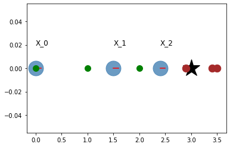
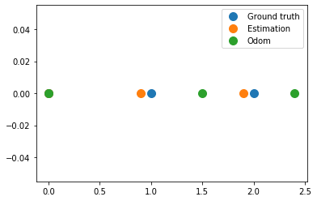
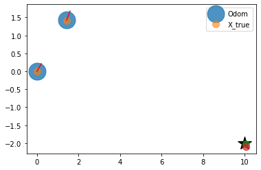
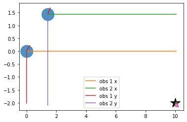
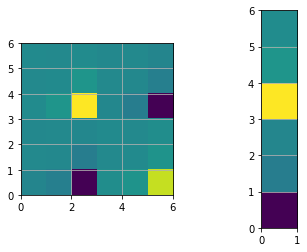

Graph SLAM
~~~~~~~~~~~~

.. code:: ipython3

    import copy
    import math
    import itertools
    import numpy as np 
    import matplotlib.pyplot as plt
    from graph_based_slam import calc_rotational_matrix, calc_jacobian, cal_observation_sigma, \
                                 calc_input, observation, motion_model, Edge, pi_2_pi
    
    %matplotlib inline
    np.set_printoptions(precision=3, suppress=True)
    np.random.seed(0)

Introduction
^^^^^^^^^^^^

In contrast to the probabilistic approaches for solving SLAM, such as
EKF, UKF, particle filters, and so on, the graph technique formulates
the SLAM as an optimization problem. It is mostly used to solve the full
SLAM problem in an offline fashion, i.e. optimize all the poses of the
robot after the path has been traversed. However, some variants are
available that uses graph-based approaches to perform online estimation
or to solve for a subset of the poses.

GraphSLAM uses the motion information as well as the observations of the
environment to create least square problem that can be solved using
standard optimization techniques.

Minimal Example
^^^^^^^^^^^^^^^

The following example illustrates the main idea behind graphSLAM. A
simple case of a 1D robot is considered that can only move in 1
direction. The robot is commanded to move forward with a control input
:math:`u_t=1`, however, the motion is not perfect and the measured
odometry will deviate from the true path. At each time step the robot can
observe its environment, for this simple case as well, there is only a
single landmark at coordinates :math:`x=3`. The measured observations
are the range between the robot and landmark. These measurements are
also subjected to noise. No bearing information is required since this
is a 1D problem.

To solve this, graphSLAM creates what is called as the system
information matrix :math:`\Omega` also referred to as :math:`H` and the
information vector :math:`\xi` also known as :math:`b`. The entries are
created based on the information of the motion and the observation.

.. code:: ipython3

    R = 0.2
    Q = 0.2
    N = 3
    graphics_radius = 0.1
    
    odom = np.empty((N,1))
    obs = np.empty((N,1))
    x_true = np.empty((N,1))
    
    landmark = 3
    # Simulated readings of odometry and observations
    x_true[0], odom[0], obs[0] = 0.0, 0.0, 2.9
    x_true[1], odom[1], obs[1] = 1.0, 1.5, 2.0
    x_true[2], odom[2], obs[2] = 2.0, 2.4, 1.0
    
    hxDR = copy.deepcopy(odom)
    # Visualization
    plt.plot(landmark,0, '*k', markersize=30)
    for i in range(N):
        plt.plot(odom[i], 0, '.', markersize=50, alpha=0.8, color='steelblue')
        plt.plot([odom[i], odom[i] + graphics_radius],
                 [0,0], 'r')
        plt.text(odom[i], 0.02, "X_{}".format(i), fontsize=12)
        plt.plot(obs[i]+odom[i],0,'.', markersize=25, color='brown')
        plt.plot(x_true[i],0,'.g', markersize=20)
    plt.grid()    
    plt.show()
    
    
    # Defined as a function to facilitate iteration
    def get_H_b(odom, obs):
        """
        Create the information matrix and information vector. This implementation is 
        based on the concept of virtual measurement i.e. the observations of the
        landmarks are converted into constraints (edges) between the nodes that
        have observed this landmark.
        """
        measure_constraints = {}
        omegas = {}
        zids = list(itertools.combinations(range(N),2))
        H = np.zeros((N,N))
        b = np.zeros((N,1))
        for (t1, t2) in zids:
            x1 = odom[t1]
            x2 = odom[t2]
            z1 = obs[t1]
            z2 = obs[t2]
            
            # Adding virtual measurement constraint
            measure_constraints[(t1,t2)] = (x2-x1-z1+z2)
            omegas[(t1,t2)] = (1 / (2*Q))
            
            # populate system's information matrix and vector
            H[t1,t1] += omegas[(t1,t2)]
            H[t2,t2] += omegas[(t1,t2)]
            H[t2,t1] -= omegas[(t1,t2)]
            H[t1,t2] -= omegas[(t1,t2)]
    
            b[t1] += omegas[(t1,t2)] * measure_constraints[(t1,t2)]
            b[t2] -= omegas[(t1,t2)] * measure_constraints[(t1,t2)]
    
        return H, b
    
    
    H, b = get_H_b(odom, obs)
    print("The determinant of H: ", np.linalg.det(H))
    H[0,0] += 1 # np.inf ?
    print("The determinant of H after anchoring constraint: ", np.linalg.det(H))
    
    for i in range(5):
        H, b = get_H_b(odom, obs)
        H[(0,0)] += 1
        
        # Recover the posterior over the path
        dx = np.linalg.inv(H) @ b
        odom += dx
        # repeat till convergence
    print("Running graphSLAM ...")    
    print("Odometry values after optimzation: \n", odom)
    
    plt.figure()
    plt.plot(x_true, np.zeros(x_true.shape), '.', markersize=20, label='Ground truth')
    plt.plot(odom, np.zeros(x_true.shape), '.', markersize=20, label='Estimation')
    plt.plot(hxDR, np.zeros(x_true.shape), '.', markersize=20, label='Odom')
    plt.legend()
    plt.grid()
    plt.show()

.. parsed-literal::

    The determinant of H:  0.0
    The determinant of H after anchoring constraint:  18.750000000000007
    Running graphSLAM ...
    Odometry values after optimzation: 
     [[-0. ]
     [ 0.9]
     [ 1.9]]

In particular, the tasks are split into 2 parts, graph construction, and
graph optimization. ### Graph Construction

Firstly the nodes are defined
:math:`\boldsymbol{x} = \boldsymbol{x}_{1:n}` such that each node is the
pose of the robot at time :math:`t_i` Secondly, the edges i.e. the
constraints, are constructed according to the following conditions:

-  robot moves from :math:`\boldsymbol{x}_i` to
   :math:`\boldsymbol{x}_j`. This edge corresponds to the odometry
   measurement. Relative motion constraints (Not included in the
   previous minimal example).
-  Measurement constraints, this can be done in two ways:

   -  The information matrix is set in such a way that it includes the
      landmarks in the map as well. Then the constraints can be entered
      in a straightforward fashion between a node
      :math:`\boldsymbol{x}_i` and some landmark :math:`m_k`
   -  Through creating a virtual measurement among all the node that
      have observed the same landmark. More concretely, robot observes
      the same landmark from :math:`\boldsymbol{x}_i` and
      :math:`\boldsymbol{x}_j`. Relative measurement constraint. The
      “virtual measurement” :math:`\boldsymbol{z}_{ij}`, which is the
      estimated pose of :math:`\boldsymbol{x}_j` as seen from the node
      :math:`\boldsymbol{x}_i`. The virtual measurement can then be
      entered in the information matrix and vector in a similar fashion
      to the motion constraints.

An edge is fully characterized by the values of the error (entry to
information vector) and the local information matrix (entry to the
system’s information vector). The larger the local information matrix
(lower :math:`Q` or :math:`R`) the values that this edge will contribute
with.

Important Notes:

-  The addition to the information matrix and vector are added to the
   earlier values.
-  In the case of 2D robot, the constraints will be non-linear,
   therefore, a Jacobian of the error w.r.t the states is needed when
   updated :math:`H` and :math:`b`.
-  The anchoring constraint is needed in order to avoid having a
   singular information matri.

Graph Optimization
^^^^^^^^^^^^^^^^^^

The result from this formulation yields an overdetermined system of
equations. The goal after constructing the graph is to find:
:math:`x^*=\underset{x}{\mathrm{argmin}}~\underset{ij}\Sigma~f(e_{ij})`,
where :math:`f` is some error function that depends on the edges between
to related nodes :math:`i` and :math:`j`. The derivation in the references
arrive at the solution for :math:`x^* = H^{-1}b`

Planar Example:
^^^^^^^^^^^^^^^

Now we will go through an example with a more realistic case of a 2D
robot with 3DoF, namely, :math:`[x, y, \theta]^T`

.. code:: ipython3

    #  Simulation parameter
    Qsim = np.diag([0.01, np.deg2rad(0.010)])**2 # error added to range and bearing
    Rsim = np.diag([0.1, np.deg2rad(1.0)])**2 # error added to [v, w]
    
    DT = 2.0  # time tick [s]
    SIM_TIME = 100.0  # simulation time [s]
    MAX_RANGE = 30.0  # maximum observation range
    STATE_SIZE = 3  # State size [x,y,yaw]
    
    # TODO: Why not use Qsim ? 
    # Covariance parameter of Graph Based SLAM
    C_SIGMA1 = 0.1
    C_SIGMA2 = 0.1
    C_SIGMA3 = np.deg2rad(1.0)
    
    MAX_ITR = 20  # Maximum iteration during optimization
    timesteps = 1
    
    # consider only 2 landmarks for simplicity
    # RFID positions [x, y, yaw]
    RFID = np.array([[10.0, -2.0, 0.0],
    #                  [15.0, 10.0, 0.0],
    #                  [3.0, 15.0, 0.0],
    #                  [-5.0, 20.0, 0.0],
    #                  [-5.0, 5.0, 0.0]
                     ])
    
    # State Vector [x y yaw v]'
    xTrue = np.zeros((STATE_SIZE, 1))
    xDR = np.zeros((STATE_SIZE, 1))  # Dead reckoning
    xTrue[2] = np.deg2rad(45)
    xDR[2] = np.deg2rad(45)
    # history initial values
    hxTrue = xTrue
    hxDR = xTrue
    _, z, _, _ = observation(xTrue, xDR, np.array([[0,0]]).T, RFID)
    hz = [z]
    
    for i in range(timesteps):
        u = calc_input()
        xTrue, z, xDR, ud = observation(xTrue, xDR, u, RFID)
        hxDR = np.hstack((hxDR, xDR))
        hxTrue = np.hstack((hxTrue, xTrue))
        hz.append(z)
    
    # visualize
    graphics_radius = 0.3
    plt.plot(RFID[:, 0], RFID[:, 1], "*k", markersize=20)
    plt.plot(hxDR[0, :], hxDR[1, :], '.', markersize=50, alpha=0.8, label='Odom')
    plt.plot(hxTrue[0, :], hxTrue[1, :], '.', markersize=20, alpha=0.6, label='X_true')
    
    for i in range(hxDR.shape[1]):
        x = hxDR[0, i]
        y = hxDR[1, i]
        yaw = hxDR[2, i]
        plt.plot([x, x + graphics_radius * np.cos(yaw)],
                 [y, y + graphics_radius * np.sin(yaw)], 'r')
        d = hz[i][:, 0]
        angle = hz[i][:, 1]
        plt.plot([x + d * np.cos(angle + yaw)], [y + d * np.sin(angle + yaw)], '.',
                 markersize=20, alpha=0.7)
        plt.legend()
    plt.grid()    
    plt.show()

.. code:: ipython3

    # Copy the data to have a consistent naming with the .py file
    zlist = copy.deepcopy(hz)
    x_opt = copy.deepcopy(hxDR)
    xlist = copy.deepcopy(hxDR)
    number_of_nodes = x_opt.shape[1]
    n = number_of_nodes * STATE_SIZE

After the data has been saved, the graph will be constructed by looking
at each pair for nodes. The virtual measurement is only created if two
nodes have observed the same landmark at different points in time. The
next cells are a walk through for a single iteration of graph
construction -> optimization -> estimate update.

.. code:: ipython3

    # get all the possible combination of the different node
    zids = list(itertools.combinations(range(len(zlist)), 2))
    print("Node combinations: \n", zids)
    
    for i in range(xlist.shape[1]):
        print("Node {} observed landmark with ID {}".format(i, zlist[i][0, 3]))

.. parsed-literal::

    Node combinations: 
     [(0, 1)]
    Node 0 observed landmark with ID 0.0
    Node 1 observed landmark with ID 0.0

In the following code snippet the error based on the virtual measurement
between node 0 and 1 will be created. The equations for the error is as follows:
:math:`e_{ij}^x = x_j + d_j cos(\psi_j +\theta_j) - x_i - d_i cos(\psi_i + \theta_i)`

:math:`e_{ij}^y = y_j + d_j sin(\psi_j + \theta_j) - y_i - d_i sin(\psi_i + \theta_i)`

:math:`e_{ij}^x = \psi_j + \theta_j - \psi_i - \theta_i`

Where :math:`[x_i, y_i, \psi_i]` is the pose for node :math:`i` and
similarly for node :math:`j`, :math:`d` is the measured distance at
nodes :math:`i` and :math:`j`, and :math:`\theta` is the measured
bearing to the landmark. The difference is visualized with the figure in
the next cell.

In case of perfect motion and perfect measurement the error shall be
zero since :math:`x_j + d_j cos(\psi_j + \theta_j)` should equal
:math:`x_i + d_i cos(\psi_i + \theta_i)`

.. code:: ipython3

    # Initialize edges list
    edges = []
    
    # Go through all the different combinations
    for (t1, t2) in zids:
        x1, y1, yaw1 = xlist[0, t1], xlist[1, t1], xlist[2, t1]
        x2, y2, yaw2 = xlist[0, t2], xlist[1, t2], xlist[2, t2]
        
        # All nodes have valid observation with ID=0, therefore, no data association condition
        iz1 = 0
        iz2 = 0
        
        d1 = zlist[t1][iz1, 0]
        angle1, phi1 = zlist[t1][iz1, 1], zlist[t1][iz1, 2]
        d2 = zlist[t2][iz2, 0]
        angle2, phi2 = zlist[t2][iz2, 1], zlist[t2][iz2, 2]
        
        # find angle between observation and horizontal 
        tangle1 = pi_2_pi(yaw1 + angle1)
        tangle2 = pi_2_pi(yaw2 + angle2)
        
        # project the observations 
        tmp1 = d1 * math.cos(tangle1)
        tmp2 = d2 * math.cos(tangle2)
        tmp3 = d1 * math.sin(tangle1)
        tmp4 = d2 * math.sin(tangle2)
        
        edge = Edge()
        print(y1,y2, tmp3, tmp4)
        # calculate the error of the virtual measurement
        # node 1 as seen from node 2 throught the observations 1,2
        edge.e[0, 0] = x2 - x1 - tmp1 + tmp2
        edge.e[1, 0] = y2 - y1 - tmp3 + tmp4
        edge.e[2, 0] = pi_2_pi(yaw2 - yaw1 - tangle1 + tangle2)
    
        edge.d1, edge.d2 = d1, d2
        edge.yaw1, edge.yaw2 = yaw1, yaw2
        edge.angle1, edge.angle2 = angle1, angle2
        edge.id1, edge.id2 = t1, t2
        
        edges.append(edge)
        
        print("For nodes",(t1,t2))
        print("Added edge with errors: \n", edge.e)
        
        # Visualize measurement projections
        plt.plot(RFID[0, 0], RFID[0, 1], "*k", markersize=20)
        plt.plot([x1,x2],[y1,y2], '.', markersize=50, alpha=0.8)
        plt.plot([x1, x1 + graphics_radius * np.cos(yaw1)],
                 [y1, y1 + graphics_radius * np.sin(yaw1)], 'r')
        plt.plot([x2, x2 + graphics_radius * np.cos(yaw2)],
                 [y2, y2 + graphics_radius * np.sin(yaw2)], 'r')
        
        plt.plot([x1,x1+tmp1], [y1,y1], label="obs 1 x")
        plt.plot([x2,x2+tmp2], [y2,y2], label="obs 2 x")
        plt.plot([x1,x1], [y1,y1+tmp3], label="obs 1 y")
        plt.plot([x2,x2], [y2,y2+tmp4], label="obs 2 y")
        plt.plot(x1+tmp1, y1+tmp3, 'o')
        plt.plot(x2+tmp2, y2+tmp4, 'o')
    plt.legend()
    plt.grid()
    plt.show()

.. parsed-literal::

    0.0 1.427649841628278 -2.0126109674819155 -3.524048014922737
    For nodes (0, 1)
    Added edge with errors: 
     [[-0.02 ]
     [-0.084]
     [ 0.   ]]

Since the constraints equations derived before are non-linear,
linearization is needed before we can insert them into the information
matrix and information vector. Two jacobians

:math:`A = \frac{\partial e_{ij}}{\partial \boldsymbol{x}_i}` as
:math:`\boldsymbol{x}_i` holds the three variabls x, y, and theta.
Similarly, :math:`B = \frac{\partial e_{ij}}{\partial \boldsymbol{x}_j}`

.. code:: ipython3

    # Initialize the system information matrix and information vector
    H = np.zeros((n, n))
    b = np.zeros((n, 1))
    x_opt = copy.deepcopy(hxDR)
    
    for edge in edges:
        id1 = edge.id1 * STATE_SIZE
        id2 = edge.id2 * STATE_SIZE
        
        t1 = edge.yaw1 + edge.angle1
        A = np.array([[-1.0, 0, edge.d1 * math.sin(t1)],
                      [0, -1.0, -edge.d1 * math.cos(t1)],
                      [0, 0, -1.0]])
    
        t2 = edge.yaw2 + edge.angle2
        B = np.array([[1.0, 0, -edge.d2 * math.sin(t2)],
                      [0, 1.0, edge.d2 * math.cos(t2)],
                      [0, 0, 1.0]])
        
        # TODO: use Qsim instead of sigma
        sigma = np.diag([C_SIGMA1, C_SIGMA2, C_SIGMA3])
        Rt1 = calc_rotational_matrix(tangle1)
        Rt2 = calc_rotational_matrix(tangle2)
        edge.omega = np.linalg.inv(Rt1 @ sigma @ Rt1.T + Rt2 @ sigma @ Rt2.T)
    
        # Fill in entries in H and b
        H[id1:id1 + STATE_SIZE, id1:id1 + STATE_SIZE] += A.T @ edge.omega @ A
        H[id1:id1 + STATE_SIZE, id2:id2 + STATE_SIZE] += A.T @ edge.omega @ B
        H[id2:id2 + STATE_SIZE, id1:id1 + STATE_SIZE] += B.T @ edge.omega @ A
        H[id2:id2 + STATE_SIZE, id2:id2 + STATE_SIZE] += B.T @ edge.omega @ B
    
        b[id1:id1 + STATE_SIZE] += (A.T @ edge.omega @ edge.e)
        b[id2:id2 + STATE_SIZE] += (B.T @ edge.omega @ edge.e)
       
    
    print("The determinant of H: ", np.linalg.det(H))
    plt.figure()
    plt.subplot(1,2,1)
    plt.imshow(H, extent=[0, n, 0, n])
    plt.subplot(1,2,2)
    plt.imshow(b, extent=[0, 1, 0, n])
    plt.show()    
    
    # Fix the origin, multiply by large number gives same results but better visualization
    H[0:STATE_SIZE, 0:STATE_SIZE] += np.identity(STATE_SIZE)
    print("The determinant of H after origin constraint: ", np.linalg.det(H))    
    plt.figure()
    plt.subplot(1,2,1)
    plt.imshow(H, extent=[0, n, 0, n])
    plt.subplot(1,2,2)
    plt.imshow(b, extent=[0, 1, 0, n])
    plt.show()

.. parsed-literal::

    The determinant of H:  0.0
    The determinant of H after origin constraint:  716.1972439134893

.. image:: graphSLAM_doc_files/graphSLAM_doc_11_1.png

.. code:: ipython3

    # Find the solution (first iteration)
    dx = - np.linalg.inv(H) @ b
    for i in range(number_of_nodes):
        x_opt[0:3, i] += dx[i * 3:i * 3 + 3, 0]
    print("dx: \n",dx)
    print("ground truth: \n ",hxTrue)
    print("Odom: \n", hxDR)
    print("SLAM: \n", x_opt)
    
    # performance will improve with more iterations, nodes and landmarks.
    print("\ngraphSLAM localization error: ", np.sum((x_opt - hxTrue) ** 2))
    print("Odom localization error: ", np.sum((hxDR - hxTrue) ** 2))

.. parsed-literal::

    dx: 
     [[-0.   ]
     [-0.   ]
     [ 0.   ]
     [ 0.02 ]
     [ 0.084]
     [-0.   ]]
    ground truth: 
      [[0.    1.414]
     [0.    1.414]
     [0.785 0.985]]
    Odom: 
     [[0.    1.428]
     [0.    1.428]
     [0.785 0.976]]
    SLAM: 
     [[-0.     1.448]
     [-0.     1.512]
     [ 0.785  0.976]]
    
    graphSLAM localization error:  0.010729072751057656
    Odom localization error:  0.0004460978857535104

The references:
^^^^^^^^^^^^^^^

-  `The GraphSLAM Algorithm with Applications to Large-Scale Mapping of Urban Structures <http://robots.stanford.edu/papers/thrun.graphslam.pdf>`_

-  `Introduction to Mobile Robotics Graph-Based SLAM <http://ais.informatik.uni-freiburg.de/teaching/ss13/robotics/slides/16-graph-slam.pdf>`_

-  `A Tutorial on Graph-Based SLAM <http://www2.informatik.uni-freiburg.de/~stachnis/pdf/grisetti10titsmag.pdf>`_

N.B. An additional step is required that uses the estimated path to
update the belief regarding the map.

