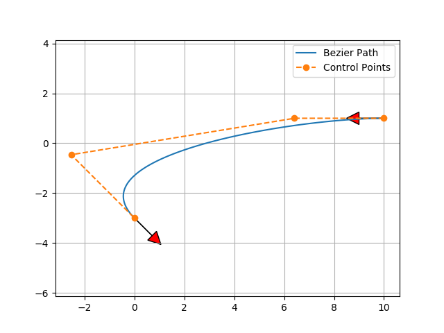

Bezier path planning
--------------------

A sample code of Bezier path planning.

It is based on 4 control points Beizer path.

If you change the offset distance from start and end point,

You can get different Beizer course:

Code Link
~~~~~~~~~~~~~~~

.. autofunction:: PathPlanning.BezierPath.bezier_path.calc_4points_bezier_path

Reference
~~~~~~~~~~~~~~~

-  `Continuous Curvature Path Generation Based on Bezier Curves for
   Autonomous
   Vehicles <https://citeseerx.ist.psu.edu/document?repid=rep1&type=pdf&doi=b00b657c3e0e828c589132a14825e7119772003d>`__
