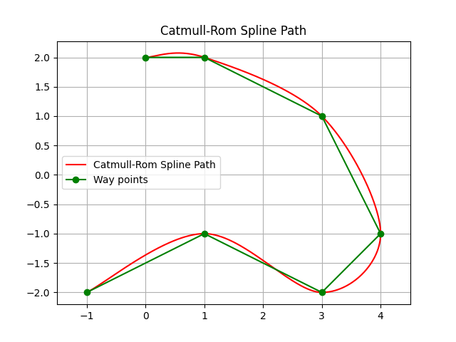
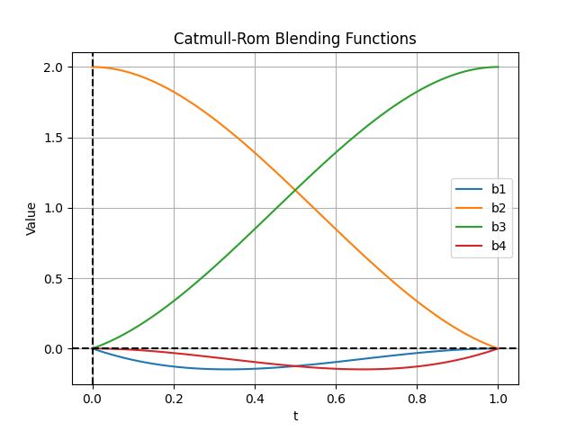

Catmull-Rom Spline Planning
----------------------------

This is a Catmull-Rom spline path planning routine.

If you provide waypoints, the Catmull-Rom spline generates a smooth path that always passes through the control points, 
exhibits local control, and maintains 𝐶1 continuity.

Catmull-Rom Spline Fundamentals
~~~~~~~~~~~~~~~~~~~~~~~~~~~~~~~~~

Catmull-Rom splines are a type of cubic spline that passes through a given set of points, known as control points. 

They are defined by the following equation for calculating a point on the spline:

:math:`P(t) = 0.5 \times \left( 2P_1 + (-P_0 + P_2)t + (2P_0 - 5P_1 + 4P_2 - P_3)t^2 + (-P_0 + 3P_1 - 3P_2 + P_3)t^3 \right)`

Where:

* :math:`P(t)` is the point on the spline at parameter :math:`t`.
* :math:`P_0, P_1, P_2, P_3` are the control points surrounding the parameter :math:`t`.

Types of Catmull-Rom Splines
~~~~~~~~~~~~~~~~~~~~~~~~~~~~~~~~~~

There are different types of Catmull-Rom splines based on the choice of the **tau** parameter, which influences how the curve 
behaves in relation to the control points:

1. **Uniform Catmull-Rom Spline**: 
   The standard implementation where the parameterization is uniform. Each segment of the spline is treated equally, 
   regardless of the distances between control points.

2. **Chordal Catmull-Rom Spline**: 
   This spline type takes into account the distance between control points. The parameterization is based on the actual distance 
   along the spline, ensuring smoother transitions. The equation can be modified to include the chord length :math:`L_i` between 
   points :math:`P_i` and :math:`P_{i+1}`:
   
   .. math::
       \tau_i = \sqrt{(x_{i+1} - x_i)^2 + (y_{i+1} - y_i)^2}

3. **Centripetal Catmull-Rom Spline**: 
   This variation improves upon the chordal spline by using the square root of the distance to determine the parameterization, 
   which avoids oscillations and creates a more natural curve. The parameter :math:`t_i` is adjusted using the following relation:
   
   .. math::
       t_i = \sqrt{(x_{i+1} - x_i)^2 + (y_{i+1} - y_i)^2}

Blending Functions
~~~~~~~~~~~~~~~~~~~~~

In Catmull-Rom spline interpolation, blending functions are used to calculate the influence of each control point on the spline at a 
given parameter :math:`t`. The blending functions ensure that the spline is smooth and passes through the control points while 
maintaining continuity. The four blending functions used in Catmull-Rom splines are defined as follows:

1. **Blending Function 1**:
   
   .. math::
       b_1(t) = -t + 2t^2 - t^3

2. **Blending Function 2**:
   
   .. math::
       b_2(t) = 2 - 5t^2 + 3t^3

3. **Blending Function 3**:
   
   .. math::
       b_3(t) = t + 4t^2 - 3t^3

4. **Blending Function 4**:
   
   .. math::
       b_4(t) = -t^2 + t^3

The blending functions are combined in the spline equation to create a smooth curve that reflects the influence of each control point.

The following figure illustrates the blending functions over the interval :math:`[0, 1]`:

Catmull-Rom Spline API
~~~~~~~~~~~~~~~~~~~~~~~

This section provides an overview of the functions used for Catmull-Rom spline path planning.

Code Link
++++++++++

.. autofunction:: PathPlanning.Catmull_RomSplinePath.catmull_rom_spline_path.catmull_rom_point

.. autofunction:: PathPlanning.Catmull_RomSplinePath.catmull_rom_spline_path.catmull_rom_spline

References
~~~~~~~~~~~~~~

-  `Catmull-Rom Spline - Wikipedia <https://en.wikipedia.org/wiki/Centripetal_Catmull%E2%80%93Rom_spline>`__
-  `Catmull-Rom Splines <http://graphics.cs.cmu.edu/nsp/course/15-462/Fall04/assts/catmullRom.pdf>`__