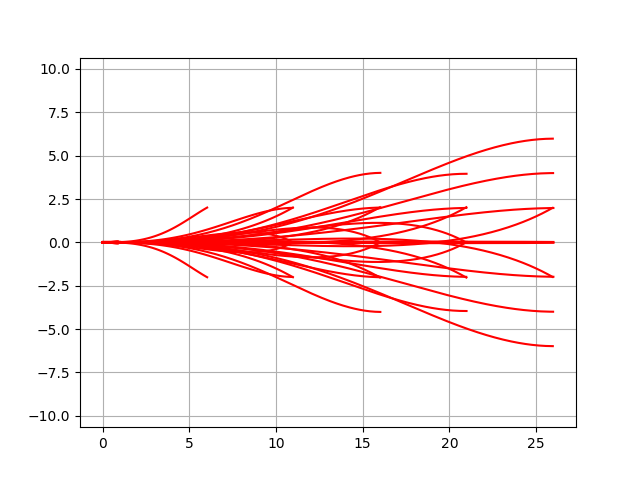

Model Predictive Trajectory Generator
-------------------------------------

This is a path optimization sample on model predictive trajectory
generator.

This algorithm is used for state lattice planner.

Code Link
~~~~~~~~~~~~~

.. autofunction:: PathPlanning.ModelPredictiveTrajectoryGenerator.trajectory_generator.optimize_trajectory

Path optimization sample
~~~~~~~~~~~~~~~~~~~~~~~~

.. image:: https://github.com/AtsushiSakai/PythonRoboticsGifs/raw/master/PathPlanning/ModelPredictiveTrajectoryGenerator/kn05animation.gif

Lookup table generation sample
~~~~~~~~~~~~~~~~~~~~~~~~~~~~~~

Reference
~~~~~~~~~~~~

-  `Optimal rough terrain trajectory generation for wheeled mobile
   robots <https://journals.sagepub.com/doi/pdf/10.1177/0278364906075328>`__
