Reeds Shepp planning
--------------------

A sample code with Reeds Shepp path planning.

.. image:: https://github.com/AtsushiSakai/PythonRoboticsGifs/raw/master/PathPlanning/ReedsSheppPath/animation.gif?raw=true

Code Link
==============

.. autofunction:: PathPlanning.ReedsSheppPath.reeds_shepp_path_planning.reeds_shepp_path_planning

Mathematical Description of Individual Path Types
=================================================
Here is an overview of mathematical derivations of formulae for individual path types.

In all the derivations below, radius of curvature of the vehicle is assumed to be of unit length and start pose is considered to be at origin.  (*In code we are removing the offset due to start position and normalising the lengths before passing the values to these functions.*)

Also, (t, u, v) respresent the measure of each motion requried. Thus, in case of a turning maneuver, they represent the angle inscribed at the centre of turning circle and in case of straight maneuver, they represent the distance to be travelled. 

1. **Left-Straight-Left**

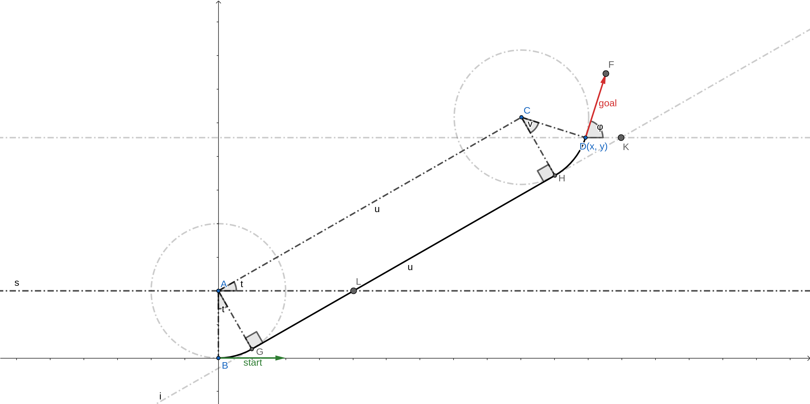

We can deduce the following facts using geometry.

- AGHC is a rectangle.
- :math:`∠LAC = ∠BAG = t`
- :math:`t + v = φ`
- :math:`C(x - sin(φ), y + cos(φ))`
- :math:`A(0, 1)`
- :math:`u, t = polar(vector<AC>)`

Hence, we have:

- :math:`u, t = polar(x - sin(φ), y + cos(φ) - 1)`
- :math:`v = φ - t`

2. **Left-Straight-Right**

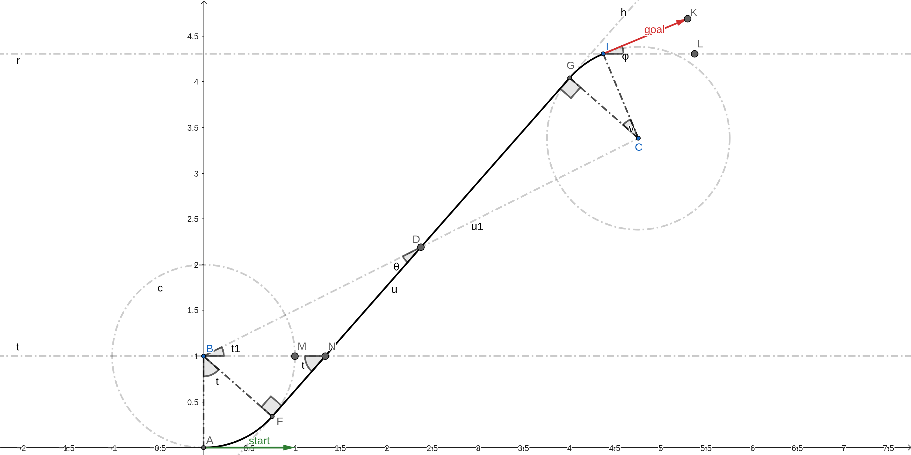

With followng notations:

- :math:`∠MBD = t1`
- :math:`∠BDF = θ`
- :math:`BC = u1`

We can deduce the following facts using geometry.

- D is mid-point of BC and FG.
- :math:`t - v = φ`
- :math:`C(x + sin(φ), y - cos(φ))`
- :math:`A(0, 1)`
- :math:`u1, t1 = polar(vector<AC>)`
- :math:`\frac{u1^2}{4} = 1 + \frac{u^2}{4}`
- :math:`BF = 1` [Radius Of Curvature]
- :math:`FD = \frac{u}{2}`
- :math:`θ = arctan(\frac{BF}{FD})`
- :math:`t1 + θ = t`

Hence, we have:

- :math:`u1, t1 = polar(x + sin(φ), y - cos(φ) - 1)`
- :math:`u = \sqrt{u1^2 - 4}`
- :math:`θ = arctan(\frac{2}{u})`
- :math:`t = t1 + θ`
- :math:`v = t - φ`

3. **LeftxRightxLeft**

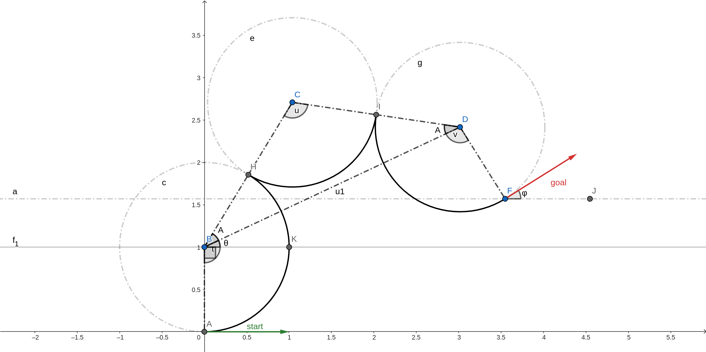

With followng notations:

- :math:`∠CBD = ∠CDB = A` [BCD is an isoceles triangle]
- :math:`∠DBK = θ`
- :math:`BD = u1`

We can deduce the following facts using geometry.

- :math:`t + u + v = φ`
- :math:`D(x - sin(φ), y + cos(φ))`
- :math:`B(0, 1)`
- :math:`u1, θ = polar(vector<BD>)`
- :math:`A = arccos(\frac{BD/2}{CD})`
- :math:`u = (π - 2*A)`
- :math:`∠ABK = \frac{π}{2}`
- :math:`∠KBD = θ`
- :math:`t = ∠ABK + ∠KBD + ∠DBC`

Hence, we have:

- :math:`u1, θ = polar(x - sin(φ), y + cos(φ) - 1)`
- :math:`A = arccos(\frac{u1/2}{2})`
- :math:`t = \frac{π}{2} + θ + A`
- :math:`u = (π - 2*A)`
- :math:`v = (φ - t - u)`

4. **LeftxRight-Left**

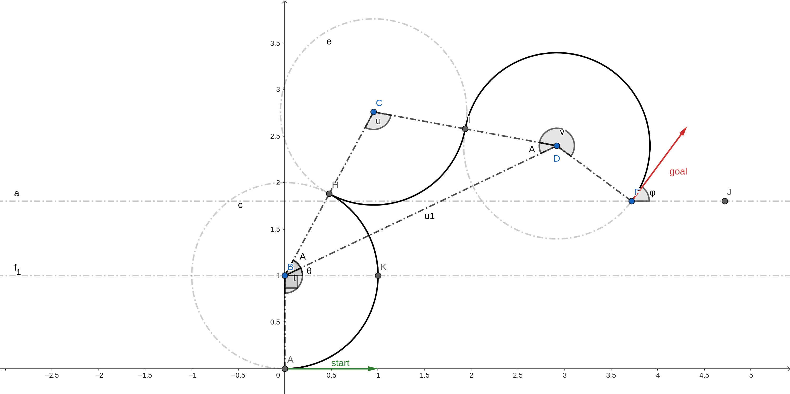

With followng notations:

- :math:`∠CBD = ∠CDB = A` [BCD is an isoceles triangle]
- :math:`∠DBK = θ`
- :math:`BD = u1`

We can deduce the following facts using geometry.

- :math:`t + u - v = φ`
- :math:`D(x - sin(φ), y + cos(φ))`
- :math:`B(0, 1)`
- :math:`u1, θ = polar(vector<BD>)`
- :math:`A = arccos(\frac{BD/2}{CD})`
- :math:`u = (π - 2*A)`
- :math:`∠ABK = \frac{π}{2}`
- :math:`∠KBD = θ`
- :math:`t = ∠ABK + ∠KBD + ∠DBC`

Hence, we have:

- :math:`u1, θ = polar(x - sin(φ), y + cos(φ) - 1)`
- :math:`A = arccos(\frac{u1/2}{2})`
- :math:`t = \frac{π}{2} + θ + A`
- :math:`u = (π - 2*A)`
- :math:`v = (-φ + t + u)`

5. **Left-RightxLeft**

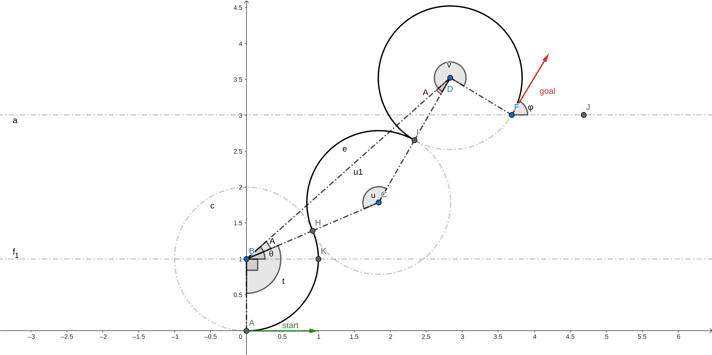

With followng notations:

- :math:`∠CBD = ∠CDB = A` [BCD is an isoceles triangle]
- :math:`∠DBK = θ`
- :math:`BD = u1`

We can deduce the following facts using geometry.

- :math:`t - u - v = φ`
- :math:`D(x - sin(φ), y + cos(φ))`
- :math:`B(0, 1)`
- :math:`u1, θ = polar(vector<BD>)`
- :math:`BC = CD = 2` [2 * radius of curvature]
- :math:`cos(2π - u) = \frac{BC^2 + CD^2 - BD^2}{2 * BC * CD}` [Cosine Rule]
- :math:`\frac{sin(A)}{BC} = \frac{sin(u)}{u1}` [Sine Rule]
- :math:`∠ABK = \frac{π}{2}`
- :math:`∠KBD = θ`
- :math:`t = ∠ABK + ∠KBD - ∠DBC`

Hence, we have:

- :math:`u1, θ = polar(x - sin(φ), y + cos(φ) - 1)`
- :math:`u = arccos(1 - \frac{u1^2}{8})`
- :math:`A = arcsin(\frac{sin(u)}{u1}*2)`
- :math:`t = \frac{π}{2} + θ - A`
- :math:`v = (t - u - φ)`

6. **Left-RightxLeft-Right**

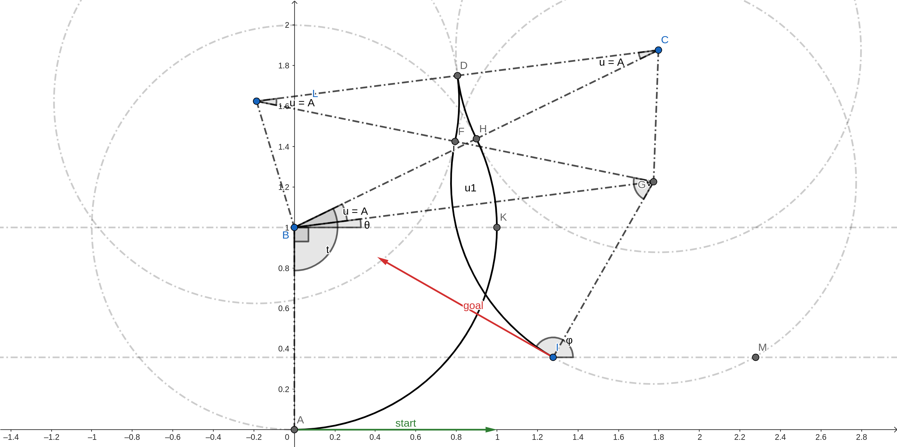

With followng notations:

- :math:`∠CLG = ∠BCL = ∠CBG = ∠LGB = A = u` [BGCL is an isoceles trapezium]
- :math:`∠KBG = θ`
- :math:`BG = u1`

We can deduce the following facts using geometry.

- :math:`t - 2u + v = φ`
- :math:`G(x + sin(φ), y - cos(φ))`
- :math:`B(0, 1)`
- :math:`u1, θ = polar(vector<BG>)`
- :math:`BC = CL = LG = 2` [2 * radius of curvature]
- :math:`CG^2 = CL^2 + LG^2 - 2*CL*LG*cos(A)` [Cosine rule in LGC]
- :math:`CG^2 = CL^2 + LG^2 - 2*CL*LG*cos(A)` [Cosine rule in LGC]
- From the previous two equations: :math:`A = arccos(\frac{u1 + 2}{4})`
- :math:`∠ABK = \frac{π}{2}`
- :math:`t = ∠ABK + ∠KBG + ∠GBC`

Hence, we have:

- :math:`u1, θ = polar(x + sin(φ), y - cos(φ) - 1)`
- :math:`u = arccos(\frac{u1 + 2}{4})`
- :math:`t = \frac{π}{2} + θ + u`
- :math:`v = (φ - t + 2u)`

7. **LeftxRight-LeftxRight**

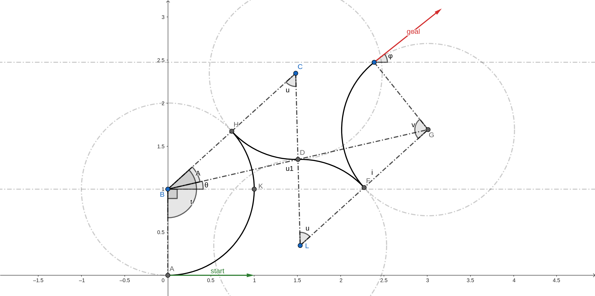

With followng notations:

- :math:`∠GBC = A` [BGCL is an isoceles trapezium]
- :math:`∠KBG = θ`
- :math:`BG = u1`

We can deduce the following facts using geometry.

- :math:`t - v = φ`
- :math:`G(x + sin(φ), y - cos(φ))`
- :math:`B(0, 1)`
- :math:`u1, θ = polar(vector<BG>)`
- :math:`BC = CL = LG = 2` [2 * radius of curvature]
- :math:`CD = 1` [radius of curvature]
- D is midpoint of BG
- :math:`BD = \frac{u1}{2}`
- :math:`cos(u) = \frac{BC^2 + CD^2 - BD^2}{2*BC*CD}` [Cosine rule in BCD]
- :math:`sin(A) = CD*\frac{sin(u)}{BD}` [Sine rule in BCD]
- :math:`∠ABK = \frac{π}{2}`
- :math:`t = ∠ABK + ∠KBG + ∠GBC`

Hence, we have:

- :math:`u1, θ = polar(x + sin(φ), y - cos(φ) - 1)`
- :math:`u = arccos(\frac{20 - u1^2}{16})`
- :math:`A = arcsin(2*\frac{sin(u)}{u1})`
- :math:`t = \frac{π}{2} + θ + A`
- :math:`v = (t - φ)`

8. **LeftxRight90-Straight-Left**

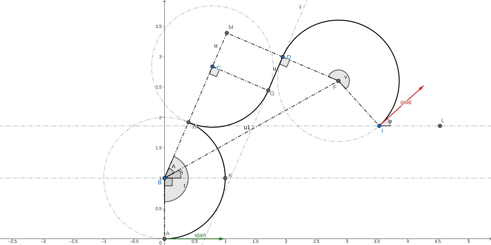

With followng notations:

- :math:`∠FBM = A` [BGCL is an isoceles trapezium]
- :math:`∠KBF = θ`
- :math:`BF = u1`

We can deduce the following facts using geometry.

- :math:`t + \frac{π}{2} - v = φ`
- :math:`F(x - sin(φ), y + cos(φ))`
- :math:`B(0, 1)`
- :math:`u1, θ = polar(vector<BF>)`
- :math:`BM = CB = 2` [2 * radius of curvature]
- :math:`MD = CD = 1` [CGDM is a rectangle]
- :math:`MC = GD = u` [CGDM is a rectangle]
- :math:`MF = MD + DF = 2`
- :math:`BM = \sqrt{BF^2 - MF^2}` [Pythagoras theorem on BFM]
- :math:`tan(A) = \frac{MF}{BM}`
- :math:`u = MC = BM - CB` 
- :math:`t = ∠ABK + ∠KBF + ∠FBC`

Hence, we have:

- :math:`u1, θ = polar(x - sin(φ), y + cos(φ) - 1)`
- :math:`u = arccos(\sqrt{u1^2 - 4} - 2)`
- :math:`A = arctan(\frac{2}{\sqrt{u1^2 - 4}})`
- :math:`t = \frac{π}{2} + θ + A`
- :math:`v = (t - φ + \frac{π}{2})`

9. **Left-Straight-Right90xLeft**

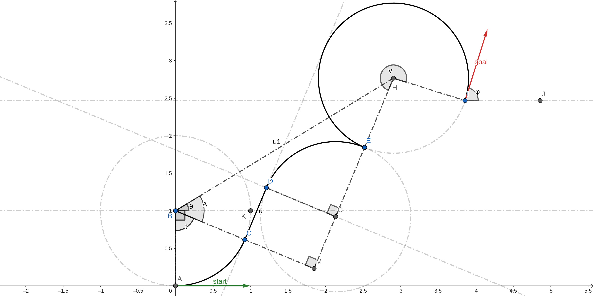

With followng notations:

- :math:`∠MBH = A` [BGCL is an isoceles trapezium]
- :math:`∠KBH = θ`
- :math:`BH = u1`

We can deduce the following facts using geometry.

- :math:`t - \frac{π}{2} - v = φ`
- :math:`H(x - sin(φ), y + cos(φ))`
- :math:`B(0, 1)`
- :math:`u1, θ = polar(vector<BH>)`
- :math:`GH = 2` [2 * radius of curvature]
- :math:`CM = DG = 1` [CGDM is a rectangle]
- :math:`CD = MG = u` [CGDM is a rectangle]
- :math:`BM = BC + CM = 2`
- :math:`MH = \sqrt{BH^2 - BM^2}` [Pythagoras theorem on BHM]
- :math:`tan(A) = \frac{HM}{BM}`
- :math:`u = MC = BM - CB` 
- :math:`t = ∠ABK + ∠KBH - ∠HBC`

Hence, we have:

- :math:`u1, θ = polar(x - sin(φ), y + cos(φ) - 1)`
- :math:`u = arccos(\sqrt{u1^2 - 4} - 2)`
- :math:`A = arctan(\frac{2}{\sqrt{u1^2 - 4}})`
- :math:`t = \frac{π}{2} + θ - A`
- :math:`v = (t - φ - \frac{π}{2})`

10. **LeftxRight90-Straight-Right**

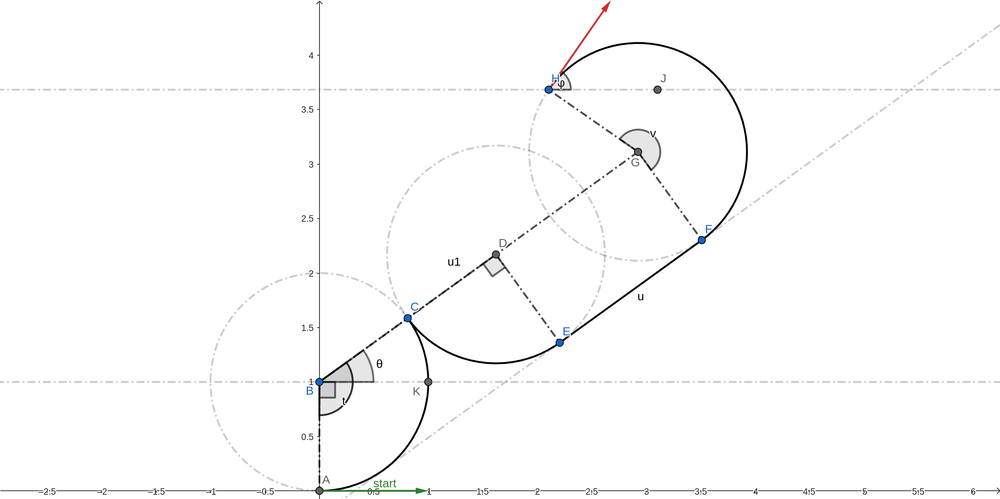

With followng notations:

- :math:`∠KBG = θ`
- :math:`BG = u1`

We can deduce the following facts using geometry.

- :math:`t - \frac{π}{2} - v = φ`
- :math:`G(x + sin(φ), y - cos(φ))`
- :math:`B(0, 1)`
- :math:`u1, θ = polar(vector<BG>)`
- :math:`BD = 2` [2 * radius of curvature]
- :math:`DG = EF = u` [DGFE is a rectangle]
- :math:`DG = BG - BD = 2`
- :math:`∠ABK = \frac{π}{2}`
- :math:`t = ∠ABK + ∠KBG`

Hence, we have:

- :math:`u1, θ = polar(x + sin(φ), y - cos(φ) - 1)`
- :math:`u = u1 - 2`
- :math:`t = \frac{π}{2} + θ`
- :math:`v = (t - φ - \frac{π}{2})`

11. **Left-Straight-Left90xRight**

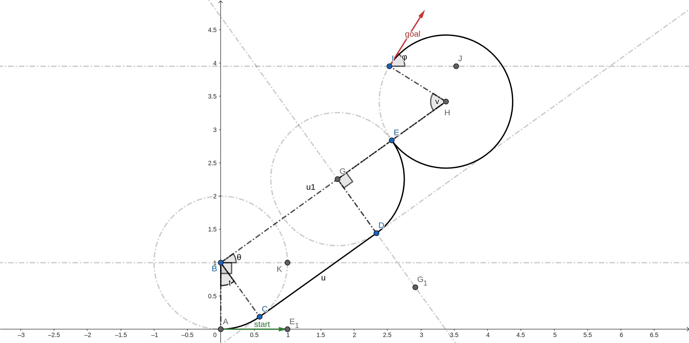

With followng notations:

- :math:`∠KBH = θ`
- :math:`BH = u1`

We can deduce the following facts using geometry.

- :math:`t + \frac{π}{2} + v = φ`
- :math:`H(x + sin(φ), y - cos(φ))`
- :math:`B(0, 1)`
- :math:`u1, θ = polar(vector<BH>)`
- :math:`GH = 2` [2 * radius of curvature]
- :math:`DC = BG = u` [DGBC is a rectangle]
- :math:`BG = BH - GH`
- :math:`∠ABC= ∠KBH`

Hence, we have:

- :math:`u1, θ = polar(x + sin(φ), y - cos(φ) - 1)`
- :math:`u = u1 - 2`
- :math:`t = θ`
- :math:`v = (φ - t - \frac{π}{2})`

12. **LeftxRight90-Straight-Left90xRight**

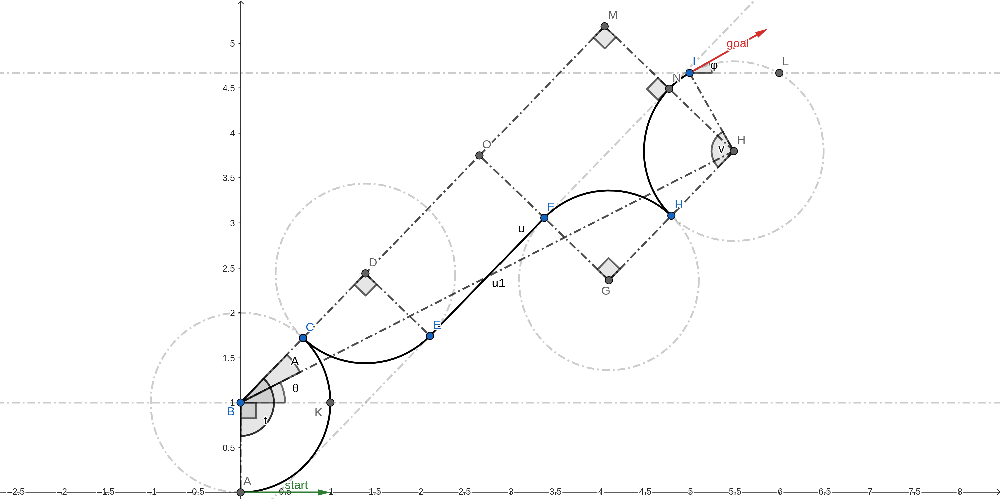

With followng notations:

- :math:`∠KBH = θ`
- :math:`∠HBM = A`
- :math:`BH = u1`

We can deduce the following facts using geometry.

- :math:`t - v = φ`
- :math:`H(x + sin(φ), y - cos(φ))`
- :math:`B(0, 1)`
- :math:`u1, θ = polar(vector<BH>)`
- :math:`GF = ED = 1` [radius of curvature]
- :math:`BD = GH = 2` [2 * radius of curvature]
- :math:`FN = GH = 2` [ENMD is a rectangle]
- :math:`NH = GF = 1` [FNHG is a rectangle]
- :math:`MN = ED = 1` [ENMD is a rectangle]
- :math:`DO = EF = u` [DOFE is a rectangle]
- :math:`MH = MN + NH = 2`
- :math:`BM = \sqrt{BH^2 - MH^2}` [Pythagoras theorem on BHM]
- :math:`DO = BM - BD - OM`
- :math:`tan(A) = \frac{MH}{BM}`
- :math:`∠ABC = ∠ABK + ∠KBH + ∠HBM`

Hence, we have:

- :math:`u1, θ = polar(x + sin(φ), y - cos(φ) - 1)`
- :math:`u = /sqrt{u1^2 - 4} - 4`
- :math:`A = arctan(\frac{2}{u1^2 - 4})`
- :math:`t = \frac{π}{2} + θ + A`
- :math:`v = (t - φ)`

Reference
=============

-  `15.3.2 Reeds-Shepp
   Curves <https://lavalle.pl/planning/node822.html>`__

-  `optimal paths for a car that goes both forwards and
   backwards <https://pdfs.semanticscholar.org/932e/c495b1d0018fd59dee12a0bf74434fac7af4.pdf>`__

-  `ghliu/pyReedsShepp: Implementation of Reeds Shepp
   curve. <https://github.com/ghliu/pyReedsShepp>`__
