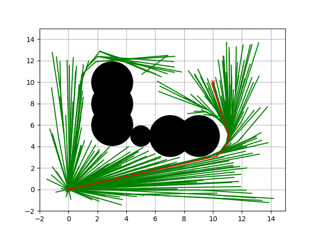

RRT\*
~~~~~

.. figure:: https://github.com/AtsushiSakai/PythonRoboticsGifs/raw/master/PathPlanning/RRTstar/animation.gif

This is a path planning code with RRT\*

Black circles are obstacles, green line is a searched tree, red crosses are start and goal positions.

Code Link
^^^^^^^^^^

.. autoclass:: PathPlanning.RRTStar.rrt_star.RRTStar

Simulation
^^^^^^^^^^

Ref
^^^
-  `Sampling-based Algorithms for Optimal Motion Planning <https://arxiv.org/pdf/1105.1186>`__
-  `Incremental Sampling-based Algorithms for Optimal Motion Planning <https://arxiv.org/abs/1005.0416>`__

