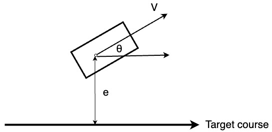
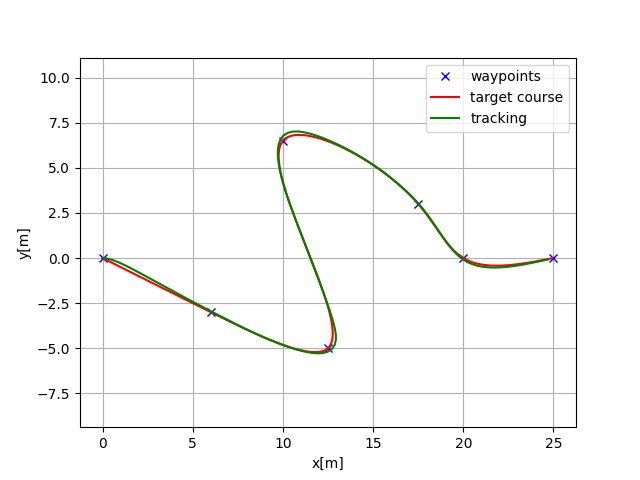
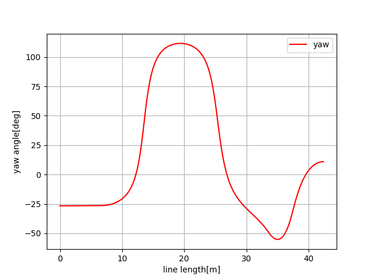
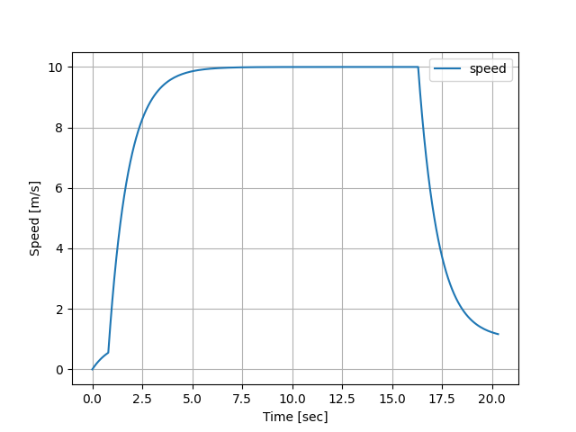

.. _linearquadratic-regulator-(lqr)-speed-and-steering-control:

Linear–quadratic regulator (LQR) speed and steering control
-----------------------------------------------------------

Path tracking simulation with LQR speed and steering control.

.. image:: https://github.com/AtsushiSakai/PythonRoboticsGifs/raw/master/PathTracking/lqr_speed_steer_control/animation.gif

Code Link
~~~~~~~~~~~~~~~

.. autofunction:: PathTracking.lqr_speed_steer_control.lqr_speed_steer_control.lqr_speed_steering_control

Overview
~~~~~~~~

The LQR (Linear Quadratic Regulator) speed and steering control model implemented in `lqr_speed_steer_control.py` provides a simulation
for an autonomous vehicle to track:

1. A desired speed by adjusting acceleration based on feedback from the current state and the desired speed.

2. A desired trajectory by adjusting steering angle based on feedback from the current state and the desired trajectory.

by only using one LQT controller.

Vehicle motion Model
~~~~~~~~~~~~~~~~~~~~~

The below figure shows the geometric model of the vehicle used in this simulation:

The `e`, :math:`{\theta}`, and :math:`\upsilon` represent the lateral error, orientation error, and velocity error, respectively, with respect to the desired trajectory and speed.
And :math:`\dot{e}` and :math:`\dot{\theta}` represent the rates of change of these errors.

The :math:`e_t` and :math:`\theta_t`, and :math:`\upsilon` are the updated values of `e`, :math:`\theta`, :math:`\upsilon` and at time `t`, respectively, and can be calculated using the following kinematic equations:

.. math:: e_t = e_{t-1} + \dot{e}_{t-1} dt

.. math:: \theta_t = \theta_{t-1} + \dot{\theta}_{t-1} dt

.. math:: \upsilon_t = \upsilon_{t-1} + a_{t-1} dt

Where `dt` is the time difference and :math:`a_t` is the acceleration at the time `t`.

The change rate of the `e` can be calculated as:

.. math:: \dot{e}_t = V \sin(\theta_{t-1})

Where `V` is the current vehicle speed.

If the :math:`\theta` is small,

.. math:: \theta \approx 0

the :math:`\sin(\theta)` can be approximated as :math:`\theta`:

.. math:: \sin(\theta) = \theta

So, the change rate of the `e` can be approximated as:

.. math:: \dot{e}_t = V \theta_{t-1}

The change rate of the :math:`\theta` can be calculated as:

.. math:: \dot{\theta}_t = \frac{V}{L} \tan(\delta)

where `L` is the wheelbase of the vehicle and :math:`\delta` is the steering angle.

If the :math:`\delta` is small,

.. math:: \delta \approx 0

the :math:`\tan(\delta)` can be approximated as :math:`\delta`:

.. math:: \tan(\delta) = \delta

So, the change rate of the :math:`\theta` can be approximated as:

.. math:: \dot{\theta}_t = \frac{V}{L} \delta

The above equations can be used to update the state of the vehicle at each time step.

Control Model
~~~~~~~~~~~~~~

To formulate the state-space representation of the vehicle dynamics as a linear model,
the state vector `x` and control input vector `u` are defined as follows:

.. math:: x_t = [e_t, \dot{e}_t, \theta_t, \dot{\theta}_t, \upsilon_t]^T

.. math:: u_t = [\delta_t, a_t]^T

The linear state transition equation can be represented as:

.. math:: x_{t+1} = A x_t + B u_t

where:

:math:`\begin{equation*} A = \begin{bmatrix} 1 & dt & 0 & 0 & 0\\ 0 & 0 & v & 0 & 0\\ 0 & 0 & 1 & dt & 0\\ 0 & 0 & 0 & 0 & 0\\ 0 & 0 & 0 & 0 & 1\\\end{bmatrix} \end{equation*}`

:math:`\begin{equation*} B = \begin{bmatrix} 0 & 0\\ 0 & 0\\ 0 & 0\\ \frac{v}{L} & 0\\ 0 & dt \\ \end{bmatrix} \end{equation*}`

LQR controller
~~~~~~~~~~~~~~~

The Linear Quadratic Regulator (LQR) controller is used to calculate the optimal control input `u` that minimizes the quadratic cost function:

:math:`J = \sum_{t=0}^{N} (x_t^T Q x_t + u_t^T R u_t)`

where `Q` and `R` are the weighting matrices for the state and control input, respectively.

for the linear model:

:math:`x_{t+1} = A x_t + B u_t`

The optimal control input `u` can be calculated as:

:math:`u_t = -K x_t`

where `K` is the feedback gain matrix obtained by solving the Riccati equation.

Simulation results
~~~~~~~~~~~~~~~~~~~

Reference
~~~~~~~~~~~

-  `Towards fully autonomous driving: Systems and algorithms <https://ieeexplore.ieee.org/document/5940562/>`__
