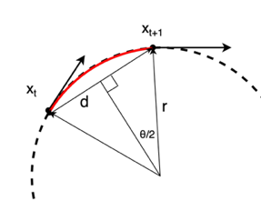

Steering Motion Model
-----------------------

Turning radius calculation
~~~~~~~~~~~~~~~~~~~~~~~~~~~~~

The Turning Radius represents the radius of the circle when the robot turns, as shown in the diagram below.

In this section, we will derive the formula for the turning radius from 2 consecutive positions of the robot trajectory.
As shown in the upper diagram above, the robot moves from a point at time :math:`t` to a point at time :math:`t+1`.
Each point is represented by a 2D position :math:`(x_t, y_t)` and an orientation :math:`\theta_t`.

The distance between the two points is :math:`d = \sqrt((x_{t+1} - x_t)^2 + (y_{t+1} - y_t)^2)`.

The angle between the two vectors from the turning center to the two points is :math:`\theta = \theta_{t+1} - \theta_t`.

References:
~~~~~~~~~~~
