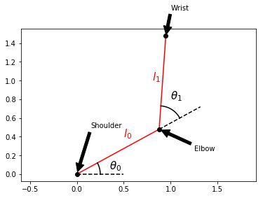
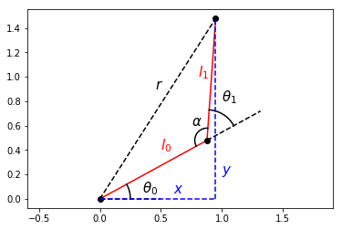
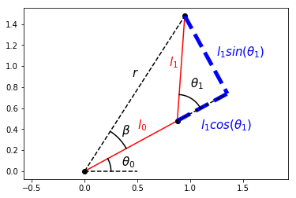
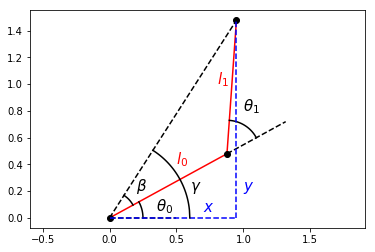

Two joint arm to point control
------------------------------

.. figure:: https://github.com/AtsushiSakai/PythonRoboticsGifs/raw/master/ArmNavigation/two_joint_arm_to_point_control/animation.gif
   :alt: TwoJointArmToPointControl

This is two joint arm to a point control simulation.

This is a interactive simulation.

You can set the goal position of the end effector with left-click on the plotting area.

Inverse Kinematics for a Planar Two-Link Robotic Arm
~~~~~~~~~~~~~~~~~~~~~~~~~~~~~~~~~~~~~~~~~~~~~~~~~~~~

A classic problem with robotic arms is getting the end-effector, the
mechanism at the end of the arm responsible for manipulating the
environment, to where you need it to be. Maybe the end-effector is a
gripper and maybe you want to pick up an object and maybe you know where
that object is relative to the robot - but you cannot tell the
end-effector where to go directly. Instead, you have to determine the
joint angles that get the end-effector to where you want it to be. This
problem is known as inverse kinematics.

Credit for this solution goes to:
https://robotacademy.net.au/lesson/inverse-kinematics-for-a-2-joint-robot-arm-using-geometry/

First, let’s define a class to make plotting our arm easier.

.. code-block:: ipython3

    %matplotlib inline
    from math import cos, sin
    import numpy as np
    import matplotlib.pyplot as plt
    
    class TwoLinkArm:
        def __init__(self, joint_angles=[0, 0]):
            self.shoulder = np.array([0, 0])
            self.link_lengths = [1, 1]
            self.update_joints(joint_angles)
            
        def update_joints(self, joint_angles):
            self.joint_angles = joint_angles
            self.forward_kinematics()
            
        def forward_kinematics(self):
            theta0 = self.joint_angles[0]
            theta1 = self.joint_angles[1]
            l0 = self.link_lengths[0]
            l1 = self.link_lengths[1]
            self.elbow = self.shoulder + np.array([l0*cos(theta0), l0*sin(theta0)])
            self.wrist = self.elbow + np.array([l1*cos(theta0 + theta1), l1*sin(theta0 + theta1)])
            
        def plot(self):
            plt.plot([self.shoulder[0], self.elbow[0]],
                     [self.shoulder[1], self.elbow[1]],
                     'r-')
            plt.plot([self.elbow[0], self.wrist[0]],
                     [self.elbow[1], self.wrist[1]],
                     'r-')
            plt.plot(self.shoulder[0], self.shoulder[1], 'ko')
            plt.plot(self.elbow[0], self.elbow[1], 'ko')
            plt.plot(self.wrist[0], self.wrist[1], 'ko')

Let’s also define a function to make it easier to draw an angle on our
diagram.

.. code-block:: ipython3

    from math import sqrt
    
    def transform_points(points, theta, origin):
        T = np.array([[cos(theta), -sin(theta), origin[0]],
                      [sin(theta), cos(theta), origin[1]],
                      [0, 0, 1]])
        return np.matmul(T, np.array(points))
    
    def draw_angle(angle, offset=0, origin=[0, 0], r=0.5, n_points=100):
            x_start = r*cos(angle)
            x_end = r
            dx = (x_end - x_start)/(n_points-1)
            coords = [[0 for _ in range(n_points)] for _ in range(3)]
            x = x_start
            for i in range(n_points-1):
                y = sqrt(r**2 - x**2)
                coords[0][i] = x
                coords[1][i] = y
                coords[2][i] = 1
                x += dx
            coords[0][-1] = r
            coords[2][-1] = 1
            coords = transform_points(coords, offset, origin)
            plt.plot(coords[0], coords[1], 'k-')

Okay, we now have a TwoLinkArm class to help us draw the arm, which
we’ll do several times during our derivation. Notice there is a method
called forward_kinematics - forward kinematics specifies the
end-effector position given the joint angles and link lengths. Forward
kinematics is easier than inverse kinematics.

.. code-block:: ipython3

    arm = TwoLinkArm()
    
    theta0 = 0.5
    theta1 = 1
    
    arm.update_joints([theta0, theta1])
    arm.plot()
    
    def label_diagram():
        plt.plot([0, 0.5], [0, 0], 'k--')
        plt.plot([arm.elbow[0], arm.elbow[0]+0.5*cos(theta0)],
                 [arm.elbow[1], arm.elbow[1]+0.5*sin(theta0)],
                 'k--')
        
        draw_angle(theta0, r=0.25)
        draw_angle(theta1, offset=theta0, origin=[arm.elbow[0], arm.elbow[1]], r=0.25)
        
        plt.annotate("$l_0$", xy=(0.5, 0.4), size=15, color="r")
        plt.annotate("$l_1$", xy=(0.8, 1), size=15, color="r")
        
        plt.annotate(r"$\theta_0$", xy=(0.35, 0.05), size=15)
        plt.annotate(r"$\theta_1$", xy=(1, 0.8), size=15)
    
    label_diagram()
    
    plt.annotate("Shoulder", xy=(arm.shoulder[0], arm.shoulder[1]), xytext=(0.15, 0.5),
        arrowprops=dict(facecolor='black', shrink=0.05))
    plt.annotate("Elbow", xy=(arm.elbow[0], arm.elbow[1]), xytext=(1.25, 0.25),
        arrowprops=dict(facecolor='black', shrink=0.05))
    plt.annotate("Wrist", xy=(arm.wrist[0], arm.wrist[1]), xytext=(1, 1.75),
        arrowprops=dict(facecolor='black', shrink=0.05))
    
    plt.axis("equal")
    
    plt.show()

It’s common to name arm joints anatomically, hence the names shoulder,
elbow, and wrist. In this example, the wrist is not itself a joint, but
we can consider it to be our end-effector. If we constrain the shoulder
to the origin, we can write the forward kinematics for the elbow and the
wrist.

| :math:`elbow_x = l_0\cos(\theta_0)`
| :math:`elbow_y = l_0\sin(\theta_0)`

| :math:`wrist_x = elbow_x + l_1\cos(\theta_0+\theta_1) = l_0\cos(\theta_0) + l_1\cos(\theta_0+\theta_1)`
| :math:`wrist_y = elbow_y + l_1\sin(\theta_0+\theta_1) = l_0\sin(\theta_0) + l_1\sin(\theta_0+\theta_1)`

Since the wrist is our end-effector, let’s just call its coordinates
\ :math:`x`\  and \ :math:`y`\ . The forward kinematics for our
end-effector is then

| :math:`x = l_0\cos(\theta_0) + l_1\cos(\theta_0+\theta_1)`
| :math:`y = l_0\sin(\theta_0) + l_1\sin(\theta_0+\theta_1)`

A first attempt to find the joint angles :math:`\theta_0` and
:math:`\theta_1` that would get our end-effector to the desired
coordinates :math:`x` and :math:`y` might be to try solving the forward
kinematics for :math:`\theta_0` and :math:`\theta_1`, but that would be
the wrong move. An easier path involves going back to the geometry of
the arm.

.. code-block:: ipython3

    from math import pi
    
    arm.plot()
    label_diagram()
    
    plt.plot([0, arm.wrist[0]],
             [0, arm.wrist[1]],
             'k--')
    
    plt.plot([arm.wrist[0], arm.wrist[0]],
             [0, arm.wrist[1]],
             'b--')
    plt.plot([0, arm.wrist[0]],
             [0, 0],
             'b--')
    
    plt.annotate("$x$", xy=(0.6, 0.05), size=15, color="b")
    plt.annotate("$y$", xy=(1, 0.2), size=15, color="b")
    plt.annotate("$r$", xy=(0.45, 0.9), size=15)
    plt.annotate(r"$\alpha$", xy=(0.75, 0.6), size=15)
    
    alpha = pi-theta1
    draw_angle(alpha, offset=theta0+theta1, origin=[arm.elbow[0], arm.elbow[1]], r=0.1)
    
    plt.axis("equal")
    plt.show()

The distance from the end-effector to the robot base (shoulder joint) is
:math:`r` and can be written in terms of the end-effector position using
the Pythagorean Theorem.

:math:`r^2` = :math:`x^2 + y^2`

Then, by the law of cosines, :math:`r`\ 2 can also be written as:

:math:`r^2` = :math:`l_0^2 + l_1^2 - 2l_0l_1\cos(\alpha)`

Because :math:`\alpha` can be written as :math:`\pi - \theta_1`, we can
relate the desired end-effector position to one of our joint angles,
:math:`\theta_1`.

:math:`x^2 + y^2` = :math:`l_0^2 + l_1^2 - 2l_0l_1\cos(\alpha)`

:math:`x^2 + y^2` = :math:`l_0^2 + l_1^2 - 2l_0l_1\cos(\pi-\theta_1)`

:math:`2l_0l_1\cos(\pi-\theta_1) = l_0^2 + l_1^2 - x^2 - y^2`

| :math:`\cos(\pi-\theta_1) = \frac{l_0^2 + l_1^2 - x^2 - y^2}{2l_0l_1}`
| :math:`~`
| :math:`~`
| :math:`\cos(\pi-\theta_1) = -cos(\theta_1)` is a trigonometric
  identity, so we can also write

:math:`\cos(\theta_1) = \frac{x^2 + y^2 - l_0^2 - l_1^2}{2l_0l_1}`

which leads us to an equation for :math:`\theta_1` in terms of the link
lengths and the desired end-effector position!

:math:`\theta_1 = \cos^{-1}(\frac{x^2 + y^2 - l_0^2 - l_1^2}{2l_0l_1})`

This is actually one of two possible solutions for :math:`\theta_1`, but
we’ll ignore the other possibility for now. This solution will lead us
to the “arm-down” configuration of the arm, which is what’s shown in the
diagram. Now we’ll derive an equation for :math:`\theta_0` that depends
on this value of :math:`\theta_1`.

.. code-block:: ipython3

    from math import atan2
    
    arm.plot()
    plt.plot([0, arm.wrist[0]],
             [0, arm.wrist[1]],
             'k--')
    
    p = 1 + cos(theta1)
    plt.plot([arm.elbow[0], p*cos(theta0)],
             [arm.elbow[1], p*sin(theta0)],
             'b--', linewidth=5)
    plt.plot([arm.wrist[0], p*cos(theta0)],
             [arm.wrist[1], p*sin(theta0)],
             'b--', linewidth=5)
    
    beta = atan2(arm.wrist[1], arm.wrist[0])-theta0
    draw_angle(beta, offset=theta0, r=0.45)
    
    plt.annotate(r"$\beta$", xy=(0.35, 0.35), size=15)
    plt.annotate("$r$", xy=(0.45, 0.9), size=15)
    plt.annotate(r"$l_1sin(\theta_1)$",xy=(1.25, 1.1), size=15, color="b")
    plt.annotate(r"$l_1cos(\theta_1)$",xy=(1.1, 0.4), size=15, color="b")
    
    label_diagram()
    
    plt.axis("equal")
    
    plt.show()

Consider the angle between the displacement vector :math:`r` and the
first link :math:`l_0`; let’s call it :math:`\beta`. If we extend the
first link to include the component of the second link in the same
direction as the first, we form a right triangle with components
:math:`l_0+l_1cos(\theta_1)` and :math:`l_1sin(\theta_1)`, allowing us
to express :math:`\beta` as

:math:`\beta = \tan^{-1}(\frac{l_1\sin(\theta_1)}{l_0+l_1\cos(\theta_1)})`

We now have an expression for this angle :math:`\beta` in terms of one
of our arm’s joint angles. Now, can we relate :math:`\beta` to
:math:`\theta_0`? Yes!

.. code-block:: ipython3

    arm.plot()
    label_diagram()
    plt.plot([0, arm.wrist[0]],
             [0, arm.wrist[1]],
             'k--')
    
    plt.plot([arm.wrist[0], arm.wrist[0]],
             [0, arm.wrist[1]],
             'b--')
    plt.plot([0, arm.wrist[0]],
             [0, 0],
             'b--')
    
    gamma = atan2(arm.wrist[1], arm.wrist[0])
    draw_angle(beta, offset=theta0, r=0.2)
    draw_angle(gamma, r=0.6)
    
    plt.annotate("$x$", xy=(0.7, 0.05), size=15, color="b")
    plt.annotate("$y$", xy=(1, 0.2), size=15, color="b")
    plt.annotate(r"$\beta$", xy=(0.2, 0.2), size=15)
    plt.annotate(r"$\gamma$", xy=(0.6, 0.2), size=15)
    
    plt.axis("equal")
    plt.show()

Our first joint angle :math:`\theta_0` added to :math:`\beta` gives us
the angle between the positive :math:`x`-axis and the displacement
vector :math:`r`; let’s call this angle :math:`\gamma`.

:math:`\gamma = \theta_0+\beta`

:math:`\theta_0`, our remaining joint angle, can then be expressed as

:math:`\theta_0 = \gamma-\beta`

We already know :math:`\beta`. :math:`\gamma` is simply the inverse
tangent of :math:`\frac{y}{x}`, so we have an equation of
:math:`\theta_0`!

:math:`\theta_0 = \tan^{-1}(\frac{y}{x})-\tan^{-1}(\frac{l_1\sin(\theta_1)}{l_0+l_1\cos(\theta_1)})`

We now have the inverse kinematics for a planar two-link robotic arm. If
you’re planning on implementing this in a programming language, it’s
best to use the atan2 function, which is included in most math libraries
and correctly accounts for the signs of :math:`y` and :math:`x`. Notice
that :math:`\theta_1` must be calculated before :math:`\theta_0`.

| :math:`\theta_1 = \cos^{-1}(\frac{x^2 + y^2 - l_0^2 - l_1^2}{2l_0l_1})`
| :math:`\theta_0 = atan2(y, x)-atan2(l_1\sin(\theta_1), l_0+l_1\cos(\theta_1))`
