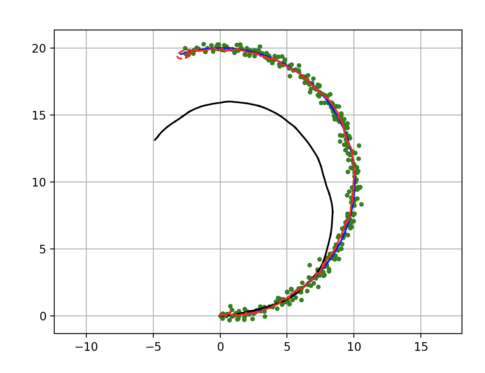

Extended Kalman Filter Localization
-----------------------------------

.. figure:: https://github.com/AtsushiSakai/PythonRoboticsGifs/raw/master/Localization/extended_kalman_filter/animation.gif

This is a sensor fusion localization with Extended Kalman Filter(EKF).

The blue line is true trajectory, the black line is dead reckoning
trajectory,

the green point is positioning observation (ex. GPS), and the red line
is estimated trajectory with EKF.

The red ellipse is estimated covariance ellipse with EKF.

Code: `PythonRobotics/extended_kalman_filter.py at master ·
AtsushiSakai/PythonRobotics <https://github.com/AtsushiSakai/PythonRobotics/blob/master/Localization/extended_kalman_filter/extended_kalman_filter.py>`__

Filter design
~~~~~~~~~~~~~

In this simulation, the robot has a state vector includes 4 states at
time :math:`t`.

.. math:: \textbf{x}_t=[x_t, y_t, \phi_t, v_t]

x, y are a 2D x-y position, :math:`\phi` is orientation, and v is
velocity.

In the code, “xEst” means the state vector.
`code <https://github.com/AtsushiSakai/PythonRobotics/blob/916b4382de090de29f54538b356cef1c811aacce/Localization/extended_kalman_filter/extended_kalman_filter.py#L168>`__

And, :math:`P_t` is covariace matrix of the state,

:math:`Q` is covariance matrix of process noise,

:math:`R` is covariance matrix of observation noise at time :math:`t`

　

The robot has a speed sensor and a gyro sensor.

So, the input vecor can be used as each time step

.. math:: \textbf{u}_t=[v_t, \omega_t]

Also, the robot has a GNSS sensor, it means that the robot can observe
x-y position at each time.

.. math:: \textbf{z}_t=[x_t,y_t]

The input and observation vector includes sensor noise.

In the code, “observation” function generates the input and observation
vector with noise
`code <https://github.com/AtsushiSakai/PythonRobotics/blob/916b4382de090de29f54538b356cef1c811aacce/Localization/extended_kalman_filter/extended_kalman_filter.py#L34-L50>`__

Motion Model
~~~~~~~~~~~~

The robot model is

.. math::  \dot{x} = v \cos(\phi)

.. math::  \dot{y} = v \sin(\phi)

.. math::  \dot{\phi} = \omega

So, the motion model is

.. math:: \textbf{x}_{t+1} = f(\textbf{x}_t, \textbf{u}_t) = F\textbf{x}_t+B\textbf{u}_t

where

:math:`\begin{equation*} F= \begin{bmatrix} 1 & 0 & 0 & 0\\ 0 & 1 & 0 & 0\\ 0 & 0 & 1 & 0 \\ 0 & 0 & 0 & 0 \\ \end{bmatrix} \end{equation*}`

:math:`\begin{equation*} B= \begin{bmatrix} cos(\phi) \Delta t & 0\\ sin(\phi) \Delta t & 0\\ 0 & \Delta t\\ 1 & 0\\ \end{bmatrix} \end{equation*}`

:math:`\Delta t` is a time interval.

This is implemented at
`code <https://github.com/AtsushiSakai/PythonRobotics/blob/916b4382de090de29f54538b356cef1c811aacce/Localization/extended_kalman_filter/extended_kalman_filter.py#L53-L67>`__

The motion function is that

:math:`\begin{equation*} \begin{bmatrix} x' \\ y' \\ w' \\ v' \end{bmatrix} = f(\textbf{x}, \textbf{u}) = \begin{bmatrix} x + v\cos(\phi)\Delta t \\ y + v\sin(\phi)\Delta t \\ \phi + \omega \Delta t \\ v \end{bmatrix} \end{equation*}`

Its Jacobian matrix is

:math:`\begin{equation*} J_f = \begin{bmatrix} \frac{\partial x'}{\partial x}& \frac{\partial x'}{\partial y} & \frac{\partial x'}{\partial \phi} & \frac{\partial x'}{\partial v}\\ \frac{\partial y'}{\partial x}& \frac{\partial y'}{\partial y} & \frac{\partial y'}{\partial \phi} & \frac{\partial y'}{\partial v}\\ \frac{\partial \phi'}{\partial x}& \frac{\partial \phi'}{\partial y} & \frac{\partial \phi'}{\partial \phi} & \frac{\partial \phi'}{\partial v}\\ \frac{\partial v'}{\partial x}& \frac{\partial v'}{\partial y} & \frac{\partial v'}{\partial \phi} & \frac{\partial v'}{\partial v} \end{bmatrix} \end{equation*}`

:math:`\begin{equation*} 　= \begin{bmatrix} 1& 0 & -v \sin(\phi) \Delta t & \cos(\phi) \Delta t\\ 0 & 1 & v \cos(\phi) \Delta t & \sin(\phi) \Delta t\\ 0 & 0 & 1 & 0 \\ 0 & 0 & 0 & 1 \end{bmatrix} \end{equation*}`

Observation Model
~~~~~~~~~~~~~~~~~

The robot can get x-y position infomation from GPS.

So GPS Observation model is

.. math:: \textbf{z}_{t} = g(\textbf{x}_t) = H \textbf{x}_t

where

:math:`\begin{equation*} H = \begin{bmatrix} 1 & 0 & 0 & 0 \\ 0 & 1 & 0 & 0 \\ \end{bmatrix} \end{equation*}`

The observation function states that

:math:`\begin{equation*} \begin{bmatrix} x' \\ y' \end{bmatrix} = g(\textbf{x}) = \begin{bmatrix} x \\ y \end{bmatrix} \end{equation*}`

Its Jacobian matrix is

:math:`\begin{equation*} J_g = \begin{bmatrix} \frac{\partial x'}{\partial x} & \frac{\partial x'}{\partial y} & \frac{\partial x'}{\partial \phi} & \frac{\partial x'}{\partial v}\\ \frac{\partial y'}{\partial x}& \frac{\partial y'}{\partial y} & \frac{\partial y'}{\partial \phi} & \frac{\partial y'}{ \partial v}\\ \end{bmatrix} \end{equation*}`

:math:`\begin{equation*} 　= \begin{bmatrix} 1& 0 & 0 & 0\\ 0 & 1 & 0 & 0\\ \end{bmatrix} \end{equation*}`

Extended Kalman Filter
~~~~~~~~~~~~~~~~~~~~~~

Localization process using Extended Kalman Filter:EKF is

=== Predict ===

:math:`x_{Pred} = Fx_t+Bu_t`

:math:`P_{Pred} = J_f P_t J_f^T + Q`

=== Update ===

:math:`z_{Pred} = Hx_{Pred}`

:math:`y = z - z_{Pred}`

:math:`S = J_g P_{Pred}.J_g^T + R`

:math:`K = P_{Pred}.J_g^T S^{-1}`

:math:`x_{t+1} = x_{Pred} + Ky`

:math:`P_{t+1} = ( I - K J_g) P_{Pred}`

Ref:
~~~~

-  `PROBABILISTIC-ROBOTICS.ORG <http://www.probabilistic-robotics.org/>`__
