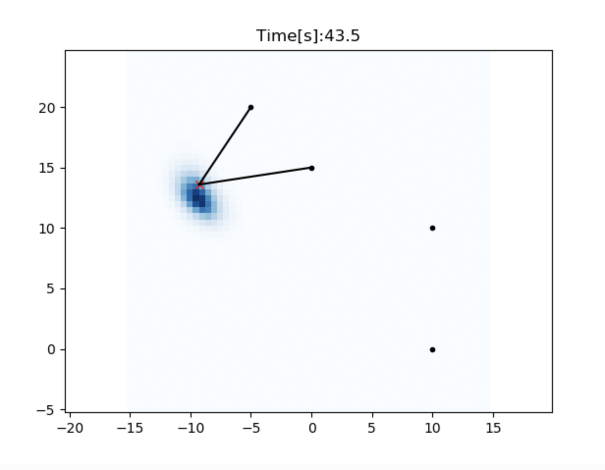
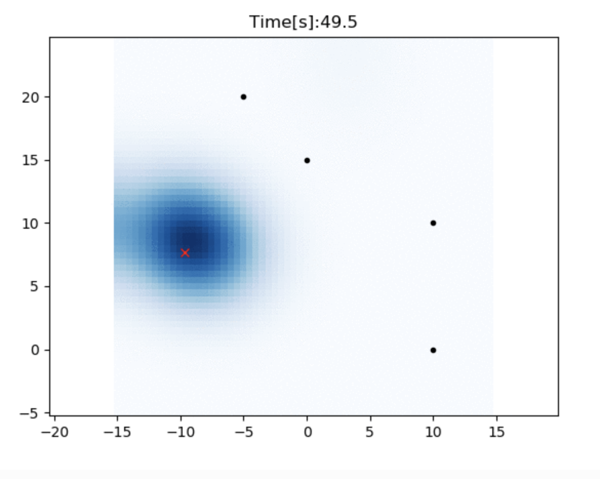
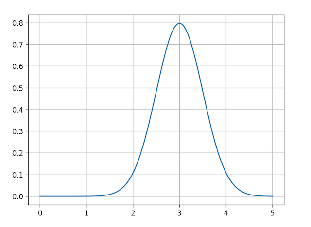
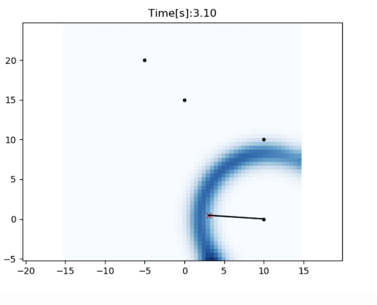

Histogram filter localization
-----------------------------

.. image:: https://github.com/AtsushiSakai/PythonRoboticsGifs/raw/master/Localization/histogram_filter/animation.gif

This is a 2D localization example with Histogram filter.

The red cross is true position, black points are RFID positions.

The blue grid shows a position probability of histogram filter.

In this simulation, we assume the robot's yaw orientation and RFID's positions are known,
but x,y positions are unknown.

The filter uses speed input and range observations from RFID for localization.

Initial position information is not needed.

Filtering algorithm
~~~~~~~~~~~~~~~~~~~~

Histogram filter is a discrete Bayes filter in continuous space.

It uses regular girds to manage probability of the robot existence.

If a grid has higher probability, it means that the robot is likely to be there.

In the simulation, we want to estimate x-y position, so we use 2D grid data.

There are 4 steps for the histogram filter to estimate the probability distribution.

Step1: Filter initialization
^^^^^^^^^^^^^^^^^^^^^^^^^^^^^

Histogram filter does not need initial position information.

In that case, we can initialize each grid probability as a same value.

If we can use initial position information, we can set initial probabilities based on it.

:ref:`gaussian_grid_map` might be useful when the initial position information is provided as gaussian distribution.

Step2: Predict probability by motion
^^^^^^^^^^^^^^^^^^^^^^^^^^^^^^^^^^^^

In histogram filter, when a robot move to a next grid,
all probability information of each grid are shifted towards the movement direction.

This process represents the change in the probability distribution as the robot moves.

After the robot has moved, the probability distribution needs reflect
the estimation error due to the movement.

For example, the position probability is peaky with observations:

But, the probability is getting uncertain without observations:

The `gaussian filter <https://docs.scipy.org/doc/scipy/reference/generated/scipy.ndimage.gaussian_filter.html>`_
is used in the simulation for adding noize.

Step3: Update probability by observation
^^^^^^^^^^^^^^^^^^^^^^^^^^^^^^^^^^^^^^^^^
In this step, all probabilities are updated by observations,
this is the update step of bayesian filter.

The probability update formula is different by the used sensor model.

This simulation uses range observation model.

The probability of each grid is updated by this formula:

.. math:: p_t=p_{t-1}*h(z)

.. math:: h(z)=\frac{\exp \left(-(d - z)^{2} / 2\right)}{\sqrt{2 \pi}}

- :math:`p_t` is the probability at the time `t`.

- :math:`h(z)` is the observation probability with the observation `z`.

- :math:`d` is the known distance from the RD-ID to the grid center.

When the `d` is 3.0, the `h(z)` distribution is:

The observation probability distribution looks a circle when a RF-ID is observed:

Step4: Estimate position from probability
^^^^^^^^^^^^^^^^^^^^^^^^^^^^^^^^^^^^^^^^^^
In each time step, we can calculate the final robot position from the current probability distribution.
There are two ways to calculate the final positions:

1. Using the maximum probability grid position.

2. Using the average of probability weighted grind position.

References:
~~~~~~~~~~~

- `_PROBABILISTIC ROBOTICS: <http://www.probabilistic-robotics.org>`_
- `Robust Vehicle Localization in Urban Environments Using Probabilistic Maps <http://driving.stanford.edu/papers/ICRA2010.pdf>`_
