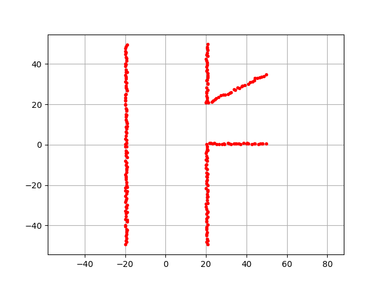
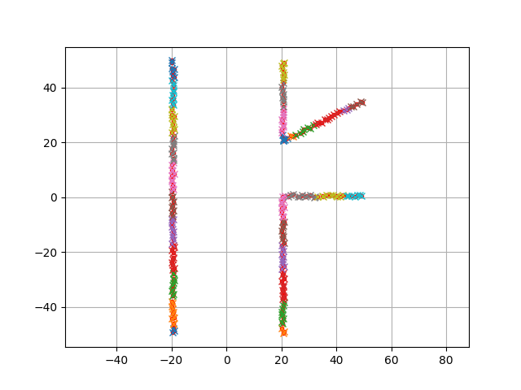
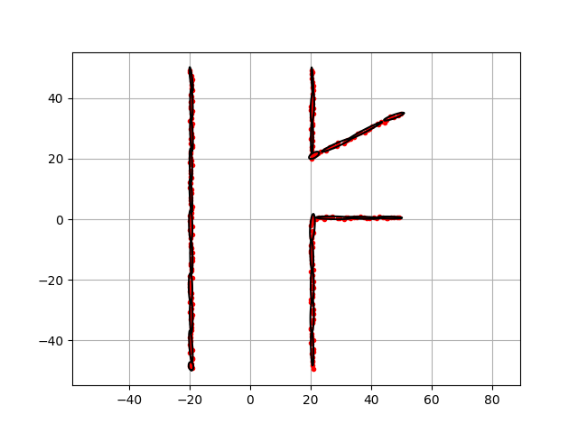
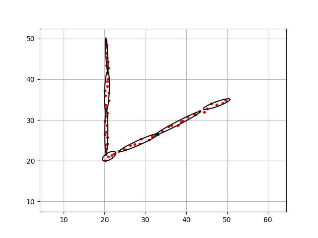

.. _ndt_map:

Normal Distance Transform (NDT) map
------------------------------------

This is a NDT mapping example.

Normal Distribution Transform (NDT) is a map representation that uses normal distribution for observation point modeling.

Normal Distribution
~~~~~~~~~~~~~~~~~~~~~

Normal distribution consists of two parameters: mean :math:`\mu` and covariance :math:`\Sigma`.

:math:`\mathbf{X} \sim \mathcal{N}(\boldsymbol{\mu}, \boldsymbol{\Sigma})`

In the 2D case, :math:`\boldsymbol{\mu}` is a 2D vector and :math:`\boldsymbol{\Sigma}` is a 2x2 matrix.

In the matrix form, the probability density function of thr normal distribution is:

:math:`X=\frac{1}{\sqrt{(2 \pi)^2|\Sigma|}} \exp \left\{-\frac{1}{2}^t(x-\mu) \sum^{-1}(x-\mu)\right\}`

Normal Distance Transform mapping steps
~~~~~~~~~~~~~~~~~~~~~~~~~~~~~~~~~~~~~~~~~　

NDT mapping consists of two steps:

When we have a new observation like this:

First, we need to cluster the observation points.
This is done by using a grid based clustering algorithm.

The result is:

Then, we need to fit a normal distribution to each grid cluster.

Black ellipse shows each NDT grid like this:

API
~~~~~

.. autoclass:: Mapping.ndt_map.ndt_map.NDTMap
    :members:
    :class-doc-from: class

