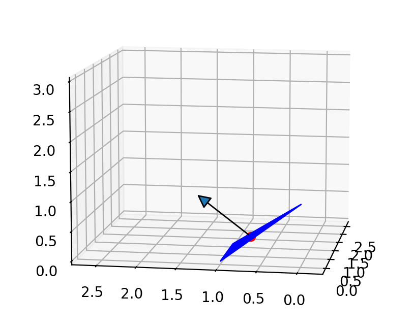
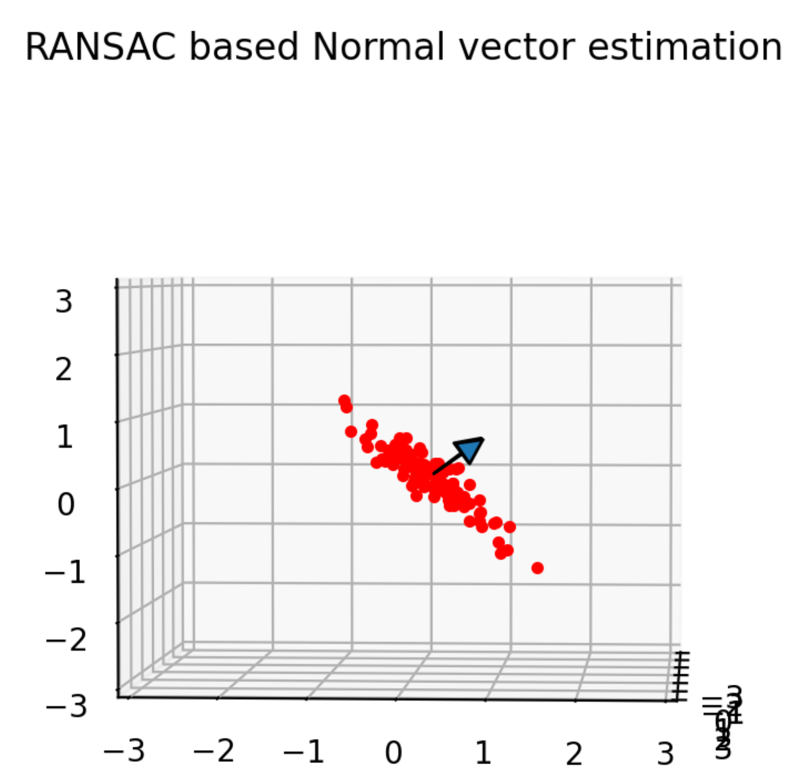

Normal vector estimation
-------------------------

Normal vector calculation of a 3D triangle
~~~~~~~~~~~~~~~~~~~~~~~~~~~~~~~~~~~~~~~~~~~~

A 3D point is as a vector:

.. math:: p = [x, y, z]

When there are 3 points in 3D space, :math:`p_1, p_2, p_3`,

we can calculate a normal vector n of a 3D triangle which is consisted of the points.

.. math:: n = \frac{v1 \times v2}{|v1 \times v2|}

where

.. math:: v1 = p2 - p1

.. math:: v2 = p3 - p1

This is an example of normal vector calculation:

API
=====

.. autofunction:: Mapping.normal_vector_estimation.normal_vector_estimation.calc_normal_vector

Normal vector estimation with RANdam SAmpling Consensus(RANSAC)
~~~~~~~~~~~~~~~~~~~~~~~~~~~~~~~~~~~~~~~~~~~~~~~~~~~~~~~~~~~~~~~~

Consider the problem of estimating the normal vector of a plane based on a
set of N 3D points where a plane can be observed.

There is a way that uses all point cloud data to estimate a plane and
a normal vector using the `least-squares method <https://stackoverflow.com/a/44315221/8387766>`_

However, this method is vulnerable to noise of the point cloud.

In this document, we will use a method that uses
`RANdam SAmpling Consensus(RANSAC) <https://en.wikipedia.org/wiki/Random_sample_consensus>`_
to estimate a plane and a normal vector.

RANSAC is a robust estimation methods for data set with outliers.

This RANSAC based normal vector estimation method is as follows:

#. Select 3 points randomly from the point cloud.

#. Calculate a normal vector of a plane which is consists of the sampled 3 points.

#. Calculate the distance between the calculated plane and the all point cloud.

#. If the distance is less than a threshold, the point is considered to be an inlier.

#. Repeat the above steps until the inlier ratio is greater than a threshold.

This is an example of RANSAC based normal vector estimation:

API
=====

.. autofunction:: Mapping.normal_vector_estimation.normal_vector_estimation.ransac_normal_vector_estimation

