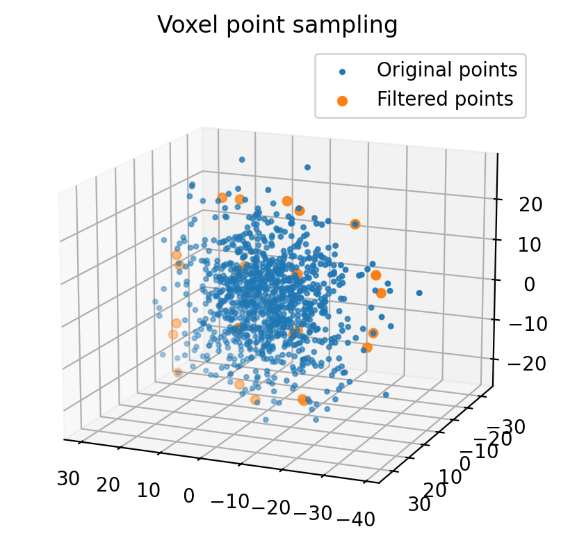
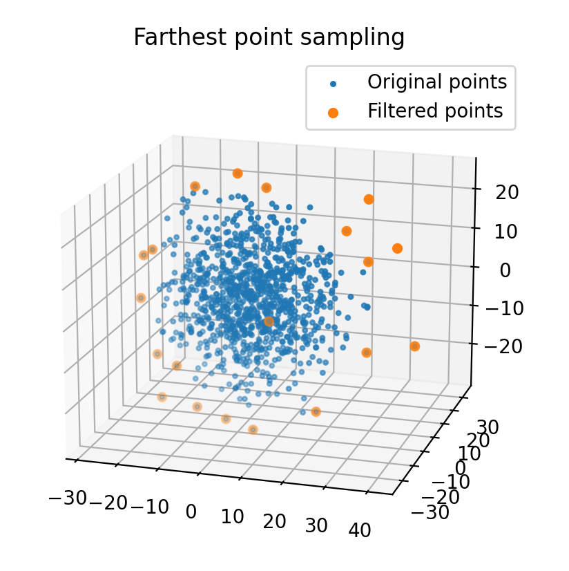
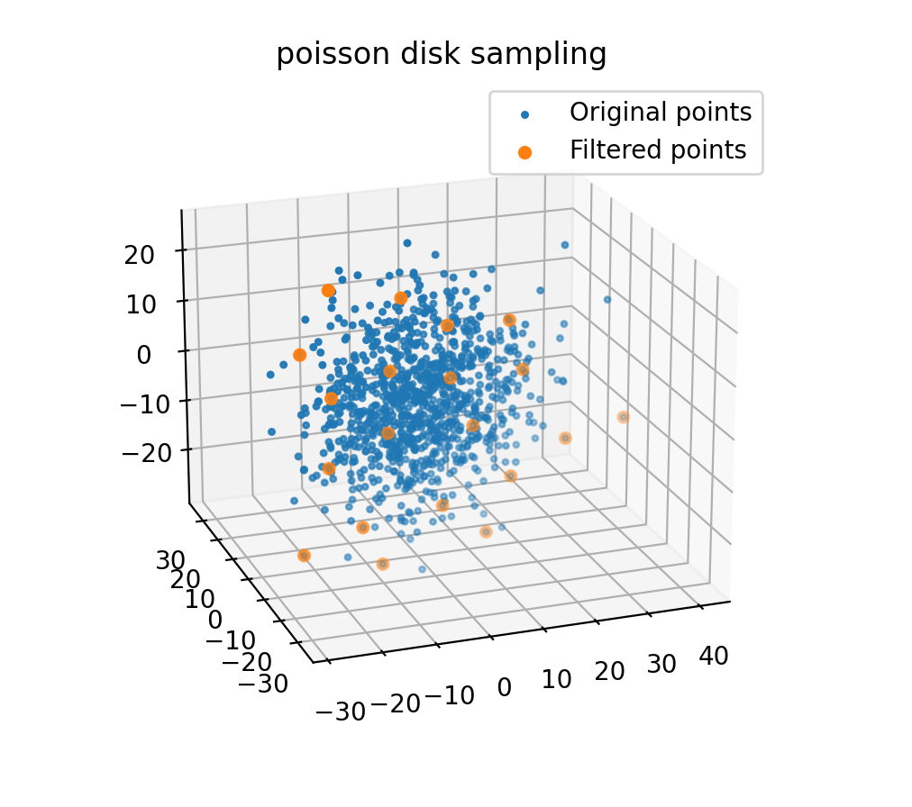

.. _point_cloud_sampling:

Point cloud Sampling
----------------------

This sections explains point cloud sampling algorithms in PythonRobotics.

Point clouds are two-dimensional and three-dimensional based data
acquired by external sensors like LIDAR, cameras, etc.
In general, Point Cloud data is very large in number of data.
So, if you process all the data, computation time might become an issue.

Point cloud sampling is a technique for solving this computational complexity
issue by extracting only representative point data and thinning the point
cloud data without compromising the performance of processing using the point
cloud data.

Voxel Point Sampling
~~~~~~~~~~~~~~~~~~~~~~~~

Voxel grid sampling is a method of reducing point cloud data by using the
`Voxel grids <https://en.wikipedia.org/wiki/Voxel>`_ which is regular grids
in three-dimensional space.

This method determines which each point is in a grid, and replaces the point
clouds that are in the same Voxel with their average to reduce the number of
points.

API
=====

.. autofunction:: Mapping.point_cloud_sampling.point_cloud_sampling.voxel_point_sampling

Farthest Point Sampling
~~~~~~~~~~~~~~~~~~~~~~~~~

API
=====

.. autofunction:: Mapping.point_cloud_sampling.point_cloud_sampling.farthest_point_sampling

Poisson Disk Sampling
~~~~~~~~~~~~~~~~~~~~~~~~~

API
=====

.. autofunction:: Mapping.point_cloud_sampling.point_cloud_sampling.poisson_disk_sampling

