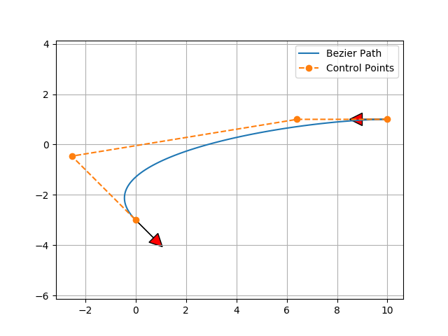

Bezier path planning
--------------------

A sample code of Bezier path planning.

It is based on 4 control points Beizer path.

If you change the offset distance from start and end point,

You can get different Beizer course:

.. image:: Figure_2.png

Ref:

-  `Continuous Curvature Path Generation Based on Bezier Curves for
   Autonomous
   Vehicles <http://citeseerx.ist.psu.edu/viewdoc/download?doi=10.1.1.294.6438&rep=rep1&type=pdf>`__
