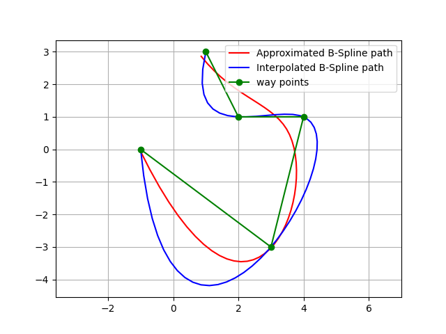
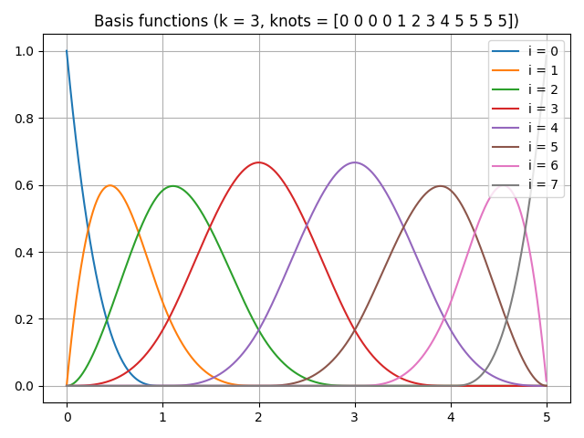
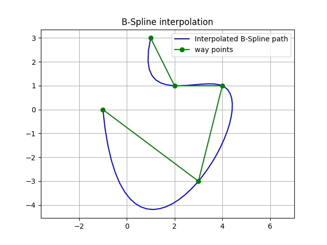
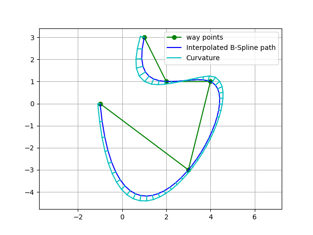
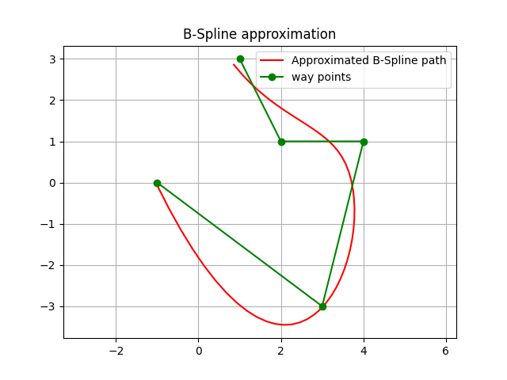
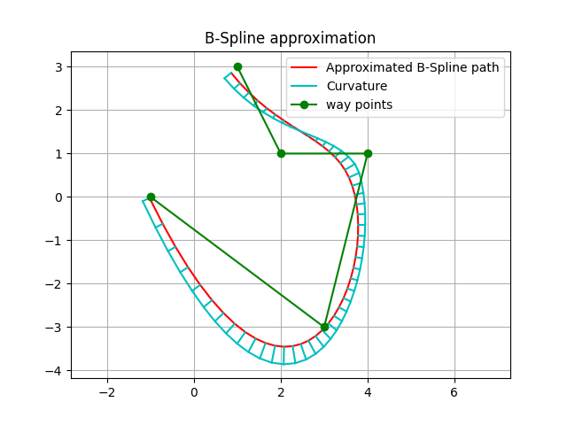

B-Spline planning
-----------------

This is a B-Spline path planning routines.

If you input waypoints, it generates a smooth path with B-Spline curve.

This codes provide two types of B-Spline curve generations:

1. Interpolation: generate a curve that passes through all waypoints.

2. Approximation: generate a curve that approximates the waypoints. (Not passing through all waypoints)

Bspline basics
~~~~~~~~~~~~~~

BSpline (Basis-Spline) is a piecewise polynomial spline curve.

It is expressed by the following equation.

:math:`\mathbf{S}(x)=\sum_{i=k-p}^k \mathbf{c}_i B_{i, p}(x)`

here:

* :math:`S(x)` is the curve point on the spline at x.
* :math:`c_i` is the representative point generating the spline, called the control point.
* :math:`p+1` is the dimension of the BSpline.
* :math:`k` is the number of knots.
* :math:`B_{i,p}(x)` is a function called Basis Function.

The the basis function can be calculated by the following `De Boor recursion formula <https://en.wikipedia.org/wiki/De_Boor%27s_algorithm>`_:

:math:`B_{i, 0}(x):= \begin{cases}1 & \text { if } \quad t_i \leq x<t_{i+1} \\ 0 & \text { otherwise }\end{cases}`

:math:`B_{i, p}(x):=\frac{x-t_i}{t_{i+p}-t_i} B_{i, p-1}(x)+\frac{t_{i+p+1}-x}{t_{i+p+1}-t_{i+1}} B_{i+1, p-1}(x)`

here:

* :math:`t_i` is each element of the knot vector.

This figure shows the BSpline basis functions for each of :math:`i`:

Note that when all the basis functions are added together, summation is 1.0 for any x value.

This means that the result curve is smooth when each control point is weighted addition by this basis function,

This code is for generating the upper basis function graph using `scipy <https://docs.scipy.org/doc/scipy/reference/generated/scipy.interpolate.BSpline.html>`_.

.. code-block:: python

	from scipy.interpolate import BSpline

	def B_orig(x, k, i, t):
		if k == 0:
			return 1.0 if t[i] <= x < t[i + 1] else 0.0
		if t[i + k] == t[i]:
			c1 = 0.0
		else:
			c1 = (x - t[i]) / (t[i + k] - t[i]) * B(x, k - 1, i, t)

		if t[i + k + 1] == t[i + 1]:
			c2 = 0.0
		else:
			c2 = (t[i + k + 1] - x) / (t[i + k + 1] - t[i + 1]) * B(x, k - 1, i + 1, t)
		return c1 + c2

	def B(x, k, i, t):
		c = np.zeros_like(t)
		c[i] = 1
		return BSpline(t, c, k)(x)

	def main():
		k = 3  # degree of the spline
		t = [0, 1, 2, 3, 4, 5]  # knots vector

		x = np.linspace(0, 5, 1000, endpoint=False)
		t = np.r_[[np.min(t)]*k, t, [np.max(t)]*k]

		n = len(t) - k - 1
		for i in range(n):
			y = np.array([B(ix, k, i, t) for ix in x])
			plt.plot(x, y, label=f'i = {i}')

		plt.title(f'Basis functions (k = {k}, knots = {t})')
		plt.show()

Bspline interpolation planning
~~~~~~~~~~~~~~~~~~~~~~~~~~~~~~

:meth:`PathPlanning.BSplinePath.bspline_path.interpolate_b_spline_path` generates a curve that passes through all waypoints.

This is a simple example of the interpolation planning:

This figure also shows curvatures of each path point using :ref:`utils.plot.plot_curvature <plot_curvature>`.

The default spline degree is 3, so curvature changes smoothly.

API
++++

.. autofunction:: PathPlanning.BSplinePath.bspline_path.interpolate_b_spline_path

Bspline approximation planning
~~~~~~~~~~~~~~~~~~~~~~~~~~~~~~

:meth:`PathPlanning.BSplinePath.bspline_path.approximate_b_spline_path`
generates a curve that approximates the waypoints, which means that
the curve might not pass through waypoints.

Users can adjust path smoothness by the smoothing parameter `s`. If this
value is bigger, the path will be smoother, but it will be less accurate.
If this value is smaller, the path will be more accurate, but it will be
less smooth.

This is a simple example of the approximation planning:

This figure also shows curvatures of each path point using :ref:`utils.plot.plot_curvature <plot_curvature>`.

The default spline degree is 3, so curvature changes smoothly.

API
++++

.. autofunction:: PathPlanning.BSplinePath.bspline_path.approximate_b_spline_path

References
~~~~~~~~~~

-  `B-spline - Wikipedia <https://en.wikipedia.org/wiki/B-spline>`__
-  `scipy.interpolate.UnivariateSpline <https://docs.scipy.org/doc/scipy/reference/generated/scipy.interpolate.UnivariateSpline.html>`__