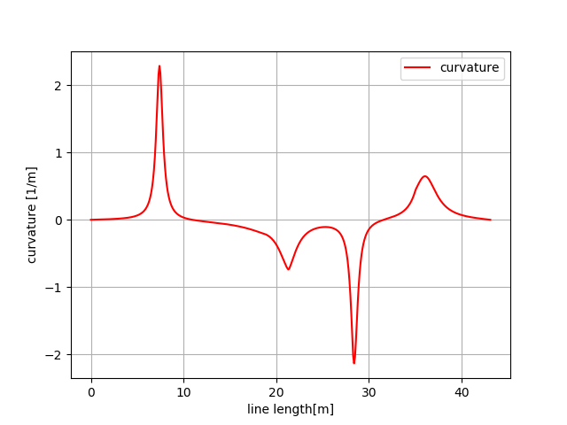

Cubic spline planning
---------------------

1D spline function
~~~~~~~~~~~~~~~~~~~

.. image:: spline.png

2D spline path
~~~~~~~~~~~~~~~~~~~

A sample code for cubic path planning.

This code generates a curvature continuous path based on x-y waypoints
with cubic spline.

Heading angle of each point can be also calculated analytically.

.. image:: Figure_1.png
.. image:: Figure_2.png

