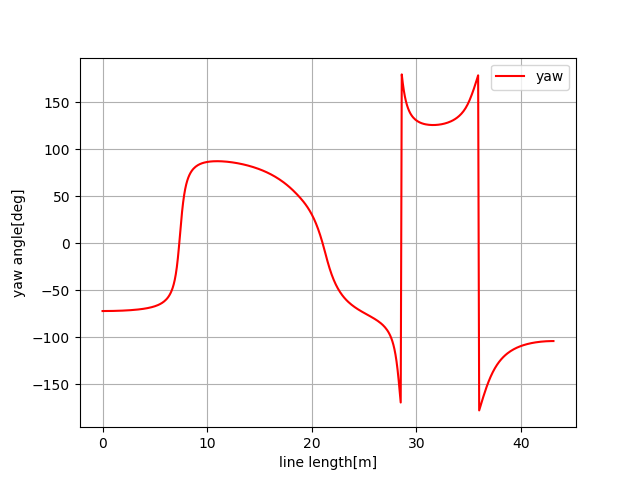

Cubic spline planning
---------------------

1D spline function
~~~~~~~~~~~~~~~~~~~

.. image:: spline.png

Constraint 1: Terminal constraints
===================================

:math:`S_j(x_j)=y_j`

Constraint 2: Point continuous constraints
============================================

:math:`S_j(x_{j+1})=S_{j+1}(x_{j+1})=y_{j+1}`

Constraint 3: Tangent vector continuous constraints
==============================================

:math:`S'_j(x_{j+1})=S'_{j+1}(x_{j+1})`

Constraint 4: Curvature continuous constraints
==============================================

:math:`S''_j(x_{j+1})=S''_{j+1}(x_{j+1})`

Constraint 4: Terminal curvature constraints
========================================================

:math:`S''_0(0)=S''_{n+1}(x_{n})=0`

2D spline path
~~~~~~~~~~~~~~~~~~~

A sample code for cubic path planning.

This code generates a curvature continuous path based on x-y waypoints
with cubic spline.

Heading angle of each point can be also calculated analytically.

.. image:: Figure_1.png

.. image:: Figure_3.png

