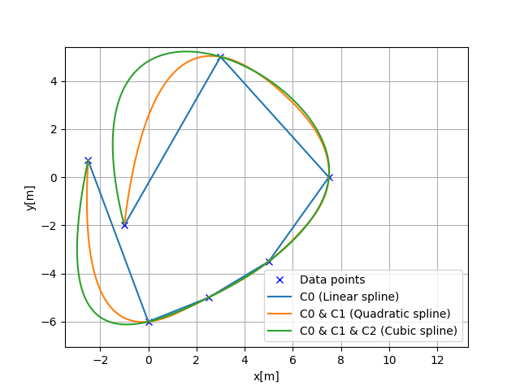

Cubic spline planning
---------------------

Spline curve continuity
~~~~~~~~~~~~~~~~~~~~~~~~

Spline curve smoothness is depending on the which kind of spline model is used.

The smoothness of the spline curve is expressed as :math:`C_0, C_1`, and so on.

This representation represents continuity of the curve.
For example, for a spline curve in two-dimensional space:

- :math:`C_0` is position continuous
- :math:`C_1` is tangent vector continuous
- :math:`C_2` is curvature vector continuous

as shown in the following figure:

Cubic spline can generate a curve with :math:`C_0, C_1, C_2`.

1D cubic spline
~~~~~~~~~~~~~~~~~~~

Cubic spline interpolation is a method of smoothly
interpolating between multiple data points when given
multiple data points, as shown in the figure below.

It separates between each interval between data points.

The each interval part is approximated by each cubic polynomial.

The cubic spline uses the cubic polynomial equation for interpolation:

:math:`S_j(x)=a_j+b_j(x-x_j)+c_j(x-x_j)^2+d_j(x-x_j)^3`

where :math:`x_j < x < x_{j+1}`, :math:`x_j` is the j-th node of the spline,
:math:`a_j`, :math:`b_j`, :math:`c_j`, :math:`d_j` are the coefficients
of the spline.

As the above equation, there are 4 unknown parameters :math:`(a,b,c,d)` for
one interval, so if the number of data points is :math:`N`, the
interpolation has :math:`4N` unknown parameters.

The following five conditions are used to determine the :math:`4N`
unknown parameters:

Constraint 1: Terminal constraints
===================================

:math:`S_j(x_j)=y_j`

This constraint is the terminal constraint of each interval.

The polynomial of each interval will pass through the x,y coordinates of
the data points.

Constraint 2: Point continuous constraints
============================================

:math:`S_j(x_{j+1})=S_{j+1}(x_{j+1})=y_{j+1}`

This constraint is a continuity condition for the boundary of each interval.

This constraint ensures that the boundary of each interval is continuous.

Constraint 3: Tangent vector continuous constraints
====================================================

:math:`S'_j(x_{j+1})=S'_{j+1}(x_{j+1})`

This constraint is a continuity condition for the first derivative of
the boundary of each interval.

This constraint makes the vectors of the boundaries of each
interval continuous.

Constraint 4: Curvature continuous constraints
==============================================

:math:`S''_j(x_{j+1})=S''_{j+1}(x_{j+1})`

This constraint is the continuity condition for the second derivative of
the boundary of each interval.

This constraint makes the curvature of the boundaries of each
interval continuous.

Constraint 5: Terminal curvature constraints
========================================================

:math:`S''_0(0)=S''_{n+1}(x_{n})=0`.

The constraint is a boundary condition for the second derivative of the starting and ending points.

Our sample code assumes these terminal curvatures are 0, which is well known as Natural Cubic Spline.

How to calculate the unknown parameters :math:`a_j, b_j, c_j, d_j`
===================================================================

Step1: calculate :math:`a_j`
+++++++++++++++++++++++++++++

Spline coefficients :math:`a_j` can be calculated by y positions of the data points:

:math:`a_j = y_i`.

Step2: calculate :math:`c_j`
+++++++++++++++++++++++++++++

Spline coefficients :math:`c_j` can be calculated by solving the linear equation:

:math:`Ac_j = B`.

The matrix :math:`A` and :math:`B` are defined as follows:

.. math::
	A=\left[\begin{array}{cccccc}
	1 & 0 & 0 & 0 & \cdots & 0 \\
	h_{0} & 2\left(h_{0}+h_{1}\right) & h_{1} & 0 & \cdots & 0 \\
	0 & h_{1} & 2\left(h_{1}+h_{2}\right) & h_{2} & \cdots & 0 \\
	0 & 0 & h_{2} & 2\left(h_{2}+h_{3}\right) & \cdots & 0 \\
	0 & 0 & 0 & h_{3} & \ddots & \\
	\vdots & \vdots & & & & \\
	0 & 0 & 0 & \cdots & 0 & 1
	\end{array}\right]

.. math::
	B=\left[\begin{array}{c}
	0 \\
	\frac{3}{h_{1}}\left(a_{2}-a_{1}\right)-\frac{3}{h_{0}}\left(a_{1}-a_{0}\right) \\
	\vdots \\
	\frac{3}{h_{n-1}}\left(a_{n}-a_{n-1}\right)-\frac{3}{h_{n-2}}\left(a_{n-1}-a_{n-2}\right) \\
	0
	\end{array}\right]

where :math:`h_{i}` is the x position distance between the i-th and (i+1)-th data points.

Step3: calculate :math:`d_j`
+++++++++++++++++++++++++++++

Spline coefficients :math:`d_j` can be calculated by the following equation:

:math:`d_{j}=\frac{c_{j+1}-c_{j}}{3 h_{j}}`

Step4: calculate :math:`b_j`
+++++++++++++++++++++++++++++

Spline coefficients :math:`b_j` can be calculated by the following equation:

:math:`b_{i}=\frac{1}{h_i}(a_{i+1}-a_{i})-\frac{h_i}{3}(2c_{i}+c_{i+1})`

How to calculate the first and second derivatives of the spline curve
======================================================================

After we can get the coefficients of the spline curve, we can calculate

the first derivative by:

:math:`y^{\prime}(x)=b+2cx+3dx^2`

the second derivative by:

:math:`y^{\prime \prime}(x)=2c+6dx`

These equations can be calculated by differentiating the cubic polynomial.

API
===

This is the 1D cubic spline class API:

.. autoclass:: PathPlanning.CubicSpline.cubic_spline_planner.CubicSpline1D
	:members:

2D cubic spline
~~~~~~~~~~~~~~~~~~~

Data x positions needs to be mono-increasing for 1D cubic spline.

So, it cannot be used for 2D path planning.

2D cubic spline uses two 1D cubic splines based on path distance from
the start point for each dimension x and y.

This can generate a curvature continuous path based on x-y waypoints.

Heading angle of each point can be calculated analytically by:

:math:`\theta=\tan ^{-1} \frac{y’}{x’}`

Curvature of each point can be also calculated analytically by:

:math:`\kappa=\frac{y^{\prime \prime} x^{\prime}-x^{\prime \prime} y^{\prime}}{\left(x^{\prime2}+y^{\prime2}\right)^{\frac{2}{3}}}`

API
===

.. autoclass:: PathPlanning.CubicSpline.cubic_spline_planner.CubicSpline2D
	:members:

References
~~~~~~~~~~
-  `Cubic Splines James Keesling <https://people.clas.ufl.edu/kees/files/CubicSplines.pdf>`__
-  `Curves and Splines <http://www.cs.cmu.edu/afs/cs/academic/class/15462-s10/www/lec-slides/lec06.pdf>`__

