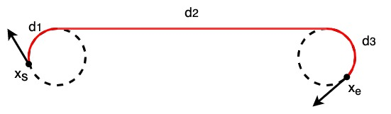
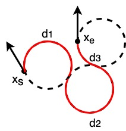

Dubins path planning
--------------------

A sample code for Dubins path planning.

.. image:: https://github.com/AtsushiSakai/PythonRoboticsGifs/raw/master/PathPlanning/DubinsPath/animation.gif?raw=True

Dubins path
~~~~~~~~~~~~
Dubins path is a analytical path planning algorithm for a simple car model.

It can generates a shortest path between two 2D poses (x, y, yaw) with maximum curvature constraint and tangent(yaw angle) constraint.

Generated paths consist of 3 segments of maximum curvature curves or a straight line segment.

Each segment type can is categorized by 3 type: 'Right turn (R)' , 'Left turn (L)', and 'Straight (S).' 

Possible path will be at least one of these six types: RSR, RSL, LSR, LSL, RLR, LRL.

Dubins path planner can output each segment type and distance of each course segment.

For example, a RSR Dubins path is:

Each segment distance can be calculated by:

:math:`\alpha = mod(-\theta)`

:math:`\beta = mod(x_{e, yaw} - \theta)`

:math:`p^2 = 2 + d ^ 2 - 2\cos(\alpha-\beta) + 2d(\sin\alpha - \sin\beta)`

:math:`t = atan2(\cos\beta - \cos\alpha, d + \sin\alpha - \sin\beta)`

:math:`d_1 = mod(-\alpha + t)`

:math:`d_2 = p`

:math:`d_3 = mod(\beta - t)`

where :math:`\theta` is tangent and d is distance from :math:`x_s` to :math:`x_e`

A RLR Dubins path is:

Each segment distance can be calculated by:

:math:`t = (6.0 - d^2 + 2\cos(\alpha-\beta) + 2d(\sin\alpha - \sin\beta)) / 8.0`

:math:`d_2 = mod(2\pi - acos(t))`

:math:`d_1 = mod(\alpha - atan2(\cos\beta - \cos\alpha, d + \sin\alpha - \sin\beta) + d_2 / 2.0)`

:math:`d_3 = mod(\alpha - \beta - d_1 + d_2)`

You can generate a path from these information and the maximum curvature information.

A path type which has minimum course length among 6 types is selected,
and then a path is constructed based on the selected type and its distances.

API
~~~~~~~~~~~~~~~~~~~~

.. autofunction:: PathPlanning.DubinsPath.dubins_path_planner.plan_dubins_path

Reference
~~~~~~~~~~~~~~~~~~~~
-  `On Curves of Minimal Length with a Constraint on Average Curvature, and with Prescribed Initial and Terminal Positions and Tangents <https://www.jstor.org/stable/2372560?origin=crossref>`__
-  `Dubins path - Wikipedia <https://en.wikipedia.org/wiki/Dubins_path>`__
-  `15.3.1 Dubins Curves <http://planning.cs.uiuc.edu/node821.html>`__
-  `A Comprehensive, Step-by-Step Tutorial to Computing Dubin’s Paths <https://gieseanw.wordpress.com/2012/10/21/a-comprehensive-step-by-step-tutorial-to-computing-dubins-paths/>`__
