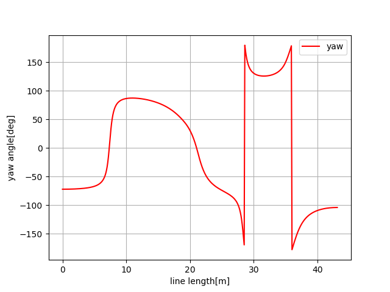
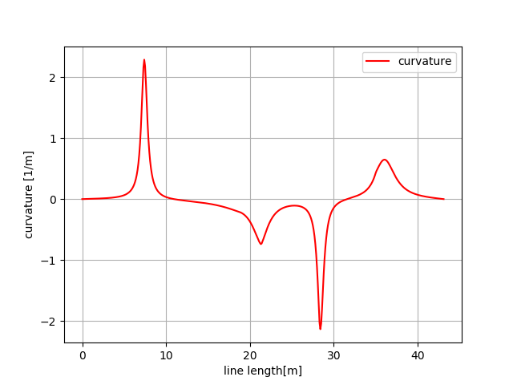
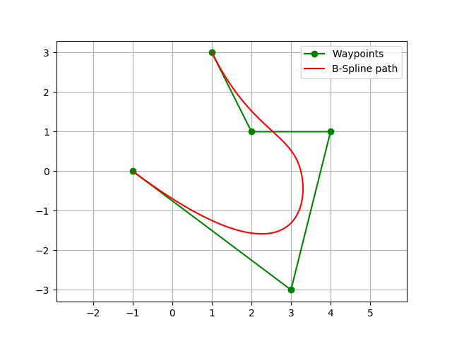

.. _path_planning:

Path Planning
=============

Dynamic Window Approach
-----------------------

This is a 2D navigation sample code with Dynamic Window Approach.

-  `The Dynamic Window Approach to Collision
   Avoidance <https://www.ri.cmu.edu/pub_files/pub1/fox_dieter_1997_1/fox_dieter_1997_1.pdf>`__

.. image:: https://github.com/AtsushiSakai/PythonRoboticsGifs/raw/master/PathPlanning/DynamicWindowApproach/animation.gif

Grid based search
-----------------

Dijkstra algorithm
~~~~~~~~~~~~~~~~~~

This is a 2D grid based shortest path planning with Dijkstra's
algorithm.

.. image:: https://github.com/AtsushiSakai/PythonRoboticsGifs/raw/master/PathPlanning/Dijkstra/animation.gif

In the animation, cyan points are searched nodes.

.. _a*-algorithm:

A\* algorithm
~~~~~~~~~~~~~

This is a 2D grid based shortest path planning with A star algorithm.

.. image:: https://github.com/AtsushiSakai/PythonRoboticsGifs/raw/master/PathPlanning/AStar/animation.gif

In the animation, cyan points are searched nodes.

Its heuristic is 2D Euclid distance.

.. _D*-algorithm:

D\* algorithm
~~~~~~~~~~~~~

This is a 2D grid based shortest path planning with D star algorithm.

.. image:: https://github.com/AtsushiSakai/PythonRoboticsGifs/raw/master/PathPlanning/DStar/animation.gif

The animation shows a robot finding its path avoiding an obstacle using the D* search algorithm.

Ref:

-  `D* search Wikipedia <https://en.wikipedia.org/wiki/D*>`__

Potential Field algorithm
~~~~~~~~~~~~~~~~~~~~~~~~~

This is a 2D grid based path planning with Potential Field algorithm.

.. image:: https://github.com/AtsushiSakai/PythonRoboticsGifs/raw/master/PathPlanning/PotentialFieldPlanning/animation.gif

In the animation, the blue heat map shows potential value on each grid.

Ref:

-  `Robotic Motion Planning:Potential
   Functions <https://www.cs.cmu.edu/~motionplanning/lecture/Chap4-Potential-Field_howie.pdf>`__

Model Predictive Trajectory Generator
-------------------------------------

This is a path optimization sample on model predictive trajectory
generator.

This algorithm is used for state lattice planner.

Path optimization sample
~~~~~~~~~~~~~~~~~~~~~~~~

.. image:: https://github.com/AtsushiSakai/PythonRoboticsGifs/raw/master/PathPlanning/ModelPredictiveTrajectoryGenerator/kn05animation.gif

Lookup table generation sample
~~~~~~~~~~~~~~~~~~~~~~~~~~~~~~

.. image:: model_predictive_trajectry_generator/lookuptable.png

Ref:

-  `Optimal rough terrain trajectory generation for wheeled mobile
   robots <http://journals.sagepub.com/doi/pdf/10.1177/0278364906075328>`__

State Lattice Planning
----------------------

This script is a path planning code with state lattice planning.

This code uses the model predictive trajectory generator to solve
boundary problem.

Ref:

-  `Optimal rough terrain trajectory generation for wheeled mobile
   robots <http://journals.sagepub.com/doi/pdf/10.1177/0278364906075328>`__

-  `State Space Sampling of Feasible Motions for High-Performance Mobile
   Robot Navigation in Complex
   Environments <http://www.frc.ri.cmu.edu/~alonzo/pubs/papers/JFR_08_SS_Sampling.pdf>`__

Uniform polar sampling
~~~~~~~~~~~~~~~~~~~~~~

.. image:: https://github.com/AtsushiSakai/PythonRoboticsGifs/raw/master/PathPlanning/StateLatticePlanner/UniformPolarSampling.gif

Biased polar sampling
~~~~~~~~~~~~~~~~~~~~~

.. image:: https://github.com/AtsushiSakai/PythonRoboticsGifs/raw/master/PathPlanning/StateLatticePlanner/BiasedPolarSampling.gif

Lane sampling
~~~~~~~~~~~~~

.. image:: https://github.com/AtsushiSakai/PythonRoboticsGifs/raw/master/PathPlanning/StateLatticePlanner/LaneSampling.gif

.. _probabilistic-road-map-(prm)-planning:

Probabilistic Road-Map (PRM) planning
-------------------------------------

.. image:: https://github.com/AtsushiSakai/PythonRoboticsGifs/raw/master/PathPlanning/ProbabilisticRoadMap/animation.gif

This PRM planner uses Dijkstra method for graph search.

In the animation, blue points are sampled points,

Cyan crosses means searched points with Dijkstra method,

The red line is the final path of PRM.

Ref:

-  `Probabilistic roadmap -
   Wikipedia <https://en.wikipedia.org/wiki/Probabilistic_roadmap>`__

　　

Voronoi Road-Map planning
-------------------------

.. image:: https://github.com/AtsushiSakai/PythonRoboticsGifs/raw/master/PathPlanning/VoronoiRoadMap/animation.gif

This Voronoi road-map planner uses Dijkstra method for graph search.

In the animation, blue points are Voronoi points,

Cyan crosses mean searched points with Dijkstra method,

The red line is the final path of Vornoi Road-Map.

Ref:

-  `Robotic Motion
   Planning <https://www.cs.cmu.edu/~motionplanning/lecture/Chap5-RoadMap-Methods_howie.pdf>`__

.. _rapidly-exploring-random-trees-(rrt):

Rapidly-Exploring Random Trees (RRT)
------------------------------------

Basic RRT
~~~~~~~~~

.. image:: https://github.com/AtsushiSakai/PythonRoboticsGifs/raw/master/PathPlanning/RRT/animation.gif

This is a simple path planning code with Rapidly-Exploring Random Trees
(RRT)

Black circles are obstacles, green line is a searched tree, red crosses
are start and goal positions.

.. include:: rrt_star.rst

RRT with dubins path
~~~~~~~~~~~~~~~~~~~~

.. image:: https://github.com/AtsushiSakai/PythonRoboticsGifs/raw/master/PathPlanning/RRTDubins/animation.gif

Path planning for a car robot with RRT and dubins path planner.

.. _rrt*-with-dubins-path:

RRT\* with dubins path
~~~~~~~~~~~~~~~~~~~~~~

.. image:: https://github.com/AtsushiSakai/PythonRoboticsGifs/raw/master/PathPlanning/RRTStarDubins/animation.gif

Path planning for a car robot with RRT\* and dubins path planner.

.. _rrt*-with-reeds-sheep-path:

RRT\* with reeds-sheep path
~~~~~~~~~~~~~~~~~~~~~~~~~~~

.. image:: https://github.com/AtsushiSakai/PythonRoboticsGifs/raw/master/PathPlanning/RRTStarReedsShepp/animation.gif

Path planning for a car robot with RRT\* and reeds sheep path planner.

.. _informed-rrt*:

Informed RRT\*
~~~~~~~~~~~~~~

.. image:: https://github.com/AtsushiSakai/PythonRoboticsGifs/raw/master/PathPlanning/InformedRRTStar/animation.gif

This is a path planning code with Informed RRT*.

The cyan ellipse is the heuristic sampling domain of Informed RRT*.

Ref:

-  `Informed RRT\*: Optimal Sampling-based Path Planning Focused via
   Direct Sampling of an Admissible Ellipsoidal
   Heuristic <https://arxiv.org/pdf/1404.2334.pdf>`__

.. _batch-informed-rrt*:

Batch Informed RRT\*
~~~~~~~~~~~~~~~~~~~~

.. image:: https://github.com/AtsushiSakai/PythonRoboticsGifs/raw/master/PathPlanning/BatchInformedRRTStar/animation.gif

This is a path planning code with Batch Informed RRT*.

Ref:

-  `Batch Informed Trees (BIT*): Sampling-based Optimal Planning via the
   Heuristically Guided Search of Implicit Random Geometric
   Graphs <https://arxiv.org/abs/1405.5848>`__

.. _closed-loop-rrt*:

Closed Loop RRT\*
~~~~~~~~~~~~~~~~~

A vehicle model based path planning with closed loop RRT*.

.. image:: https://github.com/AtsushiSakai/PythonRoboticsGifs/raw/master/PathPlanning/ClosedLoopRRTStar/animation.gif

In this code, pure-pursuit algorithm is used for steering control,

PID is used for speed control.

Ref:

-  `Motion Planning in Complex Environments using Closed-loop
   Prediction <http://acl.mit.edu/papers/KuwataGNC08.pdf>`__

-  `Real-time Motion Planning with Applications to Autonomous Urban
   Driving <http://acl.mit.edu/papers/KuwataTCST09.pdf>`__

-  `[1601.06326] Sampling-based Algorithms for Optimal Motion Planning
   Using Closed-loop Prediction <https://arxiv.org/abs/1601.06326>`__

.. _lqr-rrt*:

LQR-RRT\*
~~~~~~~~~

This is a path planning simulation with LQR-RRT*.

A double integrator motion model is used for LQR local planner.

.. image:: https://github.com/AtsushiSakai/PythonRoboticsGifs/raw/master/PathPlanning/LQRRRTStar/animation.gif

Ref:

-  `LQR-RRT\*: Optimal Sampling-Based Motion Planning with Automatically
   Derived Extension
   Heuristics <http://lis.csail.mit.edu/pubs/perez-icra12.pdf>`__

-  `MahanFathi/LQR-RRTstar: LQR-RRT\* method is used for random motion
   planning of a simple pendulum in its phase
   plot <https://github.com/MahanFathi/LQR-RRTstar>`__

Cubic spline planning
---------------------

A sample code for cubic path planning.

This code generates a curvature continuous path based on x-y waypoints
with cubic spline.

Heading angle of each point can be also calculated analytically.

.. image:: cubic_spline/Figure_1.png

B-Spline planning
-----------------

This is a path planning with B-Spline curse.

If you input waypoints, it generates a smooth path with B-Spline curve.

The final course should be on the first and last waypoints.

Ref:

-  `B-spline - Wikipedia <https://en.wikipedia.org/wiki/B-spline>`__

.. _eta^3-spline-path-planning:

Eta^3 Spline path planning
--------------------------

.. image:: https://github.com/AtsushiSakai/PythonRoboticsGifs/raw/master/PathPlanning/Eta3SplinePath/animation.gif

This is a path planning with Eta^3 spline.

Ref:

-  `\\eta^3-Splines for the Smooth Path Generation of Wheeled Mobile
   Robots <https://ieeexplore.ieee.org/document/4339545/>`__

Bezier path planning
--------------------

A sample code of Bezier path planning.

It is based on 4 control points Beier path.

.. image:: https://github.com/AtsushiSakai/PythonRobotics/raw/master/docs/modules/path_planning/Bezier_path_planning/Figure_1.png?raw=True

If you change the offset distance from start and end point,

You can get different Beizer course:

.. image:: https://github.com/AtsushiSakai/PythonRobotics/raw/master/docs/modules/path_planning/Bezier_path_planning/Figure_2.png?raw=True

Ref:

-  `Continuous Curvature Path Generation Based on Bezier Curves for
   Autonomous
   Vehicles <http://citeseerx.ist.psu.edu/viewdoc/download?doi=10.1.1.294.6438&rep=rep1&type=pdf>`__

.. include:: quintic_polynomials_planner.rst

Dubins path planning
--------------------

A sample code for Dubins path planning.

.. image:: https://github.com/AtsushiSakai/PythonRoboticsGifs/raw/master/PathPlanning/DubinsPath/animation.gif?raw=True

Ref:

-  `Dubins path -
   Wikipedia <https://en.wikipedia.org/wiki/Dubins_path>`__

Reeds Shepp planning
--------------------

A sample code with Reeds Shepp path planning.

.. image:: https://github.com/AtsushiSakai/PythonRoboticsGifs/raw/master/PathPlanning/ReedsSheppPath/animation.gif?raw=true

Ref:

-  `15.3.2 Reeds-Shepp
   Curves <http://planning.cs.uiuc.edu/node822.html>`__

-  `optimal paths for a car that goes both forwards and
   backwards <https://pdfs.semanticscholar.org/932e/c495b1d0018fd59dee12a0bf74434fac7af4.pdf>`__

-  `ghliu/pyReedsShepp: Implementation of Reeds Shepp
   curve. <https://github.com/ghliu/pyReedsShepp>`__

LQR based path planning
-----------------------

A sample code using LQR based path planning for double integrator model.

.. image:: https://github.com/AtsushiSakai/PythonRoboticsGifs/raw/master/PathPlanning/LQRPlanner/animation.gif?raw=true

Optimal Trajectory in a Frenet Frame
------------------------------------

.. image:: https://github.com/AtsushiSakai/PythonRoboticsGifs/raw/master/PathPlanning/FrenetOptimalTrajectory/animation.gif

This is optimal trajectory generation in a Frenet Frame.

The cyan line is the target course and black crosses are obstacles.

The red line is predicted path.

Ref:

-  `Optimal Trajectory Generation for Dynamic Street Scenarios in a
   Frenet
   Frame <https://www.researchgate.net/profile/Moritz_Werling/publication/224156269_Optimal_Trajectory_Generation_for_Dynamic_Street_Scenarios_in_a_Frenet_Frame/links/54f749df0cf210398e9277af.pdf>`__

-  `Optimal trajectory generation for dynamic street scenarios in a
   Frenet Frame <https://www.youtube.com/watch?v=Cj6tAQe7UCY>`__

