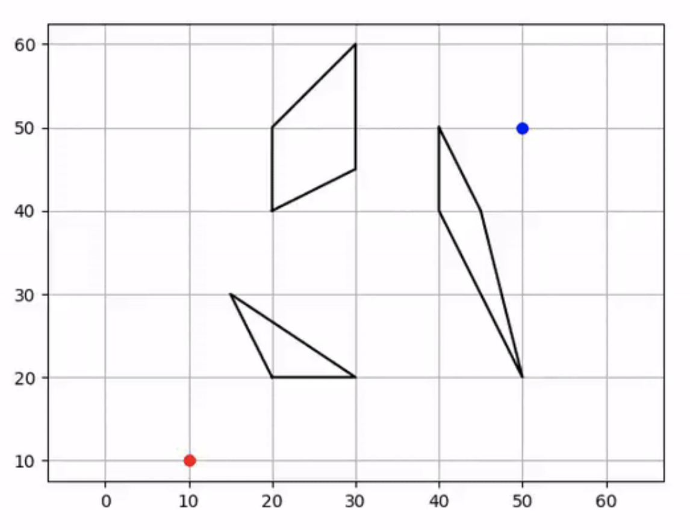

Visibility Road-Map planner
---------------------------

.. image:: https://github.com/AtsushiSakai/PythonRoboticsGifs/raw/master/PathPlanning/VisibilityRoadMap/animation.gif

`[Code] <https://github.com/AtsushiSakai/PythonRobotics/blob/master/PathPlanning/VisibilityRoadMap/visibility_road_map.py>`_

This visibility road-map planner uses Dijkstra method for graph search.

In the animation, the black lines are polygon obstacles,

red crosses are visibility nodes, and blue lines area collision free visibility graphs.

The red line is the final path searched by dijkstra algorithm frm the visibility graphs.

Algorithms
~~~~~~~~~~

In this chapter, how does the visibility road map planner search a path.

We assume this planner can be provided these information in the below figure.

- 1. Start point (Red point)
- 2. Goal point (Blue point)
- 3. Obstacle polygons (Black lines)

Step1: Generate visibility nodes based on polygon obstacles
^^^^^^^^^^^^^^^^^^^^^^^^^^^^^^^^^^^^^^^^^^^^^^^^^^^^^^^^^^^^

The nodes are generated by expanded these polygons vertexes like the below figure:

Each polygon vertex is expanded outward from the vector of adjacent vertices.

The start and goal point are included as nodes as well.

Step2: Generate visibility graphs connecting the nodes.
^^^^^^^^^^^^^^^^^^^^^^^^^^^^^^^^^^^^^^^^^^^^^^^^^^^^^^^

When connecting the nodes, the arc between two nodes is checked to collided or not to each obstacles.

If the arc is collided, the graph is removed.

The blue lines are generated visibility graphs in the figure:

Step3: Search the shortest path in the graphs using Dijkstra algorithm
^^^^^^^^^^^^^^^^^^^^^^^^^^^^^^^^^^^^^^^^^^^^^^^^^^^^^^^^^^^^^^^^^^^^^^

The red line is searched path in the figure:

You can find the details of Dijkstra algorithm in :ref:`dijkstra`.

References
^^^^^^^^^^

- `Visibility graph - Wikipedia <https://en.wikipedia.org/wiki/Visibility_graph>`_

