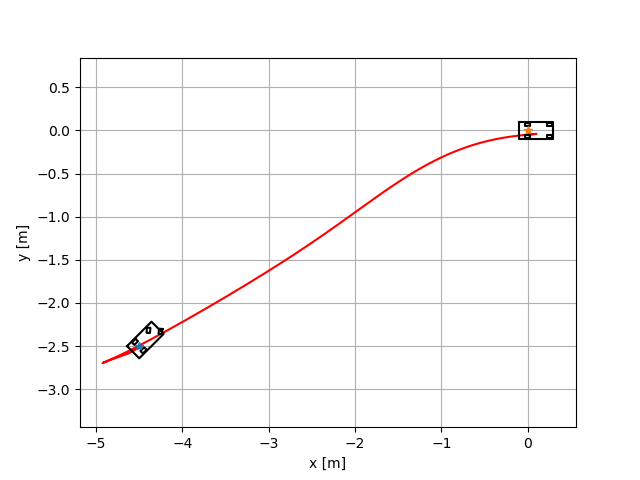
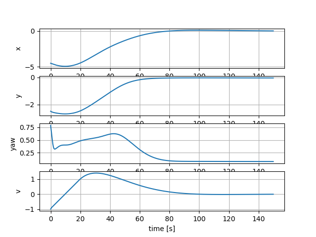
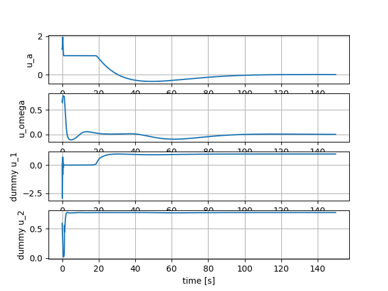
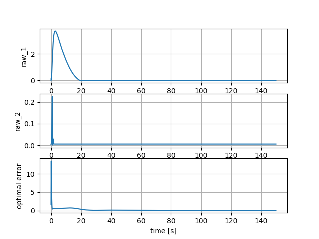

Nonlinear Model Predictive Control with C-GMRES
-----------------------------------------------

.. figure:: https://github.com/AtsushiSakai/PythonRoboticsGifs/raw/master/PathTracking/cgmres_nmpc/animation.gif
   :alt: gif

Mathematical Formulation
~~~~~~~~~~~~~~~~~~~~~~~~

Motion model is

.. math:: \dot{x}=vcos\theta

.. math:: \dot{y}=vsin\theta

.. math:: \dot{\theta}=\frac{v}{WB}sin(u_{\delta})

\ (tan is not good for optimization)

.. math:: \dot{v}=u_a

Cost function is

.. math:: J=\frac{1}{2}(u_a^2+u_{\delta}^2)-\phi_a d_a-\phi_\delta d_\delta

Input constraints are

.. math:: |u_a| \leq u_{a,max}

.. math:: |u_\delta| \leq u_{\delta,max}

So, Hamiltonian　is

.. math::

   J=\frac{1}{2}(u_a^2+u_{\delta}^2)-\phi_a d_a-\phi_\delta d_\delta\\ +\lambda_1vcos\theta+\lambda_2vsin\theta+\lambda_3\frac{v}{WB}sin(u_{\delta})+\lambda_4u_a\\ 
   +\rho_1(u_a^2+d_a^2+u_{a,max}^2)+\rho_2(u_\delta^2+d_\delta^2+u_{\delta,max}^2)

Partial differential equations of the Hamiltonian are:

:math:`\begin{equation*} \frac{\partial H}{\partial \bf{x}}=\\ \begin{bmatrix} \frac{\partial H}{\partial x}= 0&\\ \frac{\partial H}{\partial y}= 0&\\ \frac{\partial H}{\partial \theta}= -\lambda_1vsin\theta+\lambda_2vcos\theta&\\ \frac{\partial H}{\partial v}=-\lambda_1cos\theta+\lambda_2sin\theta+\lambda_3\frac{1}{WB}sin(u_{\delta})&\\ \end{bmatrix} \\ \end{equation*}`

:math:`\begin{equation*} \frac{\partial H}{\partial \bf{u}}=\\ \begin{bmatrix} \frac{\partial H}{\partial u_a}= u_a+\lambda_4+2\rho_1u_a&\\ \frac{\partial H}{\partial u_\delta}= u_\delta+\lambda_3\frac{v}{WB}cos(u_{\delta})+2\rho_2u_\delta&\\ \frac{\partial H}{\partial d_a}= -\phi_a+2\rho_1d_a&\\ \frac{\partial H}{\partial d_\delta}=-\phi_\delta+2\rho_2d_\delta&\\ \end{bmatrix} \\ \end{equation*}`

Ref
~~~

-  `Shunichi09/nonlinear_control: Implementing the nonlinear model
   predictive control, sliding mode
   control <https://github.com/Shunichi09/nonlinear_control>`__

-  `非線形モデル予測制御におけるCGMRES法をpythonで実装する -
   Qiita <https://qiita.com/MENDY/items/4108190a579395053924>`__
