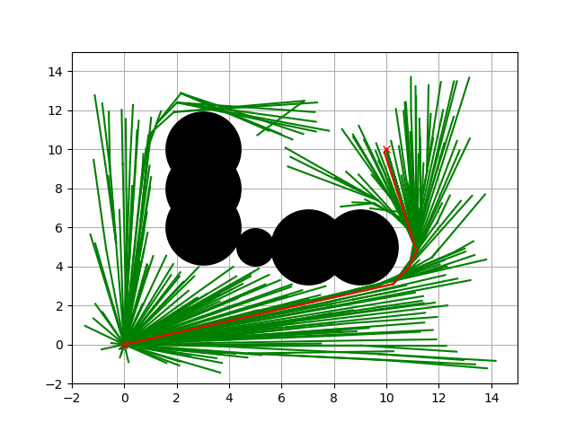

Title
-----

.. code-block:: ipython3

    from IPython.display import Image
    Image(filename="Figure_1.png",width=600)

.. figure:: https://github.com/AtsushiSakai/PythonRobotics/raw/master/Localization/extended_kalman_filter/animation.gif
   :alt: gif

   gif

Section1
~~~~~~~~

Section2
~~~~~~~~

:math:`\begin{equation*} F= \begin{bmatrix} 1 & 0 & 0 & 0\\ 0 & 1 & 0 & 0\\ 0 & 0 & 1 & 0 \\ 0 & 0 & 0 & 0 \\ \end{bmatrix} \end{equation*}`

Ref
~~~

-  `Sampling-based Algorithms for Optimal Motion
   Planning <https://arxiv.org/pdf/1105.1186.pdf>`__
