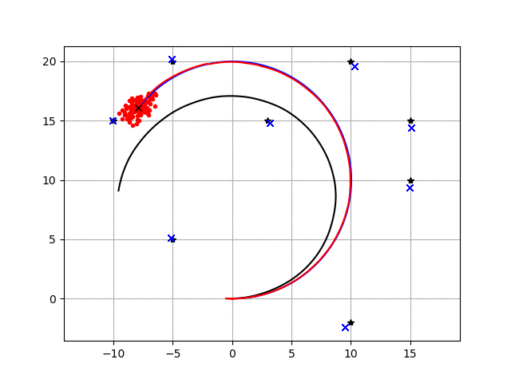
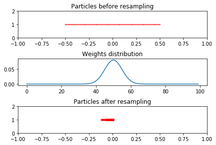
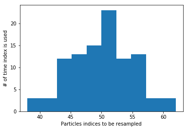

FastSLAM1.0
-----------

.. figure:: https://github.com/AtsushiSakai/PythonRoboticsGifs/raw/master/SLAM/FastSLAM1/animation.gif

Simulation
~~~~~~~~~~

This is a feature based SLAM example using FastSLAM 1.0.

The blue line is ground truth, the black line is dead reckoning, the red
line is the estimated trajectory with FastSLAM.

The red points are particles of FastSLAM.

Black points are landmarks, blue crosses are estimated landmark
positions by FastSLAM.

Introduction
~~~~~~~~~~~~

FastSLAM algorithm implementation is based on particle filters and
belongs to the family of probabilistic SLAM approaches. It is used with
feature-based maps (see gif above) or with occupancy grid maps.

As it is shown, the particle filter differs from EKF by representing the
robot’s estimation through a set of particles. Each single particle has
an independent belief, as it holds the pose :math:`(x, y, \theta)` and
an array of landmark locations
:math:`[(x_1, y_1), (x_2, y_2), ... (x_n, y_n)]` for n landmarks.

-  The blue line is the true trajectory
-  The red line is the estimated trajectory
-  The red dots represent the distribution of particles
-  The black line represent dead reckoning trajectory
-  The blue x is the observed and estimated landmarks
-  The black x is the true landmark

I.e. Each particle maintains a deterministic pose and n-EKFs for each
landmark and update it with each measurement.

Algorithm walk through
~~~~~~~~~~~~~~~~~~~~~~~

The particles are initially drawn from a uniform distribution the
represent the initial uncertainty. At each time step we do:

-  Predict the pose for each particle by using :math:`u` and the motion
   model (the landmarks are not updated).
-  Update the particles with observations :math:`z`, where the weights
   are adjusted based on how likely the particle to have the correct
   pose given the sensor measurement
-  Resampling such that the particles with the largest weights survive
   and the unlikely ones with the lowest weights die out.

1- Predict
~~~~~~~~~~

The following equations and code snippets we can see how the particles
distribution evolves in case we provide only the control :math:`(v,w)`,
which are the linear and angular velocity repsectively.

:math:`\begin{equation*} F= \begin{bmatrix} 1 & 0 & 0 \\ 0 & 1 & 0 \\ 0 & 0 & 1 \end{bmatrix} \end{equation*}`

:math:`\begin{equation*} B= \begin{bmatrix} \Delta t cos(\theta) & 0\\ \Delta t sin(\theta) & 0\\ 0 & \Delta t \end{bmatrix} \end{equation*}`

:math:`\begin{equation*} X = FX + BU \end{equation*}`

:math:`\begin{equation*} \begin{bmatrix} x_{t+1} \\ y_{t+1} \\ \theta_{t+1} \end{bmatrix}= \begin{bmatrix} 1 & 0 & 0 \\ 0 & 1 & 0 \\ 0 & 0 & 1 \end{bmatrix}\begin{bmatrix} x_{t} \\ y_{t} \\ \theta_{t} \end{bmatrix}+ \begin{bmatrix} \Delta t cos(\theta) & 0\\ \Delta t sin(\theta) & 0\\ 0 & \Delta t \end{bmatrix} \begin{bmatrix} v_{t} + \sigma_v\\ w_{t} + \sigma_w\\ \end{bmatrix} \end{equation*}`

The following snippets playback the recorded trajectory of each
particle.

To get the insight of the motion model change the value of :math:`R` and
re-run the cells again. As R is the parameters that indicates how much
we trust that the robot executed the motion commands.

It is interesting to notice also that only motion will increase the
uncertainty in the system as the particles start to spread out more. If
observations are included the uncertainty will decrease and particles
will converge to the correct estimate.

.. code-block:: ipython3

    # CODE SNIPPET #
    import numpy as np
    import math
    from copy import deepcopy
    # Fast SLAM covariance
    Q = np.diag([3.0, np.deg2rad(10.0)])**2
    R = np.diag([1.0, np.deg2rad(20.0)])**2
    
    #  Simulation parameter
    Qsim = np.diag([0.3, np.deg2rad(2.0)])**2
    Rsim = np.diag([0.5, np.deg2rad(10.0)])**2
    OFFSET_YAWRATE_NOISE = 0.01
    
    DT = 0.1  # time tick [s]
    SIM_TIME = 50.0  # simulation time [s]
    MAX_RANGE = 20.0  # maximum observation range
    M_DIST_TH = 2.0  # Threshold of Mahalanobis distance for data association.
    STATE_SIZE = 3  # State size [x,y,yaw]
    LM_SIZE = 2  # LM srate size [x,y]
    N_PARTICLE = 100  # number of particle
    NTH = N_PARTICLE / 1.5  # Number of particle for re-sampling
    
    class Particle:
    
        def __init__(self, N_LM):
            self.w = 1.0 / N_PARTICLE
            self.x = 0.0
            self.y = 0.0
            self.yaw = 0.0
            # landmark x-y positions
            self.lm = np.zeros((N_LM, LM_SIZE))
            # landmark position covariance
            self.lmP = np.zeros((N_LM * LM_SIZE, LM_SIZE))
    
    def motion_model(x, u):
        F = np.array([[1.0, 0, 0],
                      [0, 1.0, 0],
                      [0, 0, 1.0]])
    
        B = np.array([[DT * math.cos(x[2, 0]), 0],
                      [DT * math.sin(x[2, 0]), 0],
                      [0.0, DT]])
        x = F @ x + B @ u
            
        x[2, 0] = pi_2_pi(x[2, 0])
        return x
        
    def predict_particles(particles, u):
        for i in range(N_PARTICLE):
            px = np.zeros((STATE_SIZE, 1))
            px[0, 0] = particles[i].x
            px[1, 0] = particles[i].y
            px[2, 0] = particles[i].yaw
            ud = u + (np.random.randn(1, 2) @ R).T  # add noise
            px = motion_model(px, ud)
            particles[i].x = px[0, 0]
            particles[i].y = px[1, 0]
            particles[i].yaw = px[2, 0]
    
        return particles
    
    def pi_2_pi(angle):
        return (angle + math.pi) % (2 * math.pi) - math.pi
    
    # END OF SNIPPET
    
    N_LM = 0 
    particles = [Particle(N_LM) for i in range(N_PARTICLE)]
    time= 0.0
    v = 1.0  # [m/s]
    yawrate = 0.1  # [rad/s]
    u = np.array([v, yawrate]).reshape(2, 1)
    history = []
    while SIM_TIME >= time:
        time += DT
        particles = predict_particles(particles, u)
        history.append(deepcopy(particles))

.. code-block:: ipython3

    # from IPython.html.widgets import *
    from ipywidgets import *
    import numpy as np
    import matplotlib.pyplot as plt
    %matplotlib inline
    
    # playback the recorded motion of the particles
    def plot_particles(t=0):
        x = []
        y = []
        for i in range(len(history[t])):
            x.append(history[t][i].x)
            y.append(history[t][i].y)
        plt.figtext(0.15,0.82,'t = ' + str(t))
        plt.plot(x, y, '.r')
        plt.axis([-20,20, -5,25])
    
    interact(plot_particles, t=(0,len(history)-1,1));

.. parsed-literal::

    interactive(children=(IntSlider(value=0, description='t', max=499), Output()), _dom_classes=('widget-interact'…

2- Update
~~~~~~~~~

For the update step it is useful to observe a single particle and the
effect of getting a new measurements on the weight of the particle.

As mentioned earlier, each particle maintains :math:`N` :math:`2x2` EKFs
to estimate the landmarks, which includes the EKF process described in
the EKF notebook. The difference is the change in the weight of the
particle according to how likely the measurement is.

The weight is updated according to the following equation:

:math:`\begin{equation*} w_i = |2\pi Q|^{\frac{-1}{2}} exp\{\frac{-1}{2}(z_t - \hat z_i)^T Q^{-1}(z_t-\hat z_i)\} \end{equation*}`

Where, :math:`w_i` is the computed weight, :math:`Q` is the measurement
covariance, :math:`z_t` is the actual measurment and :math:`\hat z_i` is
the predicted measurement of particle :math:`i`.

To experiment this, a single particle is initialized then passed an
initial measurement, which results in a relatively average weight.
However, setting the particle coordinate to a wrong value to simulate
wrong estimation will result in a very low weight. The lower the weight
the less likely that this particle will be drawn during resampling and
probably will die out.

.. code-block:: ipython3

    # CODE SNIPPET #
    def observation(xTrue, xd, u, RFID):
    
        # calc true state
        xTrue = motion_model(xTrue, u)
    
        # add noise to range observation
        z = np.zeros((3, 0))
        for i in range(len(RFID[:, 0])):
    
            dx = RFID[i, 0] - xTrue[0, 0]
            dy = RFID[i, 1] - xTrue[1, 0]
            d = math.sqrt(dx**2 + dy**2)
            angle = pi_2_pi(math.atan2(dy, dx) - xTrue[2, 0])
            if d <= MAX_RANGE:
                dn = d + np.random.randn() * Qsim[0, 0]  # add noise
                anglen = angle + np.random.randn() * Qsim[1, 1]  # add noise
                zi = np.array([dn, pi_2_pi(anglen), i]).reshape(3, 1)
                z = np.hstack((z, zi))
    
        # add noise to input
        ud1 = u[0, 0] + np.random.randn() * Rsim[0, 0]
        ud2 = u[1, 0] + np.random.randn() * Rsim[1, 1] + OFFSET_YAWRATE_NOISE
        ud = np.array([ud1, ud2]).reshape(2, 1)
    
        xd = motion_model(xd, ud)
    
        return xTrue, z, xd, ud
    
    def update_with_observation(particles, z):
        for iz in range(len(z[0, :])):
    
            lmid = int(z[2, iz])
    
            for ip in range(N_PARTICLE):
                # new landmark
                if abs(particles[ip].lm[lmid, 0]) <= 0.01:
                    particles[ip] = add_new_lm(particles[ip], z[:, iz], Q)
                # known landmark
                else:
                    w = compute_weight(particles[ip], z[:, iz], Q)
                    particles[ip].w *= w
                    particles[ip] = update_landmark(particles[ip], z[:, iz], Q)
    
        return particles
    
    def compute_weight(particle, z, Q):
        lm_id = int(z[2])
        xf = np.array(particle.lm[lm_id, :]).reshape(2, 1)
        Pf = np.array(particle.lmP[2 * lm_id:2 * lm_id + 2])
        zp, Hv, Hf, Sf = compute_jacobians(particle, xf, Pf, Q)
        dx = z[0:2].reshape(2, 1) - zp
        dx[1, 0] = pi_2_pi(dx[1, 0])
    
        try:
            invS = np.linalg.inv(Sf)
        except np.linalg.linalg.LinAlgError:
            print("singuler")
            return 1.0
    
        num = math.exp(-0.5 * dx.T @ invS @ dx)
        den = 2.0 * math.pi * math.sqrt(np.linalg.det(Sf))
        w = num / den
    
        return w
    
    def compute_jacobians(particle, xf, Pf, Q):
        dx = xf[0, 0] - particle.x
        dy = xf[1, 0] - particle.y
        d2 = dx**2 + dy**2
        d = math.sqrt(d2)
    
        zp = np.array(
            [d, pi_2_pi(math.atan2(dy, dx) - particle.yaw)]).reshape(2, 1)
    
        Hv = np.array([[-dx / d, -dy / d, 0.0],
                       [dy / d2, -dx / d2, -1.0]])
    
        Hf = np.array([[dx / d, dy / d],
                       [-dy / d2, dx / d2]])
    
        Sf = Hf @ Pf @ Hf.T + Q
    
        return zp, Hv, Hf, Sf
    
    def add_new_lm(particle, z, Q):
    
        r = z[0]
        b = z[1]
        lm_id = int(z[2])
    
        s = math.sin(pi_2_pi(particle.yaw + b))
        c = math.cos(pi_2_pi(particle.yaw + b))
    
        particle.lm[lm_id, 0] = particle.x + r * c
        particle.lm[lm_id, 1] = particle.y + r * s
    
        # covariance
        Gz = np.array([[c, -r * s],
                       [s, r * c]])
    
        particle.lmP[2 * lm_id:2 * lm_id + 2] = Gz @ Q @ Gz.T
    
        return particle
    
    def update_KF_with_cholesky(xf, Pf, v, Q, Hf):
        PHt = Pf @ Hf.T
        S = Hf @ PHt + Q
    
        S = (S + S.T) * 0.5
        SChol = np.linalg.cholesky(S).T
        SCholInv = np.linalg.inv(SChol)
        W1 = PHt @ SCholInv
        W = W1 @ SCholInv.T
    
        x = xf + W @ v
        P = Pf - W1 @ W1.T
    
        return x, P
    
    def update_landmark(particle, z, Q):
    
        lm_id = int(z[2])
        xf = np.array(particle.lm[lm_id, :]).reshape(2, 1)
        Pf = np.array(particle.lmP[2 * lm_id:2 * lm_id + 2, :])
    
        zp, Hv, Hf, Sf = compute_jacobians(particle, xf, Pf, Q)
    
        dz = z[0:2].reshape(2, 1) - zp
        dz[1, 0] = pi_2_pi(dz[1, 0])
    
        xf, Pf = update_KF_with_cholesky(xf, Pf, dz, Q, Hf)
    
        particle.lm[lm_id, :] = xf.T
        particle.lmP[2 * lm_id:2 * lm_id + 2, :] = Pf
    
        return particle
    
    # END OF CODE SNIPPET #
    
    
    
    # Setting up the landmarks
    RFID = np.array([[10.0, -2.0],
                    [15.0, 10.0]])
    N_LM = RFID.shape[0]
    
    # Initialize 1 particle
    N_PARTICLE = 1
    particles = [Particle(N_LM) for i in range(N_PARTICLE)]
    
    xTrue = np.zeros((STATE_SIZE, 1))
    xDR = np.zeros((STATE_SIZE, 1))
    
    print("initial weight", particles[0].w)
    
    xTrue, z, _, ud = observation(xTrue, xDR, u, RFID)
    # Initialize landmarks
    particles = update_with_observation(particles, z)
    print("weight after landmark intialization", particles[0].w)
    particles = update_with_observation(particles, z)
    print("weight after update ", particles[0].w)
    
    particles[0].x = -10
    particles = update_with_observation(particles, z)
    print("weight after wrong prediction", particles[0].w)
            

.. parsed-literal::

    initial weight 1.0
    weight after landmark intialization 1.0
    weight after update  0.023098460073039763
    weight after wrong prediction 7.951154575772496e-07

3- Resampling
~~~~~~~~~~~~~

In the reseampling steps a new set of particles are chosen from the old
set. This is done according to the weight of each particle.

The figure shows 100 particles distributed uniformly between [-0.5, 0.5]
with the weights of each particle distributed according to a Gaussian
funciton.

The resampling picks

:math:`i \in 1,...,N` particles with probability to pick particle with
index :math:`i ∝ \omega_i`, where :math:`\omega_i` is the weight of that
particle

To get the intuition of the resampling step we will look at a set of
particles which are initialized with a given x location and weight.
After the resampling the particles are more concetrated in the location
where they had the highest weights. This is also indicated by the
indices

.. code-block:: ipython3

    # CODE SNIPPET #
    def normalize_weight(particles):
    
        sumw = sum([p.w for p in particles])
    
        try:
            for i in range(N_PARTICLE):
                particles[i].w /= sumw
        except ZeroDivisionError:
            for i in range(N_PARTICLE):
                particles[i].w = 1.0 / N_PARTICLE
    
            return particles
    
        return particles
    
    
    def resampling(particles):
        """
        low variance re-sampling
        """
    
        particles = normalize_weight(particles)
    
        pw = []
        for i in range(N_PARTICLE):
            pw.append(particles[i].w)
    
        pw = np.array(pw)
    
        Neff = 1.0 / (pw @ pw.T)  # Effective particle number
        # print(Neff)
    
        if Neff < NTH:  # resampling
            wcum = np.cumsum(pw)
            base = np.cumsum(pw * 0.0 + 1 / N_PARTICLE) - 1 / N_PARTICLE
            resampleid = base + np.random.rand(base.shape[0]) / N_PARTICLE
    
            inds = []
            ind = 0
            for ip in range(N_PARTICLE):
                while ((ind < wcum.shape[0] - 1) and (resampleid[ip] > wcum[ind])):
                    ind += 1
                inds.append(ind)
    
            tparticles = particles[:]
            for i in range(len(inds)):
                particles[i].x = tparticles[inds[i]].x
                particles[i].y = tparticles[inds[i]].y
                particles[i].yaw = tparticles[inds[i]].yaw
                particles[i].w = 1.0 / N_PARTICLE
    
        return particles, inds
    # END OF SNIPPET #
    
    
    
    def gaussian(x, mu, sig):
        return np.exp(-np.power(x - mu, 2.) / (2 * np.power(sig, 2.)))
    N_PARTICLE = 100
    particles = [Particle(N_LM) for i in range(N_PARTICLE)]
    x_pos = []
    w = []
    for i in range(N_PARTICLE):
        particles[i].x = np.linspace(-0.5,0.5,N_PARTICLE)[i]
        x_pos.append(particles[i].x)
        particles[i].w = gaussian(i, N_PARTICLE/2, N_PARTICLE/20)
        w.append(particles[i].w)
        
    
    # Normalize weights
    sw = sum(w)
    for i in range(N_PARTICLE):
        w[i] /= sw
    
    particles, new_indices = resampling(particles)
    x_pos2 = []
    for i in range(N_PARTICLE):
        x_pos2.append(particles[i].x)
        
    # Plot results
    fig, ((ax1,ax2,ax3)) = plt.subplots(nrows=3, ncols=1)
    fig.tight_layout()
    ax1.plot(x_pos,np.ones((N_PARTICLE,1)), '.r', markersize=2)
    ax1.set_title("Particles before resampling")
    ax1.axis((-1, 1, 0, 2))
    ax2.plot(w)
    ax2.set_title("Weights distribution")
    ax3.plot(x_pos2,np.ones((N_PARTICLE,1)), '.r')
    ax3.set_title("Particles after resampling")
    ax3.axis((-1, 1, 0, 2))
    fig.subplots_adjust(hspace=0.8)
    plt.show()
    
    plt.figure()
    plt.hist(new_indices)
    plt.xlabel("Particles indices to be resampled")
    plt.ylabel("# of time index is used")
    plt.show()

References
~~~~~~~~~~

- `PROBABILISTIC ROBOTICS <http://www.probabilistic-robotics.org/>`_

-  `FastSLAM Lecture <http://ais.informatik.uni-freiburg.de/teaching/ws12/mapping/pdf/slam10-fastslam.pdf>`_
