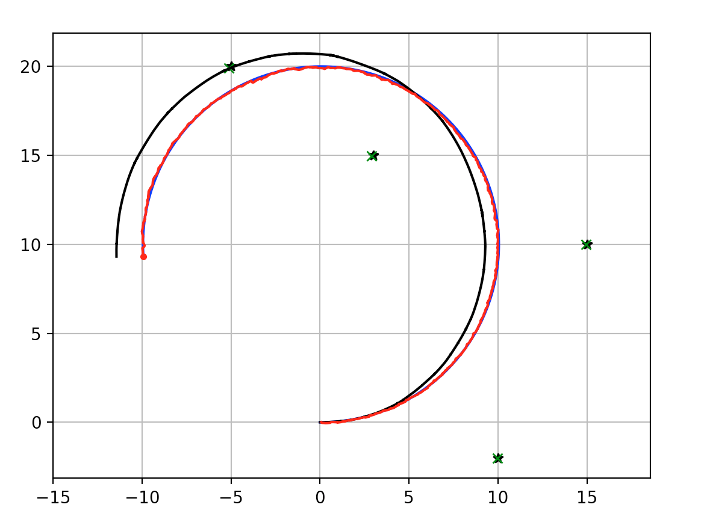

EKF SLAM
--------

This is an Extended Kalman Filter based SLAM example.

The blue line is ground truth, the black line is dead reckoning, the red
line is the estimated trajectory with EKF SLAM.

The green crosses are estimated landmarks.

.. image:: https://github.com/AtsushiSakai/PythonRoboticsGifs/raw/master/SLAM/EKFSLAM/animation.gif

Simulation
~~~~~~~~~~~~~~~~~~~~~~~~~~~~~

This is a simulation of EKF SLAM.

-  Black stars: landmarks
-  Green crosses: estimates of landmark positions
-  Black line: dead reckoning
-  Blue line: ground truth
-  Red line: EKF SLAM position estimation

Introduction
~~~~~~~~~~~~~~~~~~~~~~~~~~~~~

EKF SLAM models the SLAM problem in a single EKF where the modeled state
is both the pose :math:`(x, y, \theta)` and an array of landmarks
:math:`[(x_1, y_1), (x_2, x_y), ... , (x_n, y_n)]` for :math:`n`
landmarks. The covariance between each of the positions and landmarks
are also tracked.

:math:`\begin{equation} X = \begin{bmatrix} x \\ y \\ \theta \\ x_1 \\ y_1 \\ x_2 \\ y_2 \\ \dots \\ x_n \\ y_n \end{bmatrix} \end{equation}`

:math:`\begin{equation} P = \begin{bmatrix} \sigma_{xx} & \sigma_{xy} & \sigma_{x\theta} & \sigma_{xx_1} & \sigma_{xy_1} & \sigma_{xx_2} & \sigma_{xy_2} & \dots & \sigma_{xx_n} & \sigma_{xy_n} \\ \sigma_{yx} & \sigma_{yy} & \sigma_{y\theta} & \sigma_{yx_1} & \sigma_{yy_1} & \sigma_{yx_2} & \sigma_{yy_2} & \dots & \sigma_{yx_n} & \sigma_{yy_n} \\  & & & & \vdots & & & & & \\ \sigma_{x_nx} & \sigma_{x_ny} & \sigma_{x_n\theta} & \sigma_{x_nx_1} & \sigma_{x_ny_1} & \sigma_{x_nx_2} & \sigma_{x_ny_2} & \dots & \sigma_{x_nx_n} & \sigma_{x_ny_n} \end{bmatrix} \end{equation}`

A single estimate of the pose is tracked over time, while the confidence
in the pose is tracked by the covariance matrix :math:`P`. :math:`P` is
a symmetric square matrix which each element in the matrix corresponding
to the covariance between two parts of the system. For example,
:math:`\sigma_{xy}` represents the covariance between the belief of
:math:`x` and :math:`y` and is equal to :math:`\sigma_{yx}`.

The state can be represented more concisely as follows.

:math:`\begin{equation} X = \begin{bmatrix} x \\ m \end{bmatrix} \end{equation}`
:math:`\begin{equation} P = \begin{bmatrix} \Sigma_{xx} & \Sigma_{xm}\\ \Sigma_{mx} & \Sigma_{mm}\\ \end{bmatrix} \end{equation}`

Here the state simplifies to a combination of pose (:math:`x`) and map
(:math:`m`). The covariance matrix becomes easier to understand and
simply reads as the uncertainty of the robots pose
(:math:`\Sigma_{xx}`), the uncertainty of the map (:math:`\Sigma_{mm}`),
and the uncertainty of the robots pose with respect to the map and vice
versa (:math:`\Sigma_{xm}`, :math:`\Sigma_{mx}`).

Take care to note the difference between :math:`X` (state) and :math:`x`
(pose).

.. code:: ipython3

    """
    Extended Kalman Filter SLAM example
    original author: Atsushi Sakai (@Atsushi_twi)
    notebook author: Andrew Tu (drewtu2)
    """
    
    import math
    import numpy as np
    %matplotlib notebook
    import matplotlib.pyplot as plt
    
    
    # EKF state covariance
    Cx = np.diag([0.5, 0.5, np.deg2rad(30.0)])**2 # Change in covariance
    
    #  Simulation parameter
    Qsim = np.diag([0.2, np.deg2rad(1.0)])**2  # Sensor Noise
    Rsim = np.diag([1.0, np.deg2rad(10.0)])**2 # Process Noise
    
    DT = 0.1  # time tick [s]
    SIM_TIME = 50.0  # simulation time [s]
    MAX_RANGE = 20.0  # maximum observation range
    M_DIST_TH = 2.0  # Threshold of Mahalanobis distance for data association.
    STATE_SIZE = 3  # State size [x,y,yaw]
    LM_SIZE = 2  # LM state size [x,y]
    
    show_animation = True

Algorithm Walk through
~~~~~~~~~~~~~~~~~~~~~~~~~~~~~

At each time step, the following is done. - predict the new state using
the control functions - update the belief in landmark positions based on
the estimated state and measurements

.. code:: ipython3

    def ekf_slam(xEst, PEst, u, z):
        """
        Performs an iteration of EKF SLAM from the available information. 
        
        :param xEst: the belief in last position
        :param PEst: the uncertainty in last position
        :param u:    the control function applied to the last position 
        :param z:    measurements at this step
        :returns:    the next estimated position and associated covariance
        """
        S = STATE_SIZE
    
        # Predict
        xEst, PEst, G, Fx = predict(xEst, PEst, u)
        initP = np.eye(2)
    
        # Update
        xEst, PEst = update(xEst, PEst, u, z, initP)
    
        return xEst, PEst

1- Predict
~~~~~~~~~~~~~~~~~~~~~~~~~~~~~

**Predict State update:** The following equations describe the predicted
motion model of the robot in case we provide only the control
:math:`(v,w)`, which are the linear and angular velocity respectively.

:math:`\begin{equation*} F= \begin{bmatrix} 1 & 0 & 0 \\ 0 & 1 & 0 \\ 0 & 0 & 1 \end{bmatrix} \end{equation*}`

:math:`\begin{equation*} B= \begin{bmatrix} \Delta t cos(\theta) & 0\\ \Delta t sin(\theta) & 0\\ 0 & \Delta t \end{bmatrix} \end{equation*}`

:math:`\begin{equation*} U= \begin{bmatrix} v_t\\ w_t\\ \end{bmatrix} \end{equation*}`

:math:`\begin{equation*} X = FX + BU \end{equation*}`

:math:`\begin{equation*} \begin{bmatrix} x_{t+1} \\ y_{t+1} \\ \theta_{t+1} \end{bmatrix}= \begin{bmatrix} 1 & 0 & 0 \\ 0 & 1 & 0 \\ 0 & 0 & 1 \end{bmatrix}\begin{bmatrix} x_{t} \\ y_{t} \\ \theta_{t} \end{bmatrix}+ \begin{bmatrix} \Delta t cos(\theta) & 0\\ \Delta t sin(\theta) & 0\\ 0 & \Delta t \end{bmatrix} \begin{bmatrix} v_{t} + \sigma_v\\ w_{t} + \sigma_w\\ \end{bmatrix} \end{equation*}`

Notice that while :math:`U` is only defined by :math:`v_t` and
:math:`w_t`, in the actual calculations, a :math:`+\sigma_v` and
:math:`+\sigma_w` appear. These values represent the error between the
given control inputs and the actual control inputs.

As a result, the simulation is set up as the following. :math:`R`
represents the process noise which is added to the control inputs to
simulate noise experienced in the real world. A set of truth values are
computed from the raw control values while the values dead reckoning
values incorporate the error into the estimation.

:math:`\begin{equation*} R= \begin{bmatrix} \sigma_v\\ \sigma_w\\ \end{bmatrix} \end{equation*}`

:math:`\begin{equation*} X_{true} = FX + B(U) \end{equation*}`

:math:`\begin{equation*} X_{DR} = FX + B(U + R) \end{equation*}`

The implementation of the motion model prediction code is shown in
``motion_model``. The ``observation`` function shows how the simulation
uses (or doesn’t use) the process noise ``Rsim`` to the find the ground
truth and dead reckoning estimates of the pose.

**Predict covariance:** Add the state covariance to the the current
uncertainty of the EKF. At each time step, the uncertainty in the system
grows by the covariance of the pose, :math:`Cx`.

:math:`P = G^TPG + Cx`

Notice this uncertainty is only growing with respect to the pose, not
the landmarks.

.. code:: ipython3

    def predict(xEst, PEst, u):
        """
        Performs the prediction step of EKF SLAM
        
        :param xEst: nx1 state vector
        :param PEst: nxn covariance matrix
        :param u:    2x1 control vector
        :returns:    predicted state vector, predicted covariance, jacobian of control vector, transition fx
        """
        S = STATE_SIZE
        G, Fx = jacob_motion(xEst[0:S], u)
        xEst[0:S] = motion_model(xEst[0:S], u)
        # Fx is an an identity matrix of size (STATE_SIZE)
        # sigma = G*sigma*G.T + Noise
        PEst[0:S, 0:S] = G.T @ PEst[0:S, 0:S] @ G + Fx.T @ Cx @ Fx
        return xEst, PEst, G, Fx

.. code:: ipython3

    def motion_model(x, u):
        """
        Computes the motion model based on current state and input function. 
        
        :param x: 3x1 pose estimation
        :param u: 2x1 control input [v; w]
        :returns: the resulting state after the control function is applied
        """
        F = np.array([[1.0, 0, 0],
                      [0, 1.0, 0],
                      [0, 0, 1.0]])
    
        B = np.array([[DT * math.cos(x[2, 0]), 0],
                      [DT * math.sin(x[2, 0]), 0],
                      [0.0, DT]])
    
        x = (F @ x) + (B @ u)
        return x

2 - Update
~~~~~~~~~~~~~~~~~~~~~~~~~~~~~

In the update phase, the observations of nearby landmarks are used to
correct the location estimate.

For every landmark observed, it is associated to a particular landmark
in the known map. If no landmark exists in the position surrounding the
landmark, it is taken as a NEW landmark. The distance threshold for how
far a landmark must be from the next known landmark before its
considered to be a new landmark is set by ``M_DIST_TH``.

With an observation associated to the appropriate landmark, the
**innovation** can be calculated. Innovation (:math:`y`) is the
difference between the observation and the observation that *should*
have been made if the observation were made from the pose predicted in
the predict stage.

:math:`y = z_t - h(X)`

With the innovation calculated, the question becomes which to trust more
- the observations or the predictions? To determine this, we calculate
the Kalman Gain - a percent of how much of the innovation to add to the
prediction based on the uncertainty in the predict step and the update
step.

:math:`K = \bar{P_t}H_t^T(H_t\bar{P_t}H_t^T + Q_t)^{-1}`
In these equations, :math:`H` is the jacobian of the
measurement function. The multiplications by :math:`H^T` and :math:`H`
represent the application of the delta to the measurement covariance.
Intuitively, this equation is applying the following from the single
variate Kalman equation but in the multivariate form, i.e. finding the
ratio of the uncertainty of the process compared the measurement.

K = :math:`\frac{\bar{P_t}}{\bar{P_t} + Q_t}`

If :math:`Q_t << \bar{P_t}`, (i.e. the measurement covariance is low
relative to the current estimate), then the Kalman gain will be
:math:`~1`. This results in adding all of the innovation to the estimate
– and therefore completely believing the measurement.

However, if :math:`Q_t >> \bar{P_t}` then the Kalman gain will go to 0,
signaling a high trust in the process and little trust in the
measurement.

The update is captured in the following.

:math:`xUpdate = xEst + (K * y)`

Of course, the covariance must also be updated as well to account for
the changing uncertainty.

:math:`P_{t} = (I-K_tH_t)\bar{P_t}`

.. code:: ipython3

    def update(xEst, PEst, u, z, initP):
        """
        Performs the update step of EKF SLAM
        
        :param xEst:  nx1 the predicted pose of the system and the pose of the landmarks
        :param PEst:  nxn the predicted covariance
        :param u:     2x1 the control function 
        :param z:     the measurements read at new position
        :param initP: 2x2 an identity matrix acting as the initial covariance
        :returns:     the updated state and covariance for the system
        """
        for iz in range(len(z[:, 0])):  # for each observation
            minid = search_correspond_LM_ID(xEst, PEst, z[iz, 0:2]) # associate to a known landmark
    
            nLM = calc_n_LM(xEst) # number of landmarks we currently know about
            
            if minid == nLM: # Landmark is a NEW landmark
                print("New LM")
                # Extend state and covariance matrix
                xAug = np.vstack((xEst, calc_LM_Pos(xEst, z[iz, :])))
                PAug = np.vstack((np.hstack((PEst, np.zeros((len(xEst), LM_SIZE)))),
                                  np.hstack((np.zeros((LM_SIZE, len(xEst))), initP))))
                xEst = xAug
                PEst = PAug
            
            lm = get_LM_Pos_from_state(xEst, minid)
            y, S, H = calc_innovation(lm, xEst, PEst, z[iz, 0:2], minid)
    
            K = (PEst @ H.T) @ np.linalg.inv(S) # Calculate Kalman Gain
            xEst = xEst + (K @ y)
            PEst = (np.eye(len(xEst)) - (K @ H)) @ PEst
        
        xEst[2] = pi_2_pi(xEst[2])
        return xEst, PEst

.. code:: ipython3

    def calc_innovation(lm, xEst, PEst, z, LMid):
        """
        Calculates the innovation based on expected position and landmark position
        
        :param lm:   landmark position
        :param xEst: estimated position/state
        :param PEst: estimated covariance
        :param z:    read measurements
        :param LMid: landmark id
        :returns:    returns the innovation y, and the jacobian H, and S, used to calculate the Kalman Gain
        """
        delta = lm - xEst[0:2]
        q = (delta.T @ delta)[0, 0]
        zangle = math.atan2(delta[1, 0], delta[0, 0]) - xEst[2, 0]
        zp = np.array([[math.sqrt(q), pi_2_pi(zangle)]])
        # zp is the expected measurement based on xEst and the expected landmark position
        
        y = (z - zp).T # y = innovation
        y[1] = pi_2_pi(y[1])
        
        H = jacobH(q, delta, xEst, LMid + 1)
        S = H @ PEst @ H.T + Cx[0:2, 0:2]
    
        return y, S, H
    
    def jacobH(q, delta, x, i):
        """
        Calculates the jacobian of the measurement function
        
        :param q:     the range from the system pose to the landmark
        :param delta: the difference between a landmark position and the estimated system position
        :param x:     the state, including the estimated system position
        :param i:     landmark id + 1
        :returns:     the jacobian H
        """
        sq = math.sqrt(q)
        G = np.array([[-sq * delta[0, 0], - sq * delta[1, 0], 0, sq * delta[0, 0], sq * delta[1, 0]],
                      [delta[1, 0], - delta[0, 0], - q, - delta[1, 0], delta[0, 0]]])
    
        G = G / q
        nLM = calc_n_LM(x)
        F1 = np.hstack((np.eye(3), np.zeros((3, 2 * nLM))))
        F2 = np.hstack((np.zeros((2, 3)), np.zeros((2, 2 * (i - 1))),
                        np.eye(2), np.zeros((2, 2 * nLM - 2 * i))))
    
        F = np.vstack((F1, F2))
    
        H = G @ F
    
        return H

Observation Step
~~~~~~~~~~~~~~~~~~~~~~~~~~~~~

The observation step described here is outside the main EKF SLAM process
and is primarily used as a method of driving the simulation. The
observations function is in charge of calculating how the poses of the
robots change and accumulate error over time, and the theoretical
measurements that are expected as a result of each measurement.

Observations are based on the TRUE position of the robot. Error in dead
reckoning and control functions are passed along here as well.

.. code:: ipython3

    def observation(xTrue, xd, u, RFID):
        """
        :param xTrue: the true pose of the system
        :param xd:    the current noisy estimate of the system
        :param u:     the current control input
        :param RFID:  the true position of the landmarks
        
        :returns:     Computes the true position, observations, dead reckoning (noisy) position, 
                      and noisy control function
        """
        xTrue = motion_model(xTrue, u)
    
        # add noise to gps x-y
        z = np.zeros((0, 3))
    
        for i in range(len(RFID[:, 0])): # Test all beacons, only add the ones we can see (within MAX_RANGE)
    
            dx = RFID[i, 0] - xTrue[0, 0]
            dy = RFID[i, 1] - xTrue[1, 0]
            d = math.sqrt(dx**2 + dy**2)
            angle = pi_2_pi(math.atan2(dy, dx) - xTrue[2, 0])
            if d <= MAX_RANGE:
                dn = d + np.random.randn() * Qsim[0, 0]  # add noise
                anglen = angle + np.random.randn() * Qsim[1, 1]  # add noise
                zi = np.array([dn, anglen, i])
                z = np.vstack((z, zi))
    
        # add noise to input
        ud = np.array([[
            u[0, 0] + np.random.randn() * Rsim[0, 0],
            u[1, 0] + np.random.randn() * Rsim[1, 1]]]).T
    
        xd = motion_model(xd, ud)
        return xTrue, z, xd, ud

.. code:: ipython3

    def calc_n_LM(x):
        """
        Calculates the number of landmarks currently tracked in the state
        :param x: the state
        :returns: the number of landmarks n
        """
        n = int((len(x) - STATE_SIZE) / LM_SIZE)
        return n
    
    
    def jacob_motion(x, u):
        """
        Calculates the jacobian of motion model. 
        
        :param x: The state, including the estimated position of the system
        :param u: The control function
        :returns: G:  Jacobian
                  Fx: STATE_SIZE x (STATE_SIZE + 2 * num_landmarks) matrix where the left side is an identity matrix
        """
        
        # [eye(3) [0 x y; 0 x y; 0 x y]]
        Fx = np.hstack((np.eye(STATE_SIZE), np.zeros(
            (STATE_SIZE, LM_SIZE * calc_n_LM(x)))))
    
        jF = np.array([[0.0, 0.0, -DT * u[0] * math.sin(x[2, 0])],
                       [0.0, 0.0, DT * u[0] * math.cos(x[2, 0])],
                       [0.0, 0.0, 0.0]],dtype=object)
    
        G = np.eye(STATE_SIZE) + Fx.T @ jF @ Fx
        if calc_n_LM(x) > 0:
            print(Fx.shape)
        return G, Fx,
    
    

.. code:: ipython3

    def calc_LM_Pos(x, z):
        """
        Calculates the pose in the world coordinate frame of a landmark at the given measurement.
    
        :param x: [x; y; theta]
        :param z: [range; bearing]
        :returns: [x; y] for given measurement
        """
        zp = np.zeros((2, 1))
    
        zp[0, 0] = x[0, 0] + z[0] * math.cos(x[2, 0] + z[1])
        zp[1, 0] = x[1, 0] + z[0] * math.sin(x[2, 0] + z[1])
        #zp[0, 0] = x[0, 0] + z[0, 0] * math.cos(x[2, 0] + z[0, 1])
        #zp[1, 0] = x[1, 0] + z[0, 0] * math.sin(x[2, 0] + z[0, 1])
    
        return zp
    
    
    def get_LM_Pos_from_state(x, ind):
        """
        Returns the position of a given landmark
        
        :param x:   The state containing all landmark positions
        :param ind: landmark id
        :returns:   The position of the landmark
        """
        lm = x[STATE_SIZE + LM_SIZE * ind: STATE_SIZE + LM_SIZE * (ind + 1), :]
    
        return lm
    
    
    def search_correspond_LM_ID(xAug, PAug, zi):
        """
        Landmark association with Mahalanobis distance.
        
        If this landmark is at least M_DIST_TH units away from all known landmarks, 
        it is a NEW landmark.
        
        :param xAug: The estimated state
        :param PAug: The estimated covariance
        :param zi:   the read measurements of specific landmark
        :returns:    landmark id
        """
    
        nLM = calc_n_LM(xAug)
    
        mdist = []
    
        for i in range(nLM):
            lm = get_LM_Pos_from_state(xAug, i)
            y, S, H = calc_innovation(lm, xAug, PAug, zi, i)
            mdist.append(y.T @ np.linalg.inv(S) @ y)
    
        mdist.append(M_DIST_TH)  # new landmark
    
        minid = mdist.index(min(mdist))
    
        return minid
    
    def calc_input():
        v = 1.0  # [m/s]
        yawrate = 0.1  # [rad/s]
        u = np.array([[v, yawrate]]).T
        return u
    
    def pi_2_pi(angle):
        return (angle + math.pi) % (2 * math.pi) - math.pi

.. code:: ipython3

    def main():
        print(" start!!")
    
        time = 0.0
    
        # RFID positions [x, y]
        RFID = np.array([[10.0, -2.0],
                         [15.0, 10.0],
                         [3.0, 15.0],
                         [-5.0, 20.0]])
    
        # State Vector [x y yaw v]'
        xEst = np.zeros((STATE_SIZE, 1))
        xTrue = np.zeros((STATE_SIZE, 1))
        PEst = np.eye(STATE_SIZE)
    
        xDR = np.zeros((STATE_SIZE, 1))  # Dead reckoning
    
        # history
        hxEst = xEst
        hxTrue = xTrue
        hxDR = xTrue
    
        while SIM_TIME >= time:
            time += DT
            u = calc_input()
    
            xTrue, z, xDR, ud = observation(xTrue, xDR, u, RFID)
    
            xEst, PEst = ekf_slam(xEst, PEst, ud, z)
    
            x_state = xEst[0:STATE_SIZE]
    
            # store data history
            hxEst = np.hstack((hxEst, x_state))
            hxDR = np.hstack((hxDR, xDR))
            hxTrue = np.hstack((hxTrue, xTrue))
    
            if show_animation:  # pragma: no cover
                plt.cla()
    
                plt.plot(RFID[:, 0], RFID[:, 1], "*k")
                plt.plot(xEst[0], xEst[1], ".r")
    
                # plot landmark
                for i in range(calc_n_LM(xEst)):
                    plt.plot(xEst[STATE_SIZE + i * 2],
                             xEst[STATE_SIZE + i * 2 + 1], "xg")
    
                plt.plot(hxTrue[0, :],
                         hxTrue[1, :], "-b")
                plt.plot(hxDR[0, :],
                         hxDR[1, :], "-k")
                plt.plot(hxEst[0, :],
                         hxEst[1, :], "-r")
                plt.axis("equal")
                plt.grid(True)
                plt.pause(0.001)

.. code:: ipython3

    %matplotlib notebook
    main()

.. parsed-literal::

     start!!
    New LM
    New LM
    New LM

References:
~~~~~~~~~~~~~~~~~~~~~~~~~~~~~

- `PROBABILISTIC ROBOTICS <http://www.probabilistic-robotics.org/>`_

